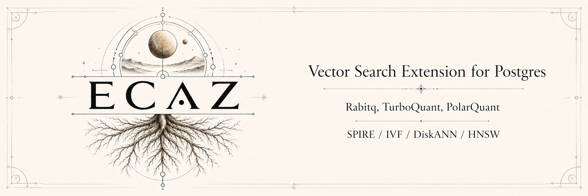

[](https://discord.gg/6qsdhSPE)

Ecaz is a rust based PostgreSQL extension for performant,
highly scalable vector storage and retrieval. It supports a broad range
of quantization and index options rather than a single fixed architecture.

#### Column Types

- `ecvector(dim)` — canonical vector row type
- `tqvector` — TurboQuant quantized vector storage

#### Quantization Types

- `turboquant` — [TurboQuant](https://research.google/blog/turboquant-redefining-ai-efficiency-with-extreme-compression/): training-free (data-oblivious) quantization that randomly rotates each vector and scalar-quantizes its coordinates, reaching near-optimal distortion at extreme compression with no learned codebook.
- `pq_fastscan` — [Product Quantization](https://ieeexplore.ieee.org/document/5432202) in the SIMD FastScan layout: the vector is split into sub-blocks, each mapped to the nearest entry of a small learned codebook; 4-bit codes are scored through in-register lookup tables, with a colder full-precision rerank payload.
- `rabitq` — [RaBitQ](https://arxiv.org/abs/2405.12497): quantization with a theoretical error bound — a random rotation collapses each dimension toward a sign bit, plus a few per-vector correction scalars that keep the distance estimate unbiased; supports 1–8 bit codes.

#### Index Families

- `ec_hnsw` — HNSW graph index (general-purpose default)
- `ec_ivf` — IVF posting-list index
- `ec_diskann` — DiskANN/Vamana-style graph index
- `ec_spire` — [SPIRE](https://arxiv.org/html/2512.17264v1) partitioned local/distributed IVF-family index

## Quick Start

```bash
cargo install cargo-pgrx@0.17
cargo pgrx init --pg18 download
cargo pgrx run --release pg18
```

`cargo pgrx run` builds the extension, installs it into the managed PG18
cluster, starts PostgreSQL if needed, and opens `psql`.

```sql
CREATE EXTENSION ecaz;

CREATE TABLE memories (
    id bigint generated always as identity primary key,
    embedding ecvector(4)
);

-- Encode and store a canonical vector
--   args: float4[] input, codebook_bits (4), rng_seed (42)
INSERT INTO memories (embedding)
VALUES (encode_to_ecvector(ARRAY[1.0, 2.0, 3.0, 4.0]::float4[], 4, 42));

-- Create HNSW index over the canonical row type
CREATE INDEX ON memories
USING ec_hnsw (embedding ecvector_ip_ops)
WITH (m = 8, ef_construction = 64);

-- Query nearest neighbors
SELECT id FROM memories
ORDER BY embedding <#> ARRAY[1.0, 2.0, 3.0, 4.0]::float4[]
LIMIT 10;
```

See [Build From Source](docs/build-from-source.md) for the full repeatable
setup path, including native prerequisites, existing-PostgreSQL installs,
operator CLI setup, and validation commands.

## Compatibility

| Area       | Status                                                |
|------------|-------------------------------------------------------|
| PostgreSQL | PG18 primary target; PG17 compatibility target        |
| pgrx       | `cargo-pgrx` 0.17                                     |
| Rust       | Stable toolchain                                      |
| Production | SIMD optimization for Graviton 4 (ARM NEON) & AWS Intel x86_64 (AVX2) |
| Development | SIMD optimization for linux/x86_64 (AVX2) & Apple Silicon (ARM NEON) |


## Build From Source

Ecaz targets PG18 by default, with PG17 kept as a compatibility build. A
complete source setup has five parts:

1. Install Rust stable, native build tools, and PostgreSQL build dependencies.
2. Install the matching pgrx toolchain: `cargo install cargo-pgrx@0.17`.
3. Initialize pgrx for PG18: `cargo pgrx init --pg18 download`.
4. Build and install into a pgrx-managed PG18: `cargo pgrx run --release pg18`.
5. Install the operator CLI for repeatable local SQL, corpus, and benchmark
   commands: `cargo install --path crates/ecaz-cli`.

For an already-installed PostgreSQL server, install with an explicit
`pg_config` instead:

```bash
cargo pgrx install --sudo --release --pg-config /path/to/pg_config
```

The detailed guide is [docs/build-from-source.md](docs/build-from-source.md).

## Performance

Results below come from the standard ecaz sweep — all four index families ×
quantizations × 10K/50K/100K/1M — run on the AWS production lanes (Graviton 4
with ARM NEON, and Intel Sapphire Rapids with AVX2) over 1536-dimensional DBpedia
OpenAI embeddings. These are engineering measurements, not product claims. See
[Benchmarks](docs/benchmarks.md), [Benchmark Index](docs/benchmark-index.md), and
[Benchmark Reporting Standard](docs/benchmark-reporting-standard.md) for the full
matrix, source packets, and reporting rules.

### Compression And Storage Format

Encoded payload size per vector, for 1536-dimensional vectors. Lower bit widths
trade recall for size; pick the format and bit width that fits your recall and
storage budget. (These are the quantized code bytes; the on-disk index adds
posting-list/graph structure — see the index sizes in the snapshot below.)

| Representation | Bytes per vector | Relative size |
| --- | ---: | ---: |
| Raw fp32 | 6,144 B | 1.00x |
| PQ-FastScan g8 (search code) | 96 B | 64.0x smaller |
| RaBitQ 1-bit | 204 B | 30.1x smaller |
| RaBitQ 2-bit | 396 B | 15.5x smaller |
| TurboQuant 2-bit | 399 B | 15.4x smaller |
| RaBitQ 4-bit | 780 B | 7.88x smaller |
| TurboQuant 4-bit | 783 B | 7.85x smaller |
| RaBitQ 8-bit | 1,548 B | 3.97x smaller |
| TurboQuant 8-bit | 1,551 B | 3.96x smaller |

A raw fp32 vector barely fits one tuple per 8 KB page; the quantized codes pack
many vectors per page, which is what makes large-corpus scans fast.


### Index Family Snapshot

All four index families at the **1M production scale on Graviton 4**
(`m8g.2xlarge`, AWS arm64), each at its strongest production quantization and a
representative high-recall operating point. Same corpus (990K real DBpedia
OpenAI embeddings, 1536-dim), same platform, same `k=10` — so the families are
directly comparable.

| Access method | Quant | Recall@10 | p50 latency | Index size |
| --- | --- | ---: | ---: | ---: |
| `ec_hnsw` | turboquant | 0.930 | 13.7 ms | 1.3 GiB |
| `ec_ivf` | rabitq (1-bit) | 0.980 | 56.8 ms | 290 MiB |
| `ec_diskann` | rabitq | 0.981 | 5.0 ms | 407 MiB |
| `ec_spire` ⁽¹⁾ | rabitq | 0.986 | 137 ms | 779 MiB |
Operating points: DiskANN `list_size=64..128`, IVF/SPIRE `nprobe=16..64`, HNSW
`ef_search=80..160`. Each family also has a faster lower-recall point on the same
index — e.g. DiskANN 0.947 @ 3.6 ms, IVF 0.926 @ 16.1 ms.

How to read it:

- **`ec_diskann`** — best all-round at scale: the most recall per millisecond and
  a compact index. Requires unit-normalized source vectors.
- **`ec_ivf`** — strong recall with the smallest index (RaBitQ 1-bit is the sweet
  spot); the posting-list model lets you trade recall against latency via `nprobe`.
- **`ec_hnsw`** — general-purpose graph default with competitive latency; recall
  tops out lower than the other families at 1M in this sweep.
- **`ec_spire`** ⁽¹⁾ — a partitioned, **distributed / scale-out** index. The row
  above is its single-node point; SPIRE's real value is multi-node (below). It
  trades single-node latency for partitioning, and its latency is still being
  optimized.

For context, at 1M `ec_ivf` (RaBitQ 1-bit) serves 0.980 recall at 56.8 ms p50 —
faster than the tuned vchord RaBitQ comparator (~90 ms p50, which reaches ~1.0
recall) — and every ecaz family is far ahead of the untuned pgvector /
pgvectorscale baselines.

Source: `reviews/task-105/006-full-scale-matrix/` (Task 105 full-scale matrix,
`main=1345ca603`; G4 + Intel × 10K/50K/100K/1M × all AM/quant).

#### ⁽¹⁾ SPIRE distributed (multi-node)

SPIRE partitions a corpus across nodes and serves queries by fanning out to
remote leaves. A real **3-node** deployment (1 coordinator + 2 remotes), with the
1M corpus sharded across the remotes (~505K + ~485K rows) and genuine remote-heap
reads, at `nprobe=64`:

| Topology | Quant | Recall@10 | p50 | p95 |
| --- | --- | ---: | ---: | ---: |
| 3-node distributed | rabitq | 0.951 | 117 ms | 135 ms |
| 3-node distributed | turboquant | 0.949 | 140 ms | 164 ms |

Distributing across 3 nodes is roughly **5x faster at 1M than the same index on a
single node** (121 ms vs 620 ms at matched `nprobe=32`) — SPIRE trades latency for
scale-out partitioning. It is currently a **research / scale-out surface**: not yet
on the single-node DiskANN/IVF latency frontier, with latency optimization
ongoing. Source: `reviews/task-107/` (`005-product-decision/`,
`004-distributed-completion/`).

## Choosing An Index

Each index family implements a different search algorithm. Quantization
(`storage_format`) is a separate concern — it controls how vectors are
compressed inside the index and is independent of the index family. See
[Usage Guide](docs/usage.md) for full SQL examples,
[Benchmarks](docs/benchmarks.md) for selected results, and
[Benchmark Reporting Standard](docs/benchmark-reporting-standard.md) for the
fields required in new AM, quantizer, storage-format, and option-set
comparisons.

| Access method | Best fit | Storage formats | Notes |
| --- | --- | --- | -- |
| `ec_hnsw` | General-purpose ANN graph search | `turboquant`, `pq_fastscan`, `rabitq` |  |
| `ec_ivf` | Posting-list experiments and high-ingest tradeoffs | `turboquant`, `pq_fastscan`, `rabitq` | |
| `ec_diskann` | Compact graph indexes, strong recall-per-ms at scale | `pq_fastscan`, `rabitq`, `turboquant` | Requires unit-normalized source vectors |
| `ec_spire` | Partitioned local and distributed search | `turboquant`, `rabitq` |  |


## Development

PG18 is the primary target; PG17 is kept as a compatibility build.

- [Rust](https://rustup.rs/) stable
- [cargo-pgrx](https://github.com/pgcentralfoundation/pgrx) `0.17`
- Native PostgreSQL build dependencies, or PostgreSQL 18 development headers if
  using an existing server

The standard local loop targets PG18:

```bash
cargo pgrx init --pg18 download
make fmt
make lint
make test
make pg-test
```

PG17 compatibility coverage is optional — run it only when touching
PG17-specific behavior:

```bash
make lint-pg17
make pg-test-pg17
```

## Documentation

| Document | Description |
| --- | --- |
| [Getting Started](docs/getting-started.md) | Prerequisites, installation, first query |
| [Build From Source](docs/build-from-source.md) | Full repeatable local build and setup path |
| [Usage Guide](docs/usage.md) | Encoding parameters, index tuning, query patterns |
| [Benchmarks](docs/benchmarks.md) | Measured performance results and methodology |
| [Benchmark Index](docs/benchmark-index.md) | Packet directory for benchmark lanes and source artifacts |
| [Benchmark Reporting Standard](docs/benchmark-reporting-standard.md) | Required fields for AM, quantizer, storage-format, and option-set comparisons |
| [Rust Safety And Quality](docs/hardening.md) | Hardening lanes for linting, unsafe audit, Miri, fuzzing, model checking, sanitizers, and supply-chain checks |
| [Operator CLI](crates/ecaz-cli/README.md) | `ecaz` corpus, benchmark, compare, stress, and dev command surface |
| [Architecture](docs/architecture.md) | Compression pipeline, index layout, page format |
| [PG18 Features](docs/pg18.md) | ReadStream, EXPLAIN hooks, AM callbacks |
| [Contributing](docs/contributing.md) | Makefile targets, CI, testing, fuzzing |
| [References](docs/references.md) | Papers and libraries |

## Project

| Resource | Description |
| --- | --- |
| [Specification](spec/spec.md) | Master requirements specification |
| [Implementation Plan](plan/plan.md) | Task board, sequencing, status |
| [ADRs](spec/adr/) | Architecture decision records |
| [Reviews](review/) | Review packets and feedback ([workflow](AGENTS.md)) |

## License

MIT

## This software was written 100% by AI

Ecaz is an Agentic Engineering experiment: an attempt to develop a complex
database system written solely by AI. A human worked with AI to design the
architecture and navigate the many design decisions, but 100% of the code was
written by GPT >=5.4 and Claude Opus >=4.6.

**The ethos is to pursue quality, testing,
[Rust safety and hardening](docs/hardening.md), and benchmarking rigorously, but
the project should not yet be considered production-ready.**

Having achieved the initial goal of support for well-known index
families, the project now aims to build proof-of-concept implementations for
frontier vector database research.
