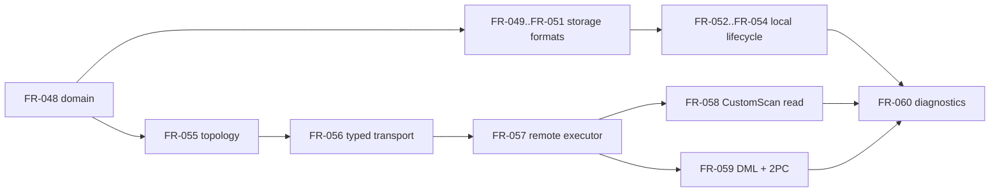
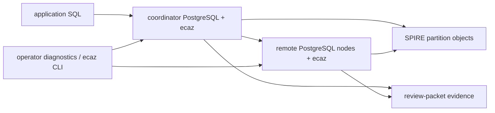

# Spec Review: SPIRE Backfill

Review target: `6bb81608` plus review packet `8f3dcd01`.

## Findings

### P1 - Prepared transaction GID is not uniquely specified for repeated branches

`FR-059` defines the SPIRE prepared transaction GID as
`ec_spire_insert_<index_oid>_<node_id>_<served_epoch>_<top_xid>`
([FR-059 lines 64-68](../../../spec/functional/spire/distributed/FR-059-spire-coordinator-dml-2pc.md#L64-L68)).
That is not sufficient to reproduce a safe 2PC implementation unless the spec
also states that there is exactly one remote prepared transaction per
`(index_oid, node_id, served_epoch, top_xid)` and that all affected rows are
batched into that branch. Otherwise two INSERT/DELETE branches in the same top
transaction, same node, and same served epoch collide on GID. This directly
undercuts `FR-059-AC-3`, which says the GID is defined well enough for operator
recovery ([FR-059 lines 101-104](../../../spec/functional/spire/distributed/FR-059-spire-coordinator-dml-2pc.md#L101-L104)).

Action: either specify the one-prepared-xact-per-node batching invariant, or add
a branch/statement/nonce component to the GID and document the recovery lookup
key.

### P1 - Several storage and wire formats are still too ambiguous for faithful reproduction

The goal says a faithful reproduction should be possible from the spec. The new
format specs are directionally good, but important binary/wire details remain
underspecified:

- `FR-050` uses `item pointer`, `bytea`, `float4[]`, and variable arrays for
  Leaf V2 meta/segments without byte offsets, alignment, item-pointer encoding,
  NULL rules, or byte-order rules for the segment payload
  ([FR-050 lines 29-55](../../../spec/functional/spire/storage/FR-050-spire-leaf-v2-format.md#L29-L55)).
- `FR-051` describes routing child entries and top-graph nodes as repeated
  structured entries but does not define offsets, alignment, vector byte order,
  or neighbor-array bounds beyond prose
  ([FR-051 lines 31-37](../../../spec/functional/spire/storage/FR-051-spire-routing-delta-topgraph-formats.md#L31-L37),
  [FR-051 lines 61-72](../../../spec/functional/spire/storage/FR-051-spire-routing-delta-topgraph-formats.md#L61-L72)).
- `FR-056` permits `query` to be "`real[]` or equivalent vector bytes" and
  defines the candidate envelope mostly as names/rules, not exact transport
  types/cardinality per candidate/batch
  ([FR-056 lines 24-34](../../../spec/functional/spire/distributed/FR-056-spire-remote-endpoint-typed-transport.md#L24-L34),
  [FR-056 lines 40-66](../../../spec/functional/spire/distributed/FR-056-spire-remote-endpoint-typed-transport.md#L40-L66)).

Action: add exact binary layouts for Leaf V2 segment payloads and routing/top
graph payloads, and define the remote request/response DTOs with exact SQL
types, batch cardinality, array alignment rules, and rejection conditions.

### P1 - NFR-013 scope contradicts its own "local readiness" boundary

`NFR-013` is titled and related as local readiness/capacity. Its relationships
only constrain local lifecycle/diagnostic FRs
([NFR-013 lines 7-19](../../../spec/non-functional/NFR-013-spire-local-readiness-and-capacity.md#L7-L19)).
But its measurement contract and capacity baseline are dominated by distributed
surfaces: remote fanout, typed tuple transport, remote leaf PIDs, distributed
read coordinator sessions, remote dispatch concurrency, coordinator-routed
writer workloads, and per-remote work limits
([NFR-013 lines 31-38](../../../spec/non-functional/NFR-013-spire-local-readiness-and-capacity.md#L31-L38),
[NFR-013 lines 45-56](../../../spec/non-functional/NFR-013-spire-local-readiness-and-capacity.md#L45-L56)).

Action: split this into local-only capacity/readiness and distributed
PostgreSQL-node readiness, or rename/retarget `NFR-013` so it explicitly
constrains `FR-055..FR-059` as well.

### P2 - Test matrix is group-level, not acceptance-criterion-level, while claiming completeness

The review checklist requires every AC to map to at least one TC. The current
matrix maps large ranges and grouped test cases, for example `FR-049..FR-051`
to "Storage object format ACs" and `FR-055..FR-058` to TC-023/TC-024
([tests lines 87-92](../../../spec/tests.md#L87-L92)). The TC rows are also
group-level descriptions rather than per-AC verification targets
([tests lines 141-146](../../../spec/tests.md#L141-L146)). This is useful
navigation, but it does not prove that every new AC is covered.

Action: either add a SPIRE AC-level coverage appendix/table, or downgrade the
"Complete" SPIRE coverage rows to partial until each `FR-048..FR-060`,
`US-018..US-022`, and `NFR-013..NFR-014` AC maps to a concrete TC/evidence
artifact.

### P2 - Deleted FR-039..FR-043 create an immutable-ID lifecycle gap

The automated ID scan reports an FR gap for `FR-039..FR-043`. The master spec
says requirement identifiers are immutable once assigned and defines
`DEPRECATED` / `SUPERSEDED` lifecycle states for retained history
([spec.md lines 284-305](../../../spec/spec.md#L284-L305)). Removing the old
files entirely makes historical references harder to interpret and violates the
review checklist's no-gap rule unless this repo explicitly allows deleted draft
IDs.

Action: restore lightweight tombstone requirement files for `FR-039..FR-043`
with `status: SUPERSEDED` and links to `FR-048..FR-060`, or update the master
spec policy to state that removed duplicate/draft IDs may intentionally remain
as gaps.

### P3 - User-story metadata and AC shape do not meet the review checklist

The new/updated SPIRE user stories use the `As/I want/So that` shape, but they
do not specify priority and their ACs are declarative statements rather than
Given/When/Then acceptance criteria. `US-022` is representative: frontmatter has
status/relationships but no priority, and `US-022-AC-1..6` are prose statements
([US-022 lines 1-23](../../../spec/usecase/US-022-operate-local-spire-index-lifecycle.md#L1-L23),
[US-022 lines 32-61](../../../spec/usecase/US-022-operate-local-spire-index-lifecycle.md#L32-L61)).

Action: either conform SPIRE stories to the checklist with priority and
Given/When/Then ACs, or document the repo's accepted deviation from that skill
template.

## Automated Checks

- ID format: pass for `US-XXX`, `FR-XXX`, `NFR-XXX`, `StR-XXX`, and AC headings.
- Duplicate IDs: pass.
- ID gaps: `FR-039..FR-043` gap detected.
- Link integrity: pass for `ix://agent-ix/ecaz/{US,FR,NFR,StR}-XXX` targets.
- Stale active SPIRE references: pass for old `FR-038 SPIRE`, `FR-039..FR-043`,
  `US-017 SPIRE`, Phase 1 scaffold, and libpq-coordinator wording under `spec/`.
- Whitespace: `git diff --check HEAD~2..HEAD` passed.

## Analysis Lenses

### Failure Domain

Strict/degraded behavior is covered in `FR-048`, `FR-057`, and `FR-060`.
Identity domains are mostly explicit: PIDs, epochs, local/global vector IDs,
placement directory keys, and source identities. The open failure-domain gaps
are the 2PC GID collision risk and underspecified remote DTO failure labels.

### Integrity

The new SPIRE tree has a coherent top-level shape and relationships are mostly
valid. Integrity gaps are AC-level coverage, deleted FR tombstones, and the
local/distributed scope conflict in `NFR-013`.

### Dependency

Logical dependency graph:

Enablement: `FR-048..FR-051`, `FR-055`, `FR-056`, and `FR-060`.
Feature behavior: `FR-052..FR-054`, `FR-057..FR-059`.

### Evidence

Evidence surfaces are named in `spec/tests.md`, but many are grouped. The spec
needs an AC-level evidence map or explicit "partial" status for the grouped
rows.

### Risk & Complexity

High-risk requirements: `FR-056..FR-059` and `NFR-014` due distributed
transport, security, cancellation, schema drift, and 2PC recovery. Medium-risk
requirements: `FR-049..FR-054` due persisted object compatibility and epoch
state transitions. Volatile areas should stay in small tasks: typed transport,
GID/reaper behavior, schema drift fingerprints, and capacity baselines.

### Scope Boundary

System context:

Core logic: storage formats, routing, local search, CustomScan, DML.
Infrastructure: remote descriptors, libpq/TLS, prepared xacts, advisory
governance.
Cross-cutting: diagnostics, evidence labels, secret redaction, schema drift.

The main boundary issue is `NFR-013`: it is labeled local but allocates
distributed readiness responsibilities.

## Overall Assessment

The backfill is a strong structural pass and is much closer to a reproduction
contract than the previous flat draft set. I would not treat it as fully
review-clean yet. The blocking fixes are to make GID uniqueness explicit, tighten
binary/wire layouts, and resolve the NFR-013 scope conflict. The remaining items
are traceability and process hygiene.
