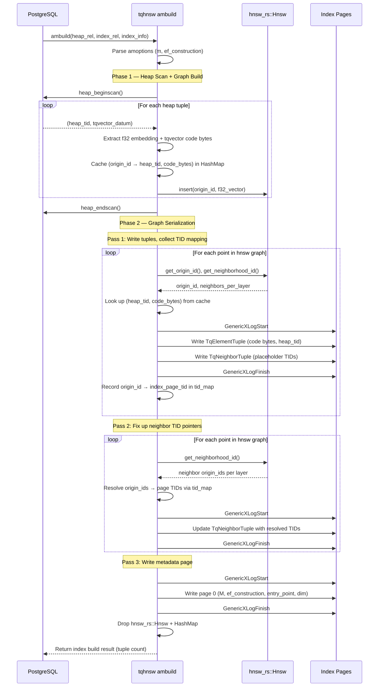

# Sequence Diagram: ambuild (Bulk Index Build)

## Key Design Decisions

1. **f32 vectors for build**: The hnsw_rs graph is built with raw f32 distance, not compressed code distance. This produces a higher-quality graph.
2. **Two-pass serialization**: Necessary because page TIDs are assigned during write, but neighbor tuples reference other points' TIDs.
3. **hnsw_rs is ephemeral**: The in-memory graph is dropped after serialization. Runtime operations use Postgres pages only.
