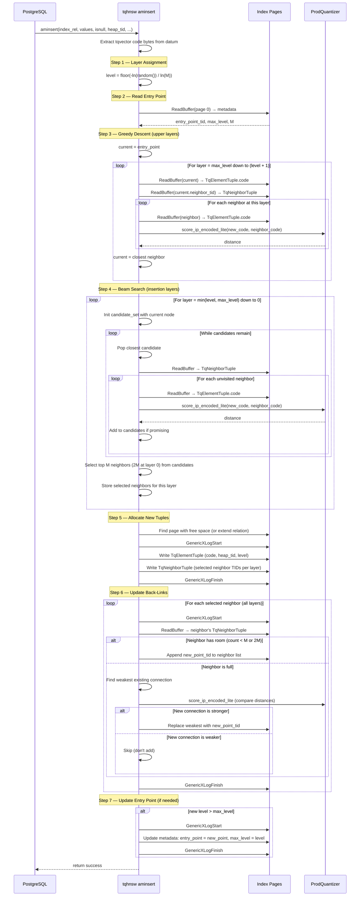

# Sequence Diagram: aminsert (Single Row Insert)

## Key Design Decisions

1. **Code-to-code scoring**: aminsert uses `score_ip_encoded_lite` (no LUT). Both sides are compressed codes stored on pages. This is less accurate than LUT-based scoring but avoids constructing a LUT for a single insert.
2. **Neighbor pruning**: When a neighbor's list is full, the weakest connection is replaced only if the new connection is stronger. This is the standard HNSW "select-neighbors-simple" heuristic.
3. **Lock ordering**: Page locks are acquired in ascending block number order to prevent deadlocks during back-link updates.
4. **GenericXLog per page**: Each page modification is its own GenericXLog transaction. If the server crashes mid-insert, partial updates are rolled back and the graph remains consistent (some back-links may be missing but the graph is still navigable).
