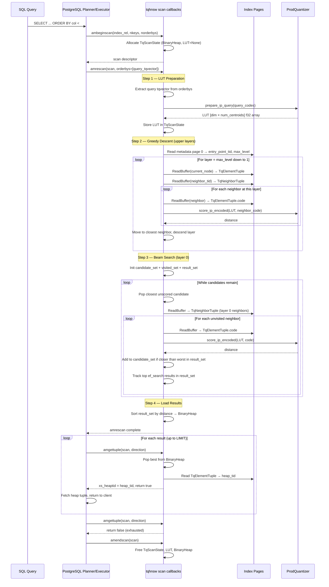

# Sequence Diagram: HNSW Index Scan (amrescan + amgettuple)

## Key Design Decisions

1. **LUT prepared once**: The LUT is built from the query codes in amrescan and reused for every distance calculation in the search. Zero allocation per scoring call.
2. **Greedy descent on upper layers**: Only one node is tracked (no beam). This matches standard HNSW — upper layers are sparse, greedy is sufficient.
3. **Beam search on layer 0**: Full beam with ef_search candidates. This is where recall is determined.
4. **Buffer pins released immediately**: Each page is pinned only during read, then released. No long-held pins.
