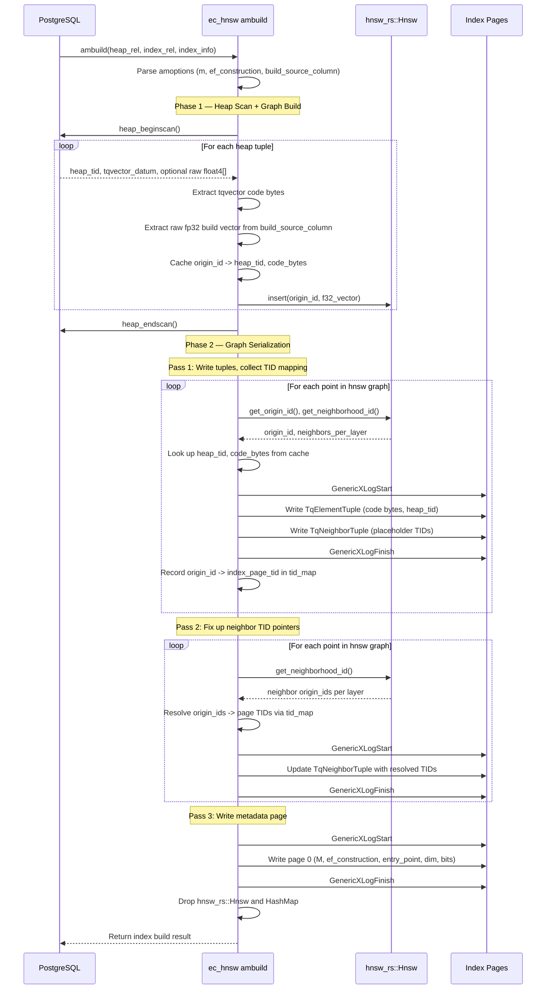

# FR-008: HNSW Index Access Method — Build
## Requirement

The extension SHALL implement the `ambuild`, `ambuildempty`, and `amoptions` callbacks for the `ec_hnsw` access method.

All build behavior SHALL be relation-local. On partitioned tables, a partition index build SHALL touch only the heap rows and index pages of that partition.

### Index Parameters — `amoptions`

The `amoptions` callback SHALL parse WITH clause parameters using `pg_sys::build_reloptions`:

| Parameter | Type | Default | Range | Description |
|---|---|---|---|---|
| `m` | int | 8 | 2–100 | Max neighbors per layer |
| `ef_construction` | int | 64 | 10–1000 | Build-time beam width |
| `build_source_column` | text | null | valid heap column name | Optional float4[] column used only during bulk build for high-quality graph construction |

Example:
```sql
CREATE INDEX ON memories USING ec_hnsw (tq_code) WITH (m = 8, ef_construction = 64);
```

If `build_source_column` is provided, it SHALL name a `float4[]` column in the heap relation. The index AM uses that column during `ambuild` only; the persisted index still stores only `tqvector` codes.

---

### `ambuild` — Bulk Index Build

Called by `CREATE INDEX ... USING ec_hnsw`. Uses the `hnsw_rs` crate for graph construction, then serializes the graph to Postgres pages.

#### Sequence Diagram



#### Phase 1: Heap Scan and Graph Construction

1. Read `(m, ef_construction)` from WITH clause via amoptions
2. Read `(dim, bits, seed)` from the first tqvector value encountered
3. Allocate a `HashMap<usize, (ItemPointerData, Vec<u8>)>` mapping origin_id → (heap TID, tqvector code bytes)
4. Scan the heap relation: for each row, extract the `tqvector` code bytes and, if configured, the raw fp32 embedding from a caller-supplied source column or expression
5. Insert each raw f32 vector into an `hnsw_rs::Hnsw<f32, TqBuildDistance>` instance, using the row's sequential number as `origin_id`
6. Cache `(heap_tid, tqvector_bytes)` in the HashMap keyed by origin_id

**Distance impl for hnsw_rs build:**

```rust
struct TqBuildDistance;

impl Distance<f32> for TqBuildDistance {
    fn eval(&self, va: &[f32], vb: &[f32]) -> f32 {
        // Standard f32 inner product (negated for distance)
        // Build uses raw f32 vectors, not compressed codes
        // This is acceptable: build is a one-time bulk operation
        -va.iter().zip(vb.iter()).map(|(a, b)| a * b).sum::<f32>()
    }
}
```

Build uses raw f32 vectors when they are available from the configured build input. This produces a higher-quality graph than building from lossy compressed distances. The `hnsw_rs` instance is dropped after graph extraction — it is never persisted or used at runtime.

If no raw-vector source is supplied, the implementation SHALL either:
- reject index build with a clear ERROR explaining that raw vectors are required for the selected build mode, or
- use an explicitly requested compressed-build mode whose lower recall target is documented separately.

The default behavior for v0.1 SHALL be to require a raw-vector source for bulk build.

#### Phase 2: Graph Serialization — Two-Pass Page Write

After `hnsw_rs` build completes, the graph is serialized to Postgres pages:

**Pass 1 — Write tuples, collect TID mapping:**

```
tid_map: HashMap<usize, ItemPointerData> = {}

for each point in hnsw.get_point_indexation():
    origin_id = point.get_origin_id()
    (heap_tid, code_bytes) = heap_cache[origin_id]
    neighbors_per_layer = point.get_neighborhood_id()

    page = get_or_extend_page(index)  // extend relation if current page full
    
    // Write TqElementTuple (with placeholder neighbor TID)
    elem_tid = write_element_tuple(page, heap_tid, code_bytes)
    
    // Write TqNeighborTuple (with placeholder neighbor TIDs)
    nbr_tid = write_neighbor_tuple(page, neighbors_per_layer.len())
    
    // Link element → neighbor
    set_element_neighbor_tid(elem_tid, nbr_tid)
    
    tid_map[origin_id] = elem_tid
```

**Pass 2 — Fix up neighbor TID pointers:**

```
for each point in hnsw.get_point_indexation():
    origin_id = point.get_origin_id()
    neighbors_per_layer = point.get_neighborhood_id()
    nbr_tuple = read_neighbor_tuple(tid_map[origin_id].neighbor_tid)
    
    for (layer, neighbors) in neighbors_per_layer:
        for neighbor in neighbors:
            nbr_origin_id = neighbor.d_id  // the neighbor's origin_id
            nbr_tuple.tids[layer][idx] = tid_map[nbr_origin_id]
```

The two-pass approach is necessary because a point's index page TID is not known until it has been written, but neighbor tuples reference TIDs of other points.

**Pass 3 — Write metadata page (page 0):**

Write M, ef_construction, entry point TID, dimensions.

All page writes in all three passes SHALL use GenericXLog (FR-011).

#### Phase completion

Drop the `hnsw_rs::Hnsw` instance and the heap cache HashMap. Report tuple count to Postgres.

---

### `ambuildempty` — Empty Index

Called for `CREATE INDEX` before any data exists:
- Write metadata page (page 0) with null entry point
- No element or neighbor pages

---

## Acceptance Criteria

### FR-008-AC-1: Bulk build populates graph
After `CREATE INDEX ... USING ec_hnsw` on a table with 1000 rows, the index SHALL contain 1000 element tuples.

### FR-008-AC-2: Crash safety
If the server crashes during ambuild, the partially-built index SHALL be automatically cleaned up on recovery (standard Postgres behavior for unfinished index builds).

### FR-008-AC-3: GenericXLog usage
Every page modification in ambuild SHALL be wrapped in GenericXLogStart/GenericXLogFinish.

### FR-008-AC-4: Two-pass TID correctness
After ambuild, every neighbor TID in every TqNeighborTuple SHALL point to a valid TqElementTuple.

### FR-008-AC-5: Build uses f32 distance
During ambuild in the default build mode, the hnsw_rs graph SHALL be constructed using f32 inner product distance from a supplied raw-vector source, not compressed code distance.

### FR-008-AC-6: amoptions validation
`WITH (m = 0)` SHALL raise ERROR. `WITH (m = 8, ef_construction = 64)` SHALL succeed.
