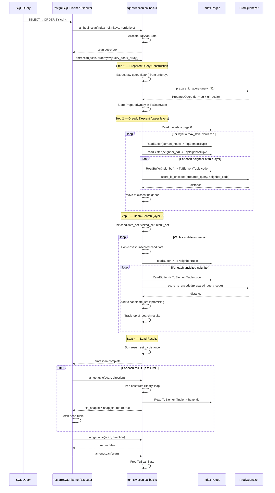

# FR-009: HNSW Index Access Method — Scan (Query)

## Requirement

The extension SHALL implement the scan callbacks for the `tqhnsw` access method: `ambeginscan`, `amrescan`, `amgettuple`, `amendscan`. All scan operations work directly on Postgres buffer pages — no `hnsw_rs` involvement.

On partitioned tables, a scan of a partition-local index SHALL traverse only that partition's index relation.

Implementation stages:
- Bootstrap stage: scan lifecycle, query validation, and a forward linear non-empty scan MAY exist as an intermediate implementation state for validating page decoding and tuple production.
- Target stage: planner-visible ordered search requires greedy descent, layer-0 traversal, `ef_search`, and distance-ordered result emission.
- Until the target stage is credible, the planner MAY be deliberately steered away from `tqhnsw` scans via `amcostestimate`.
- Current planner groundwork MAY resolve scan tuning (`ef_search`, source-of-truth, planner gate)
  before ordered execution is enabled, as long as the access method still returns prohibitive
  planner costs per ADR-011.
- Current planner groundwork MAY also expose read-only SQL/admin snapshot state for effective
  tuning and planner gate status before EXPLAIN or planner-visible scan selection are enabled.
- Current planner groundwork MAY also expose explain-oriented snapshot state that says ordered scan
  is not yet ready and explains why the planner gate remains in place.

### `ambeginscan`

Initialize scan state:
- Allocate `TqScanState` in the current memory context, containing:
  - `candidates: BinaryHeap<(OrderedFloat<f32>, ItemPointerData)>` — scored results
  - `first: bool` — whether amrescan has been called
  - `prepared_query: Option<PreparedQuery>` — pre-computed lookup table plus query-side QJL correction state

### `amrescan`

Execute the HNSW search on Postgres buffer pages:

#### Sequence Diagram



#### Step 1: Query preparation

1. Extract the raw query `float4[]` from the `orderbys` array (scan key)
2. Call `ProdQuantizer::prepare_ip_query` (FR-015) to rotate/project the raw query and build a `PreparedQuery`
3. Store the `PreparedQuery` in `TqScanState`

#### Step 2: Greedy descent (upper layers)

1. Read the entry point from metadata page (page 0)
2. Starting at the entry point's top layer, descend through layers:
   - At each layer, read the current node's TqNeighborTuple from the page
   - Score each neighbor using `score_ip_encoded` with the prepared query state (FR-015)
   - Move to the closest neighbor
   - Descend to the next layer when no closer neighbor is found

#### Step 3: Beam search (layer 0)

1. At layer 0, maintain a candidate set and a visited set
2. Initialize candidates with the node reached by greedy descent
3. While candidates remain:
   - Pop the closest unscored candidate
   - Read its TqNeighborTuple from the buffer page
   - For each unvisited neighbor: read its TqElementTuple, score using the prepared query state, add to candidate set
   - Track the `ef_search` best results in a separate result set
4. Stop when all candidates in the beam have been processed or the candidate set is exhausted

#### Step 4: Load results

Sort scored results by distance (ascending negative inner product) and load into `TqScanState.candidates` BinaryHeap.

### `amgettuple`

Return the next result:
1. Pop the next-best candidate from the BinaryHeap
2. Read the TqElementTuple to get the heap TID(s)
3. Set `scan->xs_heaptid` to the candidate's heap ctid
4. Set `scan->xs_recheck = false` because ordering is defined on the quantized estimator itself; no heap recheck of distance is required in v0.1
5. Return `true` if a candidate was returned, `false` when exhausted

### `amendscan`

Free `TqScanState`, including the prepared-query allocation and the BinaryHeap. All memory allocated in the scan memory context is freed automatically by Postgres, but explicit cleanup ensures no leaks in long-running sessions.

### `amcostestimate`

Inform the planner of expected costs:
- `startup_cost`: proportional to ef_search (beam search setup)
- `per_tuple_cost`: near-zero (results are pre-scored in amrescan)
- `index_selectivity`: based on LIMIT clause if available
- This enables the planner to choose between index scan and sequential scan

Current staged behavior:
- Before ordered traversal is complete, the implementation MAY return deliberately prohibitive costs so the planner does not select `tqhnsw`.
- This temporary planner gate is documented in `ADR-011`.

### Search-breadth control surface

The extension SHALL expose both:

- an index reloption `ef_search` as the per-index default
- a session GUC `tqhnsw.ef_search` as the planner/runtime override surface

The GUC is registered as:

| Property | Value |
|---|---|
| Name | `tqhnsw.ef_search` |
| Type | integer |
| Default | 40 |
| Range | 1–1000 |
| Context | `PGC_USERSET` (settable per-session) |

Registration via pgrx `GucRegistry::define_int_guc()` in `_PG_init`.

Precedence rules:

1. When `tqhnsw.ef_search` is set to a non-default value in the current session, it SHALL override
   the index reloption for planner/runtime tuning.
2. When the session GUC remains at its default value (`40`), the index reloption SHALL remain
   authoritative. This preserves per-index defaults without requiring a separate "unset" sentinel.
3. Ordered traversal and planner costing SHALL consume the same resolved `ef_search` value once
   planner-visible scans are enabled.

Usage:
```sql
SET tqhnsw.ef_search = 200;  -- higher recall, more distance calculations
SELECT * FROM memories ORDER BY tq_code <#> $query LIMIT 10;
```

Current staged behavior:

- The session GUC and reloption precedence model may be implemented before ordered traversal is
  wired through scan execution.
- Until that wiring lands, session overrides are planner/integration groundwork rather than a
  promise that the current planner-disabled bootstrap scan will change query behavior.

### Buffer Access Pattern

All page reads during scan use `ReadBuffer` + `LockBuffer(BUFFER_LOCK_SHARE)`. Pages are pinned only for the duration of reading a single tuple, then released immediately. This ensures scans do not hold excessive buffer pins and do not block concurrent writers.

## Acceptance Criteria

### FR-009-AC-1: Top-k results returned
`SELECT id FROM t ORDER BY col <#> $q LIMIT 10` SHALL return exactly 10 rows (given >= 10 rows in the table).

### FR-009-AC-2: Results ordered by distance
Results SHALL be ordered by ascending negative inner product (highest similarity first).

### FR-009-AC-3: Index scan used
EXPLAIN SHALL confirm an Index Scan using `tqhnsw`, not a sequential scan, when the index exists and the bootstrap-stage planner cost override has been removed.

### FR-009-AC-4: ef_search affects recall
Higher ef_search values SHALL produce higher recall at the cost of increased latency.

### FR-009-AC-5: GUC is session-settable
`SET tqhnsw.ef_search = 200` SHALL succeed and affect subsequent queries in the same session.

### FR-009-AC-6: No excessive buffer pins
During a scan of a 50K-row index, the maximum number of simultaneously pinned buffers SHALL be bounded (< 10).
