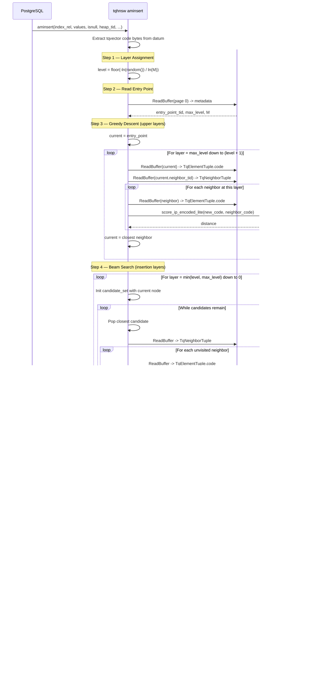

# FR-016: HNSW Index Access Method — Insert

## Requirement

The extension SHALL implement the `aminsert` callback for the `tqhnsw` access method.

All insert behavior SHALL be relation-local. On partitioned tables, a partition index insert SHALL touch only the heap rows and index pages of that partition.

### `aminsert` — Single Row Insert (Page-Level)

Called when a row is INSERTed into a table with an existing tqhnsw index. This does NOT use `hnsw_rs` — it operates directly on Postgres buffer pages and, in v0.1, uses compressed-domain scoring only.

`build_source_column` note:
- `build_source_column` is a bulk-build-only reloption in v0.1.
- Indexes created with `build_source_column` MAY use raw `float4[]` vectors during `ambuild`.
- `aminsert` does not accept a raw-vector insert path for those indexes in v0.1 and MAY reject live inserts until a compatible runtime contract exists.

#### Sequence Diagram

#### Algorithm

1. Extract tqvector code bytes from the inserted datum
2. Read the entry point from metadata page (page 0)
3. **Page-level greedy search** to find the insertion layer:
   - Start at the entry point's top layer
   - At each layer, follow neighbor links on pages, scoring each neighbor using code-to-code distance (`score_ip_encoded_lite` from FR-015)
   - Descend to lower layers, keeping the closest node found so far
4. **Page-level beam search** at the insertion layer and below:
   - Maintain a candidate set (BinaryHeap) of size `ef_construction`
   - For each candidate, read its TqNeighborTuple from the page, score each unvisited neighbor
   - Continue until the candidate set is exhausted
   - Select the top M (or 2M at layer 0) neighbors from the candidate set
5. **Allocate new tuples:**
   - Find a page with enough free space, or extend the relation
   - Write new TqElementTuple with the code bytes and heap TID
   - Write new TqNeighborTuple with the selected neighbor TIDs
6. **Update back-links:** for each selected neighbor, read their TqNeighborTuple and add the new point's TID to their neighbor list (pruning the weakest connection if at capacity M)
7. **Update entry point** if the new point is assigned to a higher layer than the current entry point
8. All page reads use `ReadBuffer`, all writes use GenericXLog

#### Quality contract for online inserts

- Online insert uses compressed-domain search and pruning, so graph quality is expected to be lower than a raw-f32 bulk build.
- The implementation SHALL document this as a deliberate tradeoff for runtime cost.
- The implementation SHALL expose index statistics sufficient to determine the fraction of nodes inserted since the last bulk build or REINDEX.
- At minimum, the metadata accessible to SQL or page-inspection tooling SHALL include:
  - total live node count in the index
  - number of nodes inserted since the last bulk build or REINDEX
  - the derived insert-drift fraction `inserted_since_rebuild / total_live_nodes`
- Recall targets in NFR-003 apply to freshly bulk-built indexes. A separate benchmark profile SHALL measure recall drift after incremental inserts.

Current staged behavior:
- `tqhnsw_index_admin_snapshot(regclass)` now exposes total live node count,
  `inserted_since_rebuild`, derived `insert_drift_fraction`, effective `ef_search`, and the
  current planner-gate state for a `tqhnsw` index.
- That snapshot now satisfies the observability portion of FR-016-AC-4.
- Full-slice backlink rewrites now retry through bounded read-only replanning when the live layer
  drifts before the page rewrite, keeping metadata-last lock ordering intact while avoiding
  silent skip-on-drift behavior.

#### Layer Assignment

The new point's layer is drawn from the geometric distribution: `floor(-ln(random()) * (1 / ln(M)))`, matching the standard HNSW layer probability.

## Acceptance Criteria

### FR-016-AC-1: Insert updates graph
After inserting a new row into an indexed table, the new vector SHALL be reachable via HNSW search.

### FR-016-AC-2: GenericXLog usage
Every page modification in aminsert SHALL be wrapped in GenericXLogStart/GenericXLogFinish.

### FR-016-AC-3: No deadlock under concurrent insert
Concurrent inserts SHALL not deadlock when page locks are acquired in the protocol defined by FR-007.

### FR-016-AC-4: Recall drift is measurable
The implementation SHALL expose queryable statistics that identify total live nodes and nodes inserted since the last bulk build or REINDEX, so recall drift checkpoints can be measured as incremental inserts accumulate after bulk build.
