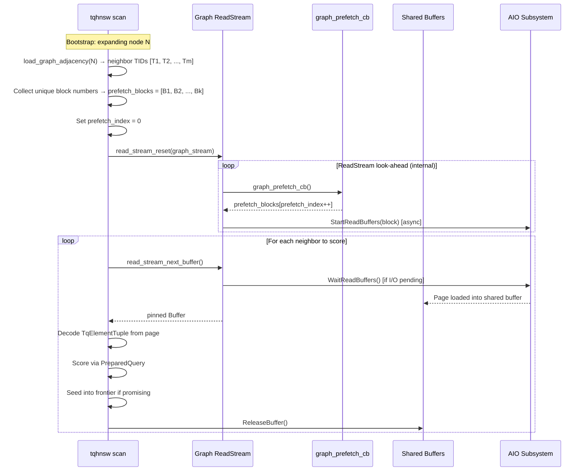
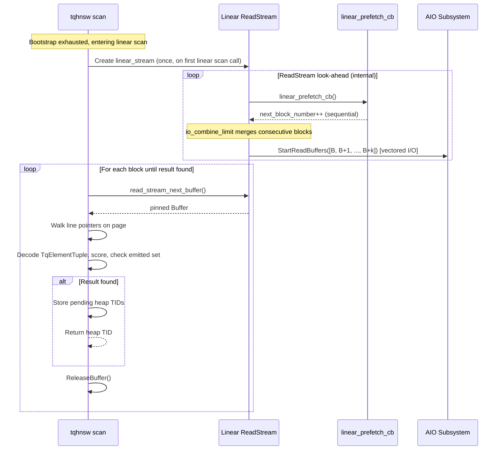

# FR-019: Async I/O — ReadStream Integration

## Requirement

On PostgreSQL 18, the extension SHALL replace synchronous `ReadBufferExtended` calls in scan and vacuum hot paths with the PG18 `read_stream` API, enabling transparent async I/O via the configured `io_method` (sync, worker, or io_uring). On PostgreSQL 17 and earlier, the extension SHALL fall back to the existing synchronous path.

Current staged behavior:
- Before PostgreSQL 18 support exists in this repository, pure ReadStream-scaffolding helpers MAY
  expose the intended graph-stream mode (`READ_STREAM_DEFAULT`), linear-stream mode
  (`READ_STREAM_SEQUENTIAL`), and their random-versus-sequential access patterns.
- Read-only snapshot helpers MAY also report that PG18 ReadStream callback surfaces, scan wiring,
  and vacuum wiring all remain unavailable.
- Those helpers SHALL stay descriptive only; they do not imply that any scan or vacuum path
  currently uses `read_stream_next_buffer()` on PG17.

### Architecture

The scan maintains **two independent ReadStream instances** with different I/O profiles:

| Stream | Access Pattern | Flag | Lifetime | Purpose |
|---|---|---|---|---|
| Graph stream | Random | `READ_STREAM_DEFAULT` | `amrescan` → `amendscan` | Prefetch neighbor element pages during bootstrap traversal |
| Linear stream | Sequential | `READ_STREAM_SEQUENTIAL` | First linear scan call → `amendscan` | Prefetch consecutive index pages during fallback scan |

Both streams use `NULL` for `BufferAccessStrategy` (no ring buffer — index scans should not pollute the buffer pool).

### ReadStream Callback Model

```
┌──────────────────────────────────────────────────────────┐
│                     ReadStream                           │
│                                                          │
│  ┌──────────┐    ┌──────────┐    ┌──────────┐           │
│  │ Callback │───▶│ Prefetch │───▶│  Buffer  │           │
│  │ returns  │    │  Queue   │    │  Ring    │           │
│  │ BlockNum │    │(io_combine│    │(pinned)  │           │
│  └──────────┘    │  _limit) │    └────┬─────┘           │
│                  └──────────┘         │                  │
│                                       ▼                  │
│                              read_stream_next_buffer()   │
│                              returns pinned Buffer       │
└──────────────────────────────────────────────────────────┘
```

The `ReadStream` calls the callback ahead of time to build a prefetch queue. Consecutive block numbers are merged into combined I/O operations (up to `io_combine_limit` pages per op). The underlying I/O method is transparent to the caller.

### Graph Stream — Neighbor Prefetch

#### Sequence Diagram



#### Callback State

```rust
struct GraphPrefetchState {
    blocks: Vec<u32>,    // block numbers to prefetch
    index: usize,        // current position
}
```

The callback is stateless and fast — it simply returns `blocks[index++]` or `InvalidBlockNumber` when exhausted.

#### Integration Point

Replace the inner loop of `refill_candidate_frontier_from_source()` (scan.rs:694-716). Currently each neighbor is loaded via:
```
graph::load_graph_element(index_relation, neighbor_tid, code_len)
  → read_page_tuple_bytes(index_relation, neighbor_tid)
    → ReadBufferExtended(..., RBM_NORMAL, ...)
    → LockBuffer(BUFFER_LOCK_SHARE)
    → copy bytes
    → UnlockReleaseBuffer
```

With read_stream, the `ReadBufferExtended` + `LockBuffer` calls are replaced by `read_stream_next_buffer()`, which returns a pre-fetched, pinned buffer. The caller still calls `LockBuffer(BUFFER_LOCK_SHARE)` for the lock and `UnlockReleaseBuffer` when done.

### Linear Stream — Sequential Prefetch

#### Sequence Diagram



#### Callback State

```rust
struct LinearPrefetchState {
    next_block: u32,
    max_block: u32,
}
```

The callback returns `next_block++` until `max_block`, then `InvalidBlockNumber`.

### Vacuum Stream — Sequential Prefetch

`count_element_tuples()` (shared.rs:142-188) scans all data blocks sequentially. On PG18, this SHALL use the same linear streaming pattern as the scan fallback. This benefits VACUUM and `amvacuumcleanup` statistics collection.

### TqScanOpaque Extensions

```rust
// Added to TqScanOpaque for PG18:
#[cfg(feature = "pg18")]
pub(super) graph_read_stream: *mut pg_sys::ReadStream,
#[cfg(feature = "pg18")]
pub(super) linear_read_stream: *mut pg_sys::ReadStream,
#[cfg(feature = "pg18")]
pub(super) graph_prefetch_state: *mut GraphPrefetchState,
#[cfg(feature = "pg18")]
pub(super) linear_prefetch_state: *mut LinearPrefetchState,
```

### Lifecycle

| Event | Graph Stream | Linear Stream |
|---|---|---|
| `amrescan` | Created via `read_stream_begin_relation()` | Not yet created |
| Bootstrap expand | `read_stream_reset()` per expansion | — |
| First linear scan call | — | Created via `read_stream_begin_relation()` |
| `amendscan` | `read_stream_end()` | `read_stream_end()` |

### PG Version Compatibility

```rust
#[cfg(feature = "pg18")]
fn read_neighbor_pages_streaming(...) { /* read_stream path */ }

#[cfg(not(feature = "pg18"))]
fn read_neighbor_pages_sync(...) { /* ReadBufferExtended path */ }
```

The dispatch is compile-time via Cargo features, not runtime. This avoids any overhead on PG17.

### Performance Characteristics

| Scenario | Sync (PG17) | Streaming (PG18) | Improvement |
|---|---|---|---|
| Cold-cache graph traversal (m=16) | ~74ms | ~19ms | **~4x** |
| Hot-cache graph traversal | ~5ms | ~5ms | Negligible |
| Cold-cache linear scan (1000 pages) | Sequential | Vectored I/O | **2-3x** |

(Sync baseline and streaming estimates from Munro's pgvector prototype with similar HNSW structure.)

### Design Constraints

1. The callback SHALL NOT perform I/O, allocation, or complex computation — it returns the next block number from a pre-populated list
2. `read_stream_reset()` resets the adaptive readahead distance to 1. If neighbor batch sizes are consistent, the stream ramps back up within 2-3 batches. If this proves problematic, the implementation MAY use `read_stream_pause()`/`read_stream_resume()` instead
3. The graph stream and linear stream SHALL be independent instances — they serve different I/O patterns and SHALL NOT share adaptive distance state
4. All buffers returned by `read_stream_next_buffer()` SHALL be released via `UnlockReleaseBuffer()` before the next call, matching the current pin discipline

## Acceptance Criteria

### FR-019-AC-1: PG18 scan uses ReadStream
On PG18, `amgettuple` SHALL NOT call `ReadBufferExtended` directly during the bootstrap or linear scan phases. All page reads SHALL go through `read_stream_next_buffer()`.

### FR-019-AC-2: PG17 fallback unchanged
On PG17, scan behavior SHALL be identical to the pre-FR-019 implementation. No `read_stream` calls SHALL be present in the compiled binary.

### FR-019-AC-3: Cold-cache improvement measurable
On PG18 with `io_method=worker` and `effective_io_concurrency=16`, cold-cache HNSW top-10 query latency SHALL be measurably lower than with `effective_io_concurrency=0` on the same dataset.

### FR-019-AC-4: No buffer pin leaks
After `amendscan`, zero buffers from the graph or linear stream SHALL remain pinned. `read_stream_end()` SHALL be called for both streams.

### FR-019-AC-5: Vacuum uses streaming reads
On PG18, `count_element_tuples()` SHALL use a sequential `ReadStream` instead of per-page `ReadBufferExtended`.

## References

- PG source: `src/include/storage/read_stream.h` — `ReadStreamBlockNumberCB` callback type, `read_stream_begin_relation()`, `read_stream_next_buffer()`, stream flags (`READ_STREAM_DEFAULT`, `READ_STREAM_SEQUENTIAL`, `READ_STREAM_FULL`)
- PG source: `src/backend/storage/aio/read_stream.c` — adaptive prefetch implementation, `read_stream_look_ahead()` internals, combined I/O via `io_combine_limit`, fast-path for cached pages
- PG source: `src/backend/storage/aio/README` — AIO subsystem design document, io_method architecture
- [Thomas Munro: read_stream prototype on pgvector HNSW — pgsql-hackers (June 2024)](https://www.mail-archive.com/pgsql-hackers@lists.postgresql.org/msg171681.html) — callback pattern for HNSW neighbor prefetch, benchmark results (73ms → 19ms), `reset_distance` issue
- [Thomas Munro: Follow-up with patches](https://www.mail-archive.com/pgsql-hackers@lists.postgresql.org/msg178397.html) — `read_stream_reset()` distance regression analysis, HNSW burst-pattern workarounds
- [BitmapHeapScan read_stream conversion — pgsql-committers](https://www.mail-archive.com/pgsql-committers@lists.postgresql.org/msg39237.html) — reference for converting an existing synchronous scan to `read_stream`
- [Waiting for Postgres 18: Accelerating Disk Reads with Async I/O — pganalyze](https://pganalyze.com/blog/postgres-18-async-io) — high-level architecture, `io_method` comparison, GUC tuning
- [PostgreSQL 18 AIO Deep Dive — credativ](https://www.credativ.de/en/blog/postgresql-en/postgresql-18-asynchronous-disk-i-o-deep-dive-into-implementation/) — `StartReadBuffers`/`WaitReadBuffers` internals, io_uring ring buffer model
- [PostgreSQL AIO Wiki](https://wiki.postgresql.org/wiki/AIO) — design overview, which operations use AIO today vs roadmap
