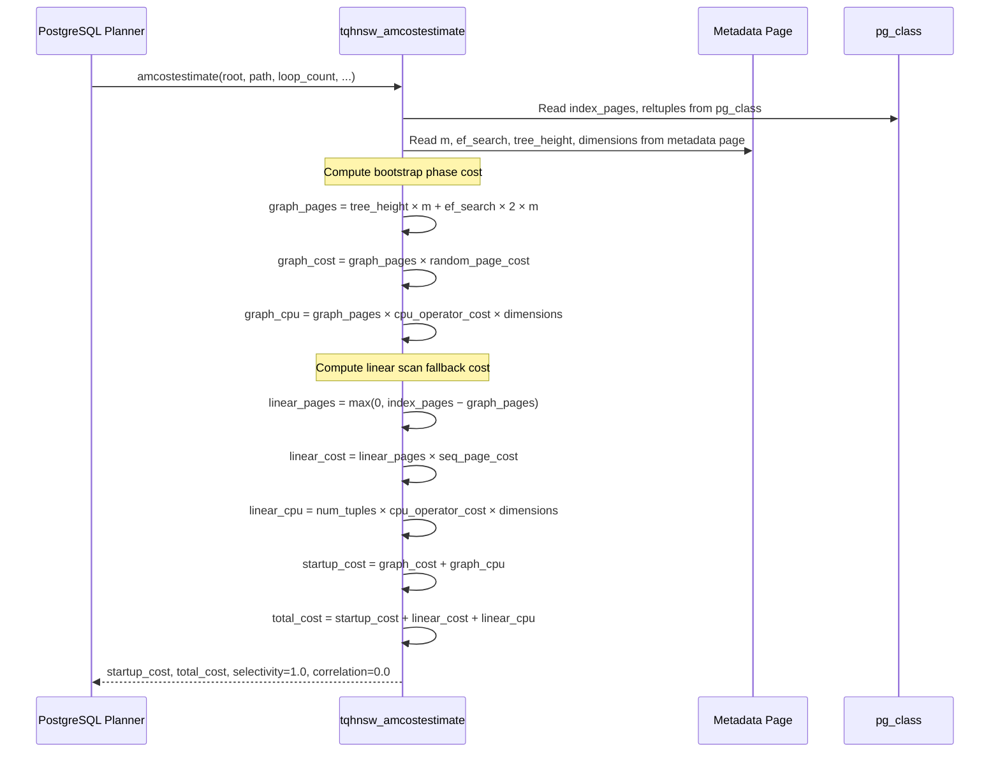

# FR-020: Planner Cost Estimation

## Requirement

The extension SHALL implement a production-ready `amcostestimate` callback that provides realistic cost estimates to the PostgreSQL query planner, replacing the current `f64::MAX` override (ADR-011). On PG18, the extension SHALL additionally implement `amgettreeheight` to report the HNSW graph height for planner refinement.

Current staged behavior:
- A pure cost-model helper MAY exist and be unit-tested behind ADR-011 while the live
  `amcostestimate` callback still returns prohibitive costs to keep planner-visible `tqhnsw` scans
  disabled.
- Read-only planner-cost snapshot helpers MAY expose both the modeled FR-020 estimate and the
  still-gated live callback contract for inspection, without changing planner behavior.
- Until PostgreSQL 18 support exists in the build/toolchain surface, staged planner-cost helpers
  MAY source `tree_height` from metadata-page `max_level` explicitly and report that this is a
  metadata fallback rather than a live `amgettreeheight` callback result.

### Cost Model

```
┌─────────────────────────────────────────────────────────────────┐
│                    tqhnsw Cost Model                            │
│                                                                 │
│  Inputs:                                                        │
│    index_pages    = RelationGetNumberOfBlocks(index)             │
│    num_tuples     = index.reltuples                              │
│    m              = index reloption                              │
│    ef_search      = index reloption (or GUC)                    │
│    tree_height    = amgettreeheight() [PG18] or max_level        │
│    dimensions     = from metadata page                          │
│                                                                 │
│  Phase 1 — Graph Traversal (bootstrap):                         │
│    graph_pages = tree_height * m                                │
│                + ef_search * 2 * m    [layer-0 beam search]     │
│    graph_cost  = graph_pages * random_page_cost                 │
│    graph_cpu   = graph_pages * cpu_operator_cost * dimensions   │
│                                                                 │
│  Phase 2 — Linear Scan (fallback):                              │
│    linear_pages = max(0, index_pages - graph_pages)             │
│    linear_cost  = linear_pages * seq_page_cost                  │
│    linear_cpu   = num_tuples * cpu_operator_cost * dimensions   │
│                                                                 │
│  Outputs:                                                       │
│    startup_cost = graph_cost + graph_cpu                        │
│    total_cost   = startup_cost + linear_cost + linear_cpu       │
│    selectivity  = 1.0   (ORDER BY returns all rows)             │
│    correlation  = 0.0   (no heap correlation)                   │
│    index_pages  = RelationGetNumberOfBlocks(index)              │
└─────────────────────────────────────────────────────────────────┘
```

### Sequence Diagram



### `amgettreeheight` (PG18)

On PG18, the extension SHALL register the `amgettreeheight` callback in `IndexAmRoutine`:

```rust
amroutine.amgettreeheight = Some(tqhnsw_amgettreeheight);
```

Implementation:
1. Read the metadata page (block 0) with `BUFFER_LOCK_SHARE`
2. Return `metadata.max_level as i32`
3. The planner caches this in `IndexOptInfo.tree_height` and passes it to `amcostestimate`

For HNSW, `tree_height` corresponds to the number of hierarchical layers. A typical 50K-row index with m=8 has `max_level` ≈ 3-4.

### LIMIT-Aware Optimization

When the planner provides a `LIMIT` clause (accessible via `path->indexinfo`), the cost model MAY reduce `total_cost` proportionally. With LIMIT k:
- If k ≤ ef_search, the linear scan phase may be skipped entirely, and `total_cost ≈ startup_cost`
- The planner already handles this partially via its own selectivity estimates, but the AM can provide better hints

### Comparison with Sequential Scan

The planner compares index scan cost against sequential scan cost. For tqhnsw:
- Small tables (< 100 rows): sequential scan is cheaper — the planner should prefer it
- Large tables (> 10K rows): index scan startup cost is amortized — the planner should prefer HNSW
- The crossover point depends on `m`, `ef_search`, and table size

### Error Conditions

| Condition | Behavior |
|---|---|
| Empty index (0 data pages) | Return `f64::MAX` startup and total cost — force planner to prefer sequential scan |
| Metadata page unreadable | `ereport(ERROR)` — index is corrupt, cannot estimate |
| `max_level = 0` (no graph layers) | Treat as linear-only scan: `startup_cost = 0`, `total_cost = index_pages × seq_page_cost` |
| `dimensions = 0` in metadata | `ereport(ERROR)` — invalid index metadata |
| `reltuples = 0` (ANALYZE not run) | Use `index_pages × 10` as tuple estimate (same heuristic as btree) |

## Acceptance Criteria

### FR-020-AC-1: Planner selects index
On a 10K-row table with a tqhnsw index, `EXPLAIN SELECT ... ORDER BY col <#> $q LIMIT 10` SHALL show "Index Scan using tqhnsw".

### FR-020-AC-2: Planner prefers seqscan for small tables
On a 50-row table with a tqhnsw index, the planner MAY prefer sequential scan (cost model correctly identifies the crossover).

### FR-020-AC-3: Cost model uses metadata
The cost model SHALL read `m`, `ef_search`, `dimensions`, and `max_level` from the index metadata page — not use hardcoded defaults.

### FR-020-AC-4: amgettreeheight reports max_level
On PG18, `amgettreeheight` SHALL return the `max_level` value from the metadata page.

### FR-020-AC-5: ADR-011 superseded
After implementation, the deliberate `f64::MAX` cost override SHALL be removed and ADR-011 SHALL be marked as superseded.

## References

- PG source: `src/include/access/amapi.h` — `amgettreeheight_function` typedef, `amcostestimate` callback signature
- PG source: `src/backend/optimizer/util/plancat.c` — `get_relation_info()` calls `amgettreeheight`, stores result in `IndexOptInfo.tree_height`
- PG source: `src/backend/access/nbtree/nbtree.c` — `btgettreeheight()` reference implementation (reads btree metapage)
- PG source: `src/backend/access/nbtree/nbtcostestimate.c` — `btcostestimate()` reference for how tree_height feeds into I/O cost estimation
- pgvector source: `src/hnswscan.c` — pgvector's HNSW cost estimation for comparison
