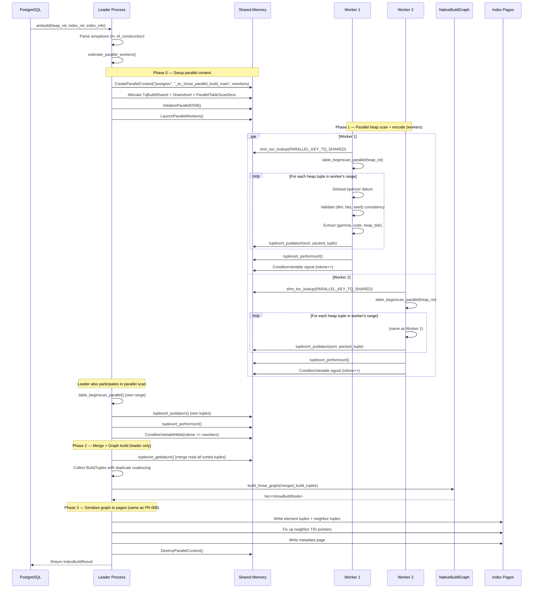

# FR-021: Parallel Index Build

## Requirement

The extension SHALL support parallel index build by parallelizing the heap scan and tqvector validation phase across multiple PostgreSQL background workers, following the GIN parallel build pattern introduced in PG18. Graph construction remains serial on the leader process.

### Architecture

```
┌─────────────────────────────────────────────────────────────────────────┐
│                        Parallel Build Architecture                      │
│                                                                         │
│  ┌──────────────────────────────────────────────────────────────────┐   │
│  │                        Shared Memory                             │   │
│  │  ┌──────────────┐  ┌──────────────┐  ┌──────────────────────┐   │   │
│  │  │ TqBuildShared │  │  Sharedsort  │  │ ParallelTableScan    │   │   │
│  │  │  heaprelid    │  │  (sorted     │  │  Desc                │   │   │
│  │  │  indexrelid   │  │   tuples)    │  │  (coordinated scan)  │   │   │
│  │  │  ndone=0      │  │              │  │                      │   │   │
│  │  │  reltuples    │  │              │  │                      │   │   │
│  │  │  cv           │  │              │  │                      │   │   │
│  │  └──────────────┘  └──────────────┘  └──────────────────────┘   │   │
│  └──────────────────────────────────────────────────────────────────┘   │
│                                                                         │
│  ┌──────────┐  ┌──────────┐  ┌──────────┐         ┌──────────────┐     │
│  │ Worker 1 │  │ Worker 2 │  │ Worker N │         │   Leader     │     │
│  │          │  │          │  │          │         │              │     │
│  │ parallel │  │ parallel │  │ parallel │  ──cv──▶│ merge sort   │     │
│  │ heap     │  │ heap     │  │ heap     │         │ build graph  │     │
│  │ scan +   │  │ scan +   │  │ scan +   │         │ write pages  │     │
│  │ detoast  │  │ detoast  │  │ detoast  │         │              │     │
│  │ validate │  │ validate │  │ validate │         │              │     │
│  │    ↓     │  │    ↓     │  │    ↓     │         │              │     │
│  │ write to │  │ write to │  │ write to │         │              │     │
│  │ sort     │  │ sort     │  │ sort     │         │              │     │
│  └──────────┘  └──────────┘  └──────────┘         └──────────────┘     │
└─────────────────────────────────────────────────────────────────────────┘
```

### Parallel Build Sequence



### Shared Memory Layout

```
┌─────────────────────────────────────────────────────┐
│ Key                          │ Content               │
│─────────────────────────────┼───────────────────────│
│ PARALLEL_KEY_TQ_SHARED      │ TqBuildShared struct   │
│ PARALLEL_KEY_TUPLESORT       │ Sharedsort handle     │
│ PARALLEL_KEY_QUERY_TEXT      │ Query string (debug)  │
│ PARALLEL_KEY_WAL_USAGE       │ Per-worker WalUsage   │
│ PARALLEL_KEY_BUFFER_USAGE    │ Per-worker BufferUsage│
└─────────────────────────────────────────────────────┘
```

### TqBuildShared Structure

```rust
#[repr(C)]
struct TqBuildShared {
    heaprelid: pg_sys::Oid,
    indexrelid: pg_sys::Oid,
    isconcurrent: bool,
    dimensions: u16,           // validated by first worker, checked by all
    bits: u8,
    seed: u64,
    mutex: pg_sys::slock_t,
    workersdonecv: pg_sys::ConditionVariable,
    nparticipantsdone: i32,
    reltuples: f64,
    indtuples: f64,
    // ParallelTableScanDescData follows
}
```

### Worker Entry Point

```rust
#[no_mangle]
pub extern "C" fn _ec_hnsw_parallel_build_main(
    seg: *mut pg_sys::dsm_segment,
    toc: *mut pg_sys::shm_toc,
) {
    // 1. Lookup shared state from TOC
    // 2. Open heap/index relations
    // 3. Begin parallel table scan
    // 4. For each tuple: detoast, validate, write to shared sort
    // 5. Perform local sort
    // 6. Signal completion via ConditionVariable
}
```

### Sort Key Design

Tuples are sorted by encoded code bytes for efficient duplicate coalescing during the leader's merge phase. The sort datum is a packed representation:

```
[gamma: 4 bytes][code: code_len bytes][heap_tid: 6 bytes]
```

### Graph Construction (Serial)

After the merge read, the leader constructs the HNSW graph using the same
native `build_hnsw_graph(...)` path as the current serial build (FR-008). The
graph construction is CPU-bound, not I/O-bound, and remains leader-only today
because `amcanbuildparallel` is still `false` and the native builder has not
yet been parallelized.

### Worker Count Estimation

```rust
fn estimate_parallel_workers(heap_rel: Relation) -> i32 {
    let heap_pages = RelationGetNumberOfBlocks(heap_rel);
    let min_pages_per_worker = 1000;
    let max_workers = max_parallel_maintenance_workers;

    let workers = (heap_pages / min_pages_per_worker).min(max_workers);
    workers.max(0) as i32
}
```

### Fallback

If `max_parallel_maintenance_workers = 0` or the table is too small for parallelism, the build falls back to the serial path (FR-008) with no overhead.

### Error Conditions

| Condition | Behavior |
|---|---|
| Worker crashes (SIGKILL, OOM) | Leader detects via `WaitForParallelWorkersToAttach`/`WaitForParallelWorkersToFinish`. Remaining workers continue; leader merges whatever tuples were committed to shared sort. If all workers fail, leader falls back to serial build. |
| Shared memory exhaustion (`dsm_create` fails) | Fall back to serial build (FR-008). Log via `ereport(LOG)`. |
| Dimension mismatch across heap tuples | First worker sets `dimensions`/`bits`/`seed` in `TqBuildShared` under mutex. Subsequent workers validate against shared values. Mismatch → `ereport(ERROR, "inconsistent tqvector dimensions")`. |
| Corrupt tqvector datum (detoast fails) | Worker skips the tuple with `ereport(WARNING)` and continues. The skipped tuple is not included in the index. |
| `maintenance_work_mem` too low for sort | `tuplesort` spills to disk automatically — no special handling needed. Performance degrades but correctness is maintained. |

## Acceptance Criteria

### FR-021-AC-1: Parallel workers used
With `max_parallel_maintenance_workers = 4` on a 100K-row table, `CREATE INDEX USING ec_hnsw` SHALL launch parallel workers.

### FR-021-AC-2: Correctness
The index produced by parallel build SHALL be structurally identical (same element count, same graph connectivity, same recall) to a serial build on the same data.

### FR-021-AC-3: Speedup
Parallel build with 4 workers SHALL complete in ≤ 60% of serial build time on a 100K-row table (measured on representative hardware).

### FR-021-AC-4: Concurrent build
`CREATE INDEX CONCURRENTLY ... USING ec_hnsw ...` SHALL work correctly with parallel workers.

### FR-021-AC-5: Small table fallback
On a 100-row table, the build SHALL fall back to serial execution without launching workers.

### FR-021-AC-6: GenericXLog safety
All page writes during the leader's graph serialization phase SHALL use GenericXLog, identical to the serial build path.

## References

- PG source: `src/backend/access/gin/gininsert.c` — `_gin_begin_parallel()`, `_gin_parallel_build_main()`, `GinBuildShared` struct, shared memory TOC keys, `ConditionVariable` signaling pattern
- PG source: `src/backend/access/gin/ginutil.c` — `amcanbuildparallel = true` in GIN's `IndexAmRoutine`
- PG source: `src/include/access/parallel.h` — `CreateParallelContext()`, `LaunchParallelWorkers()`, `InitializeParallelDSM()`
- PG source: `src/include/utils/tuplesort.h` — `Sharedsort`, `tuplesort_begin_*` with `SortCoordinate`, `tuplesort_attach_shared()`
- PG source: `src/include/storage/condition_variable.h` — `ConditionVariable` for worker-to-leader completion signaling
- PG source: `src/backend/access/nbtree/nbtsort.c` — btree parallel build (older reference implementation using same infrastructure)
