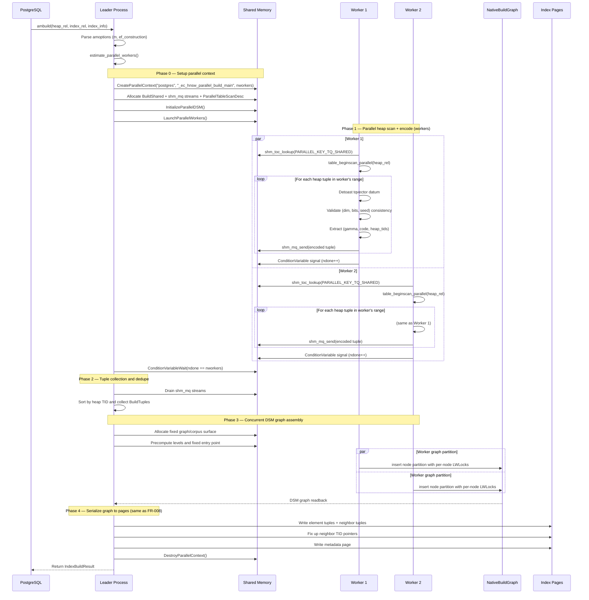

# FR-021: Parallel Index Build

## Requirement

The extension SHALL support parallel index build by parallelizing eligible
`ec_hnsw` build work across multiple PostgreSQL background workers. The build
uses PostgreSQL parallel build infrastructure for heap ingestion and the
ADR-048 concurrent DSM graph assembly path for default PG18 HNSW graph
construction.

### Architecture

Current implementation note: the heap-ingestion coordinator and the graph
assembly coordinator are separate stages. The heap-ingestion stage still uses
per-worker `shm_mq` streams to collect encoded tuples into the leader's build
state. The default PG18 graph assembly stage then uses a DSM-resident graph
surface with per-node LWLocks and worker node partitions. The serial-leader
graph path remains available through
`ec_hnsw.enable_parallel_build_concurrent_dsm = off` as a diagnostic fallback.

```
┌─────────────────────────────────────────────────────────────────────────┐
│                        Parallel Build Architecture                      │
│                                                                         │
│  ┌──────────────────────────────────────────────────────────────────┐   │
│  │                        Shared Memory                             │   │
│  │  ┌──────────────┐  ┌──────────────┐  ┌──────────────────────┐   │   │
│  │  │ BuildShared   │  │  shm_mq      │  │ ParallelTableScan    │   │   │
│  │  │  heaprelid    │  │  tuple       │  │  Desc                │   │   │
│  │  │  indexrelid   │  │   tuples)    │  │  (coordinated scan)  │   │   │
│  │  │  ndone=0      │  │  streams     │  │                      │   │   │
│  │  │  reltuples    │  │              │  │                      │   │   │
│  │  │  cv           │  │              │  │                      │   │   │
│  │  └──────────────┘  └──────────────┘  └──────────────────────┘   │   │
│  └──────────────────────────────────────────────────────────────────┘   │
│                                                                         │
│  ┌──────────┐  ┌──────────┐  ┌──────────┐         ┌──────────────┐     │
│  │ Worker 1 │  │ Worker 2 │  │ Worker N │         │   Leader     │     │
│  │          │  │          │  │          │         │              │     │
│  │ parallel │  │ parallel │  │ parallel │  ──mq──▶│ collect      │     │
│  │ heap     │  │ heap     │  │ heap     │         │ tuples       │     │
│  │ scan +   │  │ scan +   │  │ scan +   │         │ write pages  │     │
│  │ detoast  │  │ detoast  │  │ detoast  │         │              │     │
│  │ validate │  │ validate │  │ validate │         │              │     │
│  │    ↓     │  │    ↓     │  │    ↓     │         │              │     │
│  │ send via │  │ send via │  │ send via │         │ DSM graph    │     │
│  │ shm_mq   │  │ shm_mq   │  │ shm_mq   │         │ assembly     │     │
│  └──────────┘  └──────────┘  └──────────┘         └──────────────┘     │
└─────────────────────────────────────────────────────────────────────────┘
```

### Parallel Build Sequence



### Shared Memory Layout

```
┌─────────────────────────────────────────────────────┐
│ Key                          │ Content               │
│─────────────────────────────┼───────────────────────│
│ PARALLEL_KEY_TQ_SHARED      │ BuildShared struct     │
│ worker queue keys           │ shm_mq tuple streams   │
│ PARALLEL_KEY_QUERY_TEXT      │ Query string (debug)  │
│ PARALLEL_KEY_WAL_USAGE       │ Per-worker WalUsage   │
│ PARALLEL_KEY_BUFFER_USAGE    │ Per-worker BufferUsage│
│ graph key                   │ DSM graph/corpus area  │
└─────────────────────────────────────────────────────┘
```

### TqBuildShared Structure

```rust
#[repr(C)]
struct TqBuildShared {
    heaprelid: pg_sys::Oid,
    indexrelid: pg_sys::Oid,
    isconcurrent: bool,
    dimensions: u16,           // validated by first worker, checked by all
    bits: u8,
    seed: u64,
    mutex: pg_sys::slock_t,
    workersdonecv: pg_sys::ConditionVariable,
    nparticipantsdone: i32,
    reltuples: f64,
    indtuples: f64,
    // ParallelTableScanDescData follows
}
```

### Worker Entry Point

```rust
#[no_mangle]
pub extern "C" fn _ec_hnsw_parallel_build_main(
    seg: *mut pg_sys::dsm_segment,
    toc: *mut pg_sys::shm_toc,
) {
    // 1. Lookup shared state from TOC
    // 2. Open heap/index relations
    // 3. Begin parallel table scan
    // 4. For each tuple: detoast, validate, send via shm_mq
    // 5. Perform local sort
    // 6. Signal completion via ConditionVariable
}
```

### Tuple Ordering

Encoded tuples are collected by the leader and sorted by heap TID before they
are pushed into build state. Duplicate heap entries are coalesced during this
stage. The worker message payload is a packed representation:

```
[gamma: 4 bytes][code: code_len bytes][heap_tid: 6 bytes]
```

### Graph Construction (Concurrent DSM)

After tuple collection, eligible PG18 builds use ADR-048 concurrent DSM graph
assembly by default. The leader pre-computes node levels, chooses the fixed
entry point, allocates the compact code/source corpus and graph arrays in DSM,
and launches workers over node-index partitions. Each participant uses
worker-local search scratch, reads neighbor slots under shared `LWLock`, and
writes forward/backlink slots under exclusive `LWLock`.

The serial native graph builder remains available as a diagnostic fallback and
for build shapes that cannot use the DSM graph surface.

### Worker Count Estimation

```rust
fn estimate_parallel_workers(heap_rel: Relation) -> i32 {
    let heap_pages = RelationGetNumberOfBlocks(heap_rel);
    let min_pages_per_worker = 1000;
    let max_workers = max_parallel_maintenance_workers;

    let workers = (heap_pages / min_pages_per_worker).min(max_workers);
    workers.max(0) as i32
}
```

### Fallback

If `max_parallel_maintenance_workers = 0`, the table is too small for
parallelism, DSM allocation fails, or the diagnostic concurrent-DSM GUC is
disabled, the build falls back to the serial graph path (FR-008).

### Error Conditions

| Condition | Behavior |
|---|---|
| Worker crashes (SIGKILL, OOM) | Leader detects via `WaitForParallelWorkersToAttach`/`WaitForParallelWorkersToFinish`. The build aborts or falls back according to PostgreSQL parallel build error handling. |
| Shared memory exhaustion (`dsm_create` fails) | Fall back to serial build (FR-008) when possible. Log via `ereport(LOG)`. |
| Dimension mismatch across heap tuples | First worker sets `dimensions`/`bits`/`seed` in `TqBuildShared` under mutex. Subsequent workers validate against shared values. Mismatch → `ereport(ERROR, "inconsistent tqvector dimensions")`. |
| Corrupt tqvector datum (detoast fails) | Worker skips the tuple with `ereport(WARNING)` and continues. The skipped tuple is not included in the index. |
| `maintenance_work_mem` too low for sort | `tuplesort` spills to disk automatically — no special handling needed. Performance degrades but correctness is maintained. |

## Acceptance Criteria

### FR-021-AC-1: Parallel workers used
With `max_parallel_maintenance_workers = 4` on a 100K-row table, `CREATE INDEX USING ec_hnsw` SHALL launch parallel workers.

### FR-021-AC-2: Correctness
The index produced by parallel build SHALL contain the same indexed heap tuple
set as a serial build on the same data. Concurrent graph assembly is not
required to be byte-identical to serial topology; it SHALL meet the documented
recall gates for the same fixture.

### FR-021-AC-3: Speedup
Parallel build with 4 workers SHALL materially improve graph-phase and
wall-clock build time on representative 50k+ fixtures. Packet 666 records the
first accepted real-50k source-scored result: about `9.20x` wall-clock speedup
and `10.77x` graph-phase speedup against serial.

### FR-021-AC-4: Concurrent build
`CREATE INDEX CONCURRENTLY ... USING ec_hnsw ...` SHALL work correctly with parallel workers.

### FR-021-AC-5: Small table fallback
On a 100-row table, the build SHALL fall back to serial execution without launching workers.

### FR-021-AC-6: GenericXLog safety
All page writes during the leader's graph serialization phase SHALL use GenericXLog, identical to the serial build path.

## References

- PG source: `src/backend/access/gin/gininsert.c` — `_gin_begin_parallel()`, `_gin_parallel_build_main()`, `GinBuildShared` struct, shared memory TOC keys, `ConditionVariable` signaling pattern
- PG source: `src/backend/access/gin/ginutil.c` — `amcanbuildparallel = true` in GIN's `IndexAmRoutine`
- PG source: `src/include/access/parallel.h` — `CreateParallelContext()`, `LaunchParallelWorkers()`, `InitializeParallelDSM()`
- PG source: `src/include/storage/condition_variable.h` — `ConditionVariable` for worker-to-leader completion signaling
- PG source: `src/backend/access/nbtree/nbtsort.c` — btree parallel build (older reference implementation using same infrastructure)
- ADR-048: Parallel HNSW build graph assembly
- Review packet 666: Phase 3 real-50k recall and speed summary
