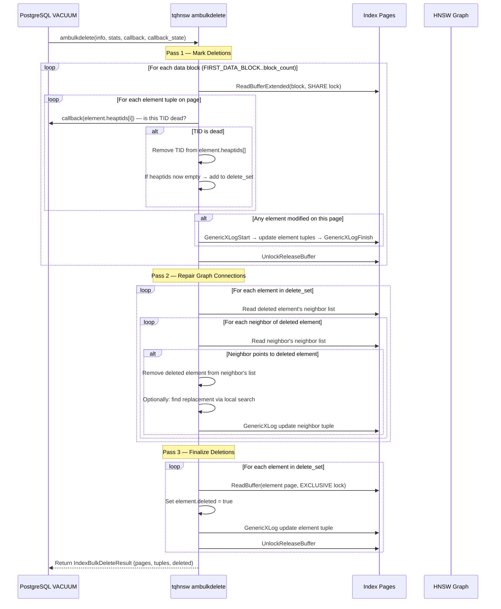

# FR-022: Vacuum Implementation — Soft Delete and Graph Maintenance

## Requirement

The extension SHALL implement a working `ambulkdelete` and `amvacuumcleanup` replacing the current no-op implementation. The vacuum algorithm uses a three-pass approach matching the specification in FR-010.

This FR supersedes the no-op behavior and provides the concrete implementation design.

### State Machine — Element Tuple Lifecycle

```
                    ┌─────────────────────┐
                    │                     │
     INSERT ───────▶│       LIVE          │
                    │  heaptids.len > 0   │
                    │  deleted = false     │
                    │                     │
                    └────────┬────────────┘
                             │
                    VACUUM removes some heap TIDs
                    (dead TID bitmap match)
                             │
                             ▼
                    ┌─────────────────────┐
                    │                     │
                    │   PARTIALLY LIVE    │
                    │  heaptids.len > 0   │
                    │  (some removed)     │
                    │  deleted = false     │
                    │                     │
                    └────────┬────────────┘
                             │
                    VACUUM removes last heap TID
                             │
                             ▼
                    ┌─────────────────────┐
                    │                     │
                    │      DELETED        │
                    │  heaptids.len = 0   │
                    │  deleted = true      │
                    │  (graph node dead)  │
                    │                     │
                    └─────────────────────┘
```

### Three-Pass Algorithm



### Pass 1 — Scan and Remove Dead Heap TIDs

For each data page:
1. Read the page with `BUFFER_LOCK_SHARE`
2. Walk element tuples (tag = `TQ_ELEMENT_TAG`)
3. For each heap TID in `element.heaptids[]`, call the vacuum callback to check liveness
4. If a TID is dead, remove it from the array (compact in place)
5. If all TIDs removed → add element's `ItemPointer` to `delete_set`
6. If any element on the page was modified:
   - Re-acquire with `BUFFER_LOCK_EXCLUSIVE`
   - Write via GenericXLog
7. Track statistics: `tuples_removed`, `num_index_tuples`

### Pass 2 — Repair Graph Connections

For each element in `delete_set`:
1. Read the deleted element's neighbor tuple → get list of neighbor TIDs
2. For each neighbor:
   - Read the neighbor's neighbor tuple
   - If the neighbor's list contains the deleted element → remove it
   - Optionally: search nearby nodes for a replacement connection
   - Write updated neighbor tuple via GenericXLog

Graph repair is optional for correctness — deleted nodes are already skipped by scan (FR-009 checks `element.deleted`). However, repair improves recall by maintaining graph connectivity.

Current implementation note:
- `main` now implements the unlink half of pass 2: persisted neighbor tuples are scanned and any
  slot pointing at a fully-dead element TID is cleared one page at a time.
- `main` now also fills currently free slots on affected live nodes across layer 0 and upper
  layers by reusing the insert-time graph search helpers plus a linear top-up fallback, all with
  the same code-to-code scorer.
- `main` now also carries `scripts/vacuum_concurrency_scratch.sh`, a 60-second scratch-cluster
  harness with concurrent INSERT, tqhnsw graph scan, and VACUUM workers that exercises the live
  `ambeginscan/amrescan/amgettuple` path through a `pg_test`-only SQL wrapper, then runs one
  final post-quiesce `VACUUM (ANALYZE)` and checks that the live index's reachable live-element
  count stays within 90% of a freshly rebuilt reference tqhnsw index on the same final table
  data.

### Pass 3 — Finalize

For each element in `delete_set`:
1. Read the element page with `BUFFER_LOCK_EXCLUSIVE`
2. Set `element.deleted = true`
3. Write via GenericXLog

### `amvacuumcleanup`

After `ambulkdelete`, `amvacuumcleanup` SHALL:
1. Count remaining live element tuples (using streaming reads on PG18 per FR-019)
2. Update `IndexBulkDeleteResult` with:
   - `num_pages`: total index pages
   - `num_index_tuples`: count of live (non-deleted) elements
   - `tuples_removed`: count from `ambulkdelete`
3. Return the result to the vacuum coordinator

### Concurrency

- Vacuum acquires `BUFFER_LOCK_SHARE` during scan phases and `BUFFER_LOCK_EXCLUSIVE` only for page writes
- Concurrent inserts to other pages are not blocked
- Concurrent scans see consistent results: a scan that started before vacuum sees the pre-vacuum state (MVCC through buffer locking)
- All page writes use GenericXLog for crash safety
- Pass 2 graph repair follows ADR-027: scan in ascending block order, rewrite one data page at a time, and keep replanning outside data-page `EXCLUSIVE` locks

### Page Compaction (Future)

This version does not compact pages after deletion. Deleted element tuples remain on the page with `deleted = true` and consume space. Page compaction (reclaiming space from deleted tuples) is a future optimization.

## Acceptance Criteria

### FR-022-AC-1: Dead rows removed
After `DELETE FROM t WHERE id = $x; VACUUM t;`, a search query SHALL NOT return the deleted row.

### FR-022-AC-2: Heap TID removal
After vacuuming, element tuples SHALL NOT contain heap TIDs that the vacuum callback reported as dead.

### FR-022-AC-3: Graph connectivity
After vacuuming 10% of rows from a 10K-row index (m=8), recall@10 SHALL be ≥ 80% of pre-vacuum recall, measured using NFR-003 methodology.

### FR-022-AC-4: Concurrent safety
Running VACUUM concurrently with INSERT and SELECT for 60 seconds SHALL NOT produce errors, panics, or corrupted results.

### FR-022-AC-5: GenericXLog
Every page write in ambulkdelete SHALL be wrapped in GenericXLog.

### FR-022-AC-6: Statistics reported
After `amvacuumcleanup`, `pg_class.reltuples` SHALL reflect the count of live (non-deleted) elements.

## References

- PG source: `src/backend/access/heap/vacuumlazy.c` — `lazy_vacuum_heap_rel()`, vacuum callback mechanism, `IndexBulkDeleteCallback` type
- PG source: `src/include/access/amapi.h` — `ambulkdelete_function`, `amvacuumcleanup_function` typedefs, `IndexVacuumInfo` struct, `IndexBulkDeleteResult` struct
- PG source: `src/backend/catalog/index.c` — `index_vacuum_cleanup()` post-vacuum catalog update flow
- PG source: `src/include/access/genam.h` — `IndexBulkDeleteCallback` type, `IndexBulkDeleteResult` fields (`num_pages`, `num_index_tuples`, `tuples_removed`)
- pgvector source: `src/hnswvacuum.c` — three-pass vacuum algorithm (scan → repair → finalize) used as reference for tqvector's approach
