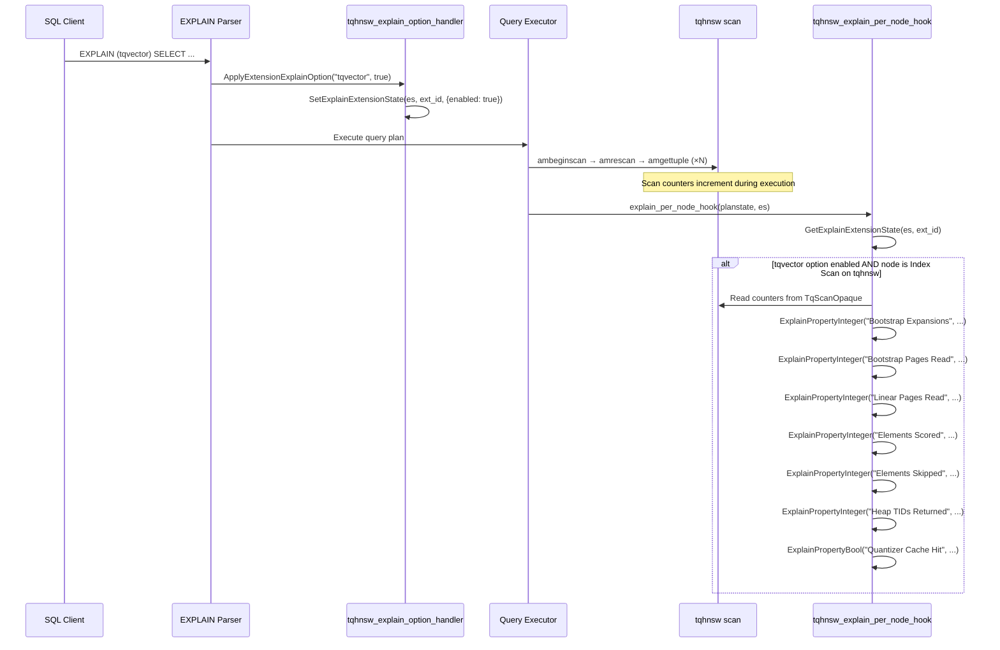

# FR-024: Custom EXPLAIN Options — Scan Diagnostics

## Requirement

On PG18, the extension SHALL register a custom EXPLAIN option `tqvector` that, when enabled, causes EXPLAIN output to include tqvector-specific scan statistics for each Index Scan node using the `tqhnsw` access method.

Current staged behavior:
- Before PostgreSQL 18 support exists in this repository, pure explain-scaffolding helpers MAY
  expose the intended EXPLAIN option name and report that both option registration and
  `explain_per_node_hook` wiring remain unavailable.
- Those same helpers MAY also expose the intended counter names, types, and increment conditions
  while keeping both scan-opaque counter storage and runtime counter wiring explicitly unavailable.
- The staged implementation MAY also define a reusable counter struct in planner-owned code so the
  scan lane can embed it in `TqScanOpaque` later without requiring the planner lane to edit
  `scan.rs` directly.
- Read-only diagnostics snapshot helpers MAY also expose the current EXPLAIN-and-pgstat readiness
  state together so productization work can inspect one consolidated PG18 diagnostics boundary.
- Those helpers SHALL stay descriptive only; they do not imply that `EXPLAIN (tqvector)` parses or
  that any PostgreSQL EXPLAIN hook is registered on PG17.

### Registration

In `_PG_init()`:

```rust
RegisterExtensionExplainOption(
    "tqvector",
    tqhnsw_explain_option_handler,
    GUCCheckBooleanExplainOption,
);
explain_per_node_hook = tqhnsw_explain_per_node_hook;
```

### Scan Counters

The following counters SHALL be added to `TqScanOpaque` and incremented during scan execution:

| Counter | Type | Incremented When |
|---|---|---|
| `stats_bootstrap_expansions` | u32 | A bootstrap frontier candidate is expanded |
| `stats_bootstrap_pages_read` | u32 | A page is read during bootstrap phase |
| `stats_linear_pages_read` | u32 | A page is read during linear scan phase |
| `stats_elements_scored` | u32 | An element is scored via PreparedQuery |
| `stats_elements_skipped` | u32 | An element is skipped (deleted or already emitted) |
| `stats_heap_tids_returned` | u32 | A heap TID is returned via amgettuple |
| `stats_quantizer_cache_hit` | bool | ProdQuantizer was reused from cache |

### EXPLAIN Output Format

```sql
EXPLAIN (tqvector) SELECT id FROM items ORDER BY embedding <#> $q LIMIT 10;
```

Produces:

```
Index Scan using idx_embedding on items
  Order By: (embedding <#> '{...}'::real[])
  TQVector Stats:
    Bootstrap Expansions: 3
    Bootstrap Pages Read: 47
    Linear Pages Read: 0
    Elements Scored: 156
    Elements Skipped: 12
    Heap TIDs Returned: 10
    Quantizer Cache Hit: true
```

With `ANALYZE`:

```sql
EXPLAIN (tqvector, ANALYZE) SELECT id FROM items ORDER BY embedding <#> $q LIMIT 10;
```

Shows actual runtime values (same counters, real measurements).

### Sequence Diagram



### Hook Implementation

The `explain_per_node_hook` SHALL:
1. Check if the `tqvector` EXPLAIN option is enabled via `GetExplainExtensionState`
2. Check if the current plan node is an `IndexScan` using the `tqhnsw` access method
3. If both conditions are met, read counters from the scan's `TqScanOpaque` and emit them via `ExplainPropertyInteger` / `ExplainPropertyBool`
4. Chain to the previous hook if one was installed (save and restore the hook pointer)

### Zero Overhead When Disabled

When `tqvector` is not specified in the EXPLAIN options, the hook SHALL return immediately after checking the extension state. The scan counters are always incremented (negligible cost — a few u32 increments per scan), but no EXPLAIN output is produced.

### PG Version Compatibility

On PG17, the custom EXPLAIN API does not exist. During the current staged implementation, the
counter contract may be exposed through read-only scaffolding helpers, but the actual counter
fields are not yet wired into `TqScanOpaque`, a planner-owned counter struct may exist for later
embedding by the scan lane, and no EXPLAIN hook is registered.

## Acceptance Criteria

### FR-024-AC-1: Option recognized
`EXPLAIN (tqvector) SELECT ...` SHALL parse without error when the extension is loaded.

### FR-024-AC-2: Stats emitted
`EXPLAIN (tqvector) SELECT ... ORDER BY col <#> $q LIMIT 10` on a table with a tqhnsw index SHALL include "TQVector Stats" section with all defined counters.

### FR-024-AC-3: No output when disabled
`EXPLAIN SELECT ... ORDER BY col <#> $q LIMIT 10` (without `tqvector` option) SHALL NOT include any tqvector-specific output.

### FR-024-AC-4: ANALYZE shows actuals
`EXPLAIN (tqvector, ANALYZE) SELECT ...` SHALL show non-zero counter values reflecting actual scan execution.

### FR-024-AC-5: Hook chains
If another extension has installed an `explain_per_node_hook`, tqvector's hook SHALL chain to the previous hook after its own processing.

## References

- PG source: `src/include/commands/explain_state.h` — `RegisterExtensionExplainOption()`, `ExplainOptionHandler` callback type, `GetExplainExtensionId()`, `GetExplainExtensionState()`, `SetExplainExtensionState()`
- PG source: `src/include/commands/explain_format.h` — `ExplainPropertyText()`, `ExplainPropertyInteger()`, `ExplainPropertyFloat()`, `ExplainPropertyBool()`, `ExplainOpenGroup()`, `ExplainCloseGroup()`
- PG source: `src/backend/commands/explain.c` — `explain_per_node_hook` / `explain_per_plan_hook` declaration, `ApplyExtensionExplainOption()` parser integration
- PG source: `src/include/commands/explain_state.h` — `GUCCheckBooleanExplainOption()` helper for boolean option validation
