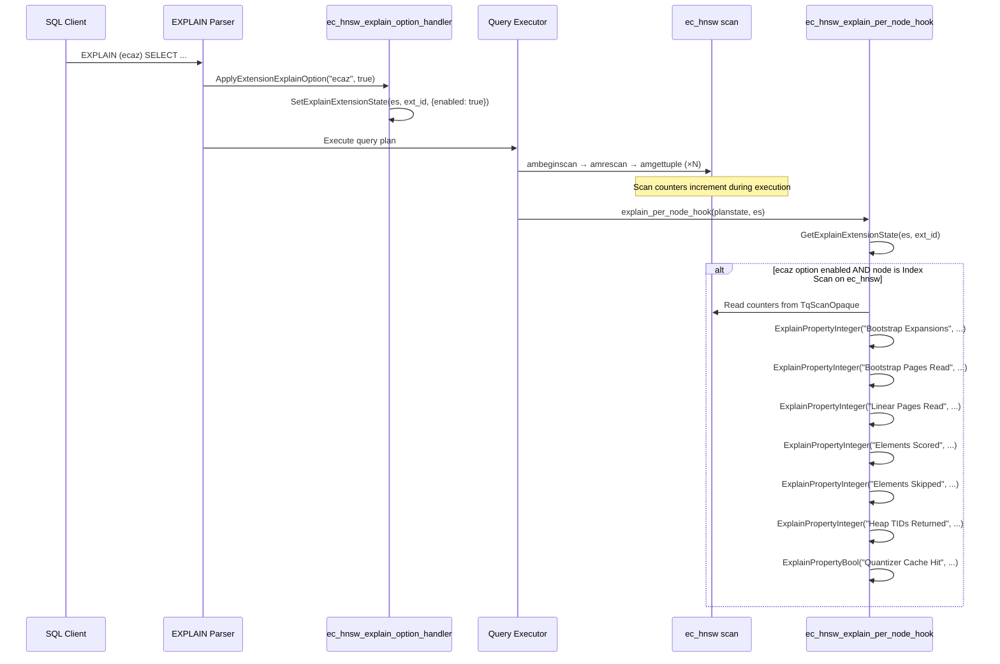

# FR-024: Custom EXPLAIN Options — Scan Diagnostics

## Requirement

On PG18, the extension SHALL register a custom EXPLAIN option `ecaz` that, when enabled, causes EXPLAIN output to include Ecaz-specific scan statistics for each Index Scan node using the `ec_hnsw` access method.

Current staged behavior:
- On PG18, `_PG_init()` now registers the `ecaz` EXPLAIN option and chains
  `explain_per_node_hook`.
- `TqExplainCounters` are now embedded in scan state and incremented at live scan seams; `ec_hnsw`
  index scans emit them when the option is enabled.
- Structured EXPLAIN formats preserve the `Ecaz Stats` group label. Text output still exposes
  the same properties even though core PostgreSQL does not render the open/close group wrapper
  there.
- Read-only diagnostics snapshot helpers still expose the EXPLAIN-and-pgstat readiness boundary in
  one place.
- PG17 still has no EXPLAIN hook registration.

### Registration

In `_PG_init()`:

```rust
RegisterExtensionExplainOption(
    "ecaz",
    ec_hnsw_explain_option_handler,
    GUCCheckBooleanExplainOption,
);
explain_per_node_hook = ec_hnsw_explain_per_node_hook;
```

### Scan Counters

The following counters SHALL be added to `TqScanOpaque` and incremented during scan execution:

| Counter | Type | Incremented When |
|---|---|---|
| `stats_bootstrap_expansions` | u32 | A bootstrap frontier candidate is expanded |
| `stats_bootstrap_pages_read` | u32 | A page is read during bootstrap phase |
| `stats_linear_pages_read` | u32 | A page is read during linear scan phase |
| `stats_elements_scored` | u32 | An element is scored via PreparedQuery |
| `stats_elements_skipped` | u32 | An element is skipped (deleted or already emitted) |
| `stats_heap_tids_returned` | u32 | A heap TID is returned via amgettuple |
| `stats_quantizer_cache_hit` | bool | ProdQuantizer was reused from cache |

### EXPLAIN Output Format

```sql
EXPLAIN (ecaz) SELECT id FROM items ORDER BY embedding <#> $q LIMIT 10;
```

Produces:

```
Index Scan using idx_embedding on items
  Order By: (embedding <#> '{...}'::real[])
  Ecaz Stats:
    Bootstrap Expansions: 3
    Bootstrap Pages Read: 47
    Linear Pages Read: 0
    Elements Scored: 156
    Elements Skipped: 12
    Heap TIDs Returned: 10
    Quantizer Cache Hit: true
```

With `ANALYZE`:

```sql
EXPLAIN (ecaz, ANALYZE) SELECT id FROM items ORDER BY embedding <#> $q LIMIT 10;
```

Shows actual runtime values (same counters, real measurements).

### Sequence Diagram



### Hook Implementation

The `explain_per_node_hook` SHALL:
1. Check if the `ecaz` EXPLAIN option is enabled via `GetExplainExtensionState`
2. Check if the current plan node is an `IndexScan` using the `ec_hnsw` access method
3. If both conditions are met, read counters from the scan's `TqScanOpaque` and emit them via `ExplainPropertyInteger` / `ExplainPropertyBool`
4. Chain to the previous hook if one was installed (save and restore the hook pointer)

### Zero Overhead When Disabled

When `ecaz` is not specified in the EXPLAIN options, the hook SHALL return immediately after checking the extension state. The scan counters are always incremented (negligible cost — a few u32 increments per scan), but no EXPLAIN output is produced.

### PG Version Compatibility

On PG17, the custom EXPLAIN API does not exist, so no EXPLAIN hook is registered. The reusable
counter contract and pure emission helpers still exist for shared testing, but the live option and
per-node hook remain PG18-only.

## Acceptance Criteria

### FR-024-AC-1: Option recognized
`EXPLAIN (ecaz) SELECT ...` SHALL parse without error when the extension is loaded.

### FR-024-AC-2: Stats emitted
`EXPLAIN (FORMAT JSON, ecaz) SELECT ... ORDER BY col <#> $q LIMIT 10` on a table with an
`ec_hnsw` index SHALL include a `"Ecaz Stats"` group with all defined counters. Text output
SHALL still expose the same counter properties even though the group label is not guaranteed there.

### FR-024-AC-3: No output when disabled
`EXPLAIN SELECT ... ORDER BY col <#> $q LIMIT 10` (without `ecaz` option) SHALL NOT include any Ecaz-specific output.

### FR-024-AC-4: ANALYZE shows actuals
`EXPLAIN (ecaz, ANALYZE) SELECT ...` SHALL show non-zero counter values reflecting actual scan execution.

### FR-024-AC-5: Hook chains
If another extension has installed an `explain_per_node_hook`, Ecaz's hook SHALL chain to the previous hook after its own processing.

## References

- PG source: `src/include/commands/explain_state.h` — `RegisterExtensionExplainOption()`, `ExplainOptionHandler` callback type, `GetExplainExtensionId()`, `GetExplainExtensionState()`, `SetExplainExtensionState()`
- PG source: `src/include/commands/explain_format.h` — `ExplainPropertyText()`, `ExplainPropertyInteger()`, `ExplainPropertyFloat()`, `ExplainPropertyBool()`, `ExplainOpenGroup()`, `ExplainCloseGroup()`
- PG source: `src/backend/commands/explain.c` — `explain_per_node_hook` / `explain_per_plan_hook` declaration, `ApplyExtensionExplainOption()` parser integration
- PG source: `src/include/commands/explain_state.h` — `GUCCheckBooleanExplainOption()` helper for boolean option validation
