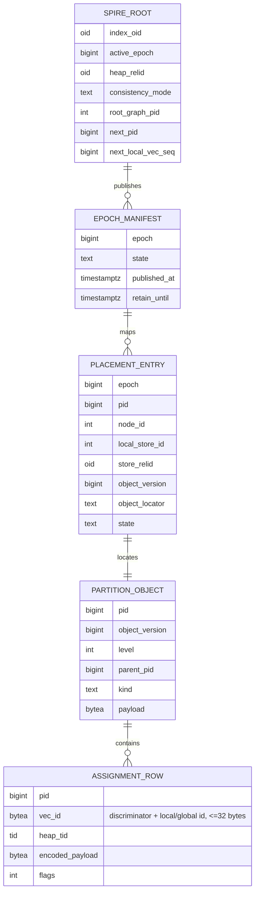
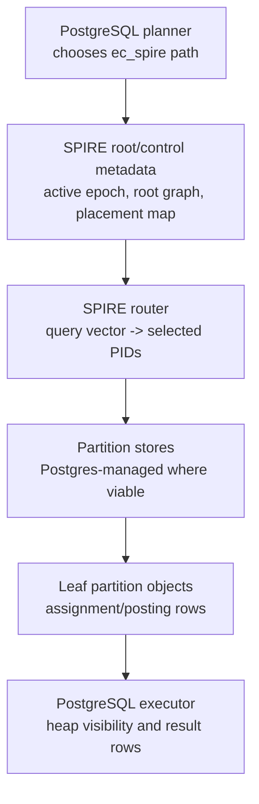

# FR-038: SPIRE Partition Object Storage and Placement

## Requirement

`ec_spire` SHALL store SPIRE hierarchy state as PID-addressed partition objects with explicit placement metadata so local single-store, local multi-NVMe, and future multi-machine deployments use the same logical routing model.

## Terminology

- **SPIRE partition:** an index-internal cluster object addressed by PID. It is not a PostgreSQL table partition.
- **PID:** durable SPIRE partition object identifier.
- **Partition object:** an immutable or versioned object containing either internal routing metadata and child PIDs or leaf vector assignment/posting rows.
- **Partition store:** a bounded physical container for many partition objects. A local deployment may place stores in different tablespaces backed by different NVMe devices.
- **Epoch:** a published SPIRE index version that identifies a compatible root graph, hierarchy, placement map, and partition object set.

## Behavior

1. `ec_spire` SHALL keep SPIRE partition selection inside the SPIRE access method or coordinator; PostgreSQL planner partition pruning SHALL NOT choose SPIRE PIDs.
2. Root/control metadata SHALL record the active epoch, hierarchy metadata, root graph metadata, and PID placement map.
3. Root/control metadata SHALL record PID allocation state and local `vec_id` allocation state.
4. Internal partition objects SHALL record level, PID, parent PID where applicable, routing metadata, and child PIDs.
5. Leaf partition objects SHALL record level, PID, parent PID where applicable, and assignment/posting rows.
6. Assignment/posting rows SHALL include stable `vec_id`, local heap TID or row locator, PID, encoded scoring payload, and flags for primary assignment, boundary replica, tombstone, stale locator, or delta state where applicable.
7. `vec_id` SHALL be unique within an index OID for live logical vector versions and encoded in no more than 32 bytes. Phase 1 local IDs SHALL use a discriminator byte plus a root/control allocated local sequence, not a heap-TID-derived identity. Future global IDs SHALL use a distinct discriminator and MAY be introduced by an epoch rewrite.
8. If a persisted local heap TID becomes stale because UPDATE/HOT movement changes the live tuple locator, SPIRE SHALL either repair the assignment row during update/vacuum or fail the affected candidate explicitly; it SHALL NOT silently return an unrelated heap row.
9. The first local implementation SHALL use PostgreSQL-managed relation-backed storage and MAY map all PIDs to one partition store, but the on-disk metadata SHALL preserve the `pid -> local_store_id -> object location` abstraction.
10. Local multi-NVMe placement SHALL map PIDs across a bounded set of local partition-store relations, normally by `hash(pid) % local_store_count`.
11. Multi-machine placement SHALL extend the map to `pid -> node_id -> local_store_id -> object location` and SHALL require stable `vec_id` values suitable for remote candidate merge.
12. Partition objects SHALL use immutable per-partition object versions referenced by an epoch manifest so a query reads a consistent object set.
13. Old epochs SHALL remain readable until in-flight queries using them can finish or fail with an explicit stale-epoch error.
14. Diagnostics SHALL expose read-only SQL functions or views for partition counts, placement map state, per-store object bytes, assignment cardinality, active epoch, and stale/unavailable placement entries.

## Data Schema

`object_locator` records the relation-backed object location for the selected
store. Phase 1 may encode it as block/offset metadata in the root/control
relation; Phase 4 may point at a bounded auxiliary store relation in a
tablespace-backed local store.

## Architecture

## Acceptance Criteria

### FR-038-AC-1

A single-level `ec_spire` build persists leaf partition objects with one logical assignment row per indexed vector.

### FR-038-AC-2

Boundary replication can add multiple assignment rows for the same `vec_id` across different PIDs without changing the persisted row schema.

### FR-038-AC-3

Admin diagnostics can report PID count, leaf assignment cardinality, active epoch, and placement distribution without allowing user DML against SPIRE partition objects.

### FR-038-AC-4

The local multi-store path can place partition objects across at least two store relations or equivalent bounded containers without creating one PostgreSQL relation per PID.

### FR-038-AC-5

A query that requests an unavailable or stale epoch fails explicitly rather than silently mixing partition objects from incompatible epochs.

### FR-038-AC-6

The persisted `vec_id` format enforces per-index uniqueness, a bounded encoded width, and a reserved local/global discriminator.

### FR-038-AC-7

When update or vacuum detects an invalid stored heap TID, SPIRE either repairs the row locator through an epoch-safe path or suppresses the candidate with diagnostics.
