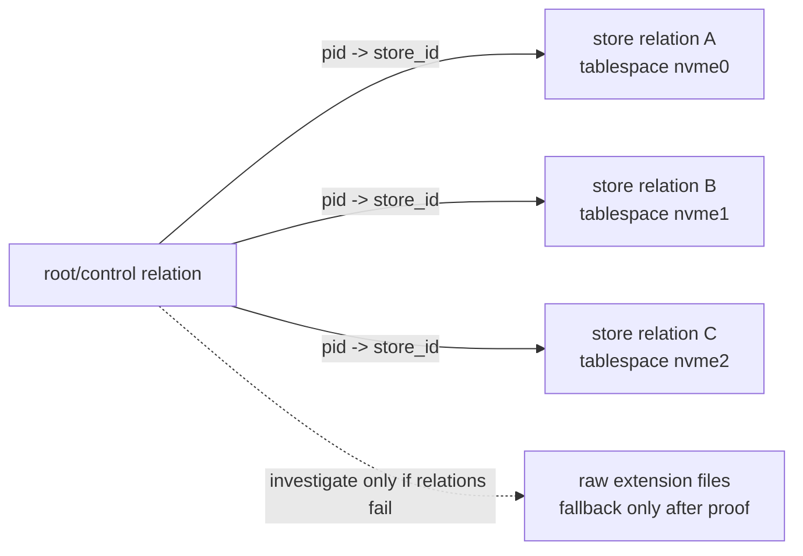
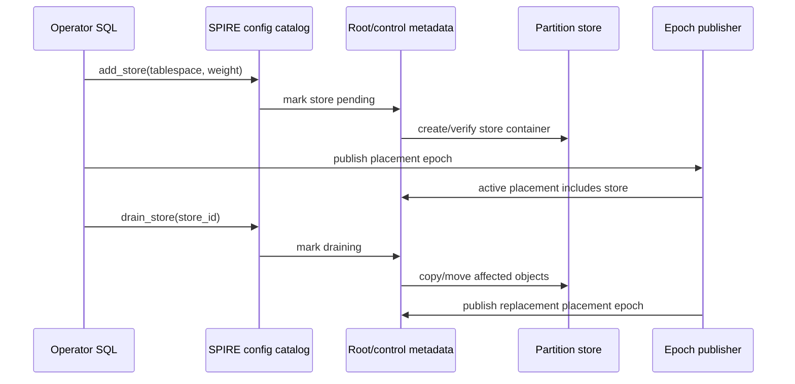

# FR-039: SPIRE Local NVMe Store Placement

## Requirement

`ec_spire` SHALL support PostgreSQL-managed live configuration of bounded local partition stores so SPIRE partition objects can be placed across physical NVMe devices without using PostgreSQL declarative table partitions for ANN routing.

## Behavior

1. Local store configuration SHALL be represented in PostgreSQL-managed SQL state where possible: tablespaces, extension-owned catalog tables, or extension SQL functions.
2. The preferred storage investigation path SHALL start with table/relation-backed stores because they inherit PostgreSQL durability, backup, permissions, and operational tooling.
3. Phase 0 SHALL compare candidate physical layouts before implementation commits to one hot-path storage form.
4. Operators SHALL be able to add, disable, drain, and inspect stores live, subject to documented locks and epoch-publish boundaries.
5. Placement SHALL map each PID to one primary local store in v1.
6. Graceful degradation SHALL be the default failure posture when degraded recall is configured: unavailable stores are skipped or downweighted with explicit diagnostics.
7. Strict fail-closed behavior SHALL remain available for deployments that require epoch-complete results.
8. Replicated partition objects are deferred; they MAY be introduced later for read throughput and availability.

## Candidate Storage Layouts



## Configuration Schema

The SQL surface may choose exact names later, but it SHALL preserve these
fields:

```text
spire_local_store_config
  index_oid oid
  store_id int
  tablespace_oid oid
  state active | disabled | draining | failed
  weight int
  created_at timestamptz
  updated_at timestamptz

spire_local_store_stats
  index_oid oid
  store_id int
  object_count bigint
  object_bytes bigint
  assignment_count bigint
  last_error text
```

## Store Lifecycle



## Acceptance Criteria

### FR-039-AC-1

At least one local store can be configured through SQL and inspected through SQL diagnostics.

### FR-039-AC-2

The first multi-store proof can place PIDs across at least two PostgreSQL-managed store containers without creating one relation per PID.

### FR-039-AC-3

A disabled or unavailable store produces explicit diagnostics and follows the configured strict or degraded consistency mode.

### FR-039-AC-4

The implementation records enough placement metadata to rebalance PIDs from one local store to another through an epoch transition.
