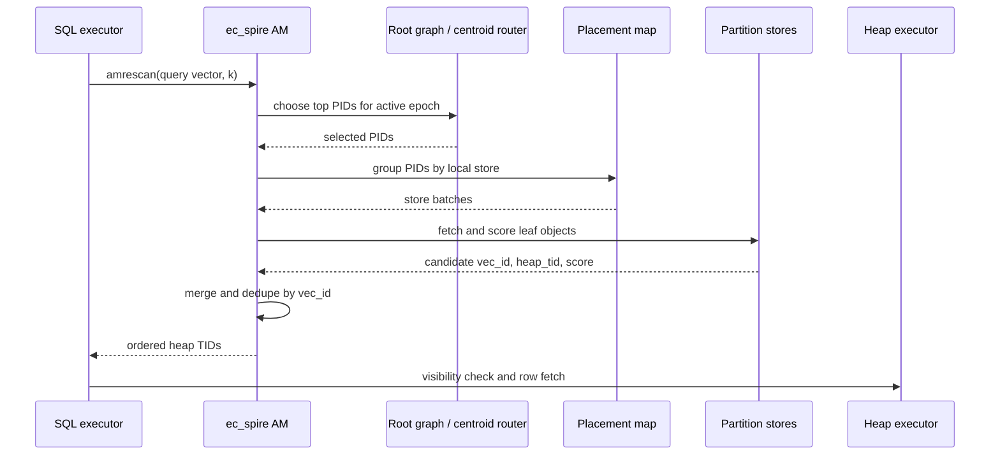
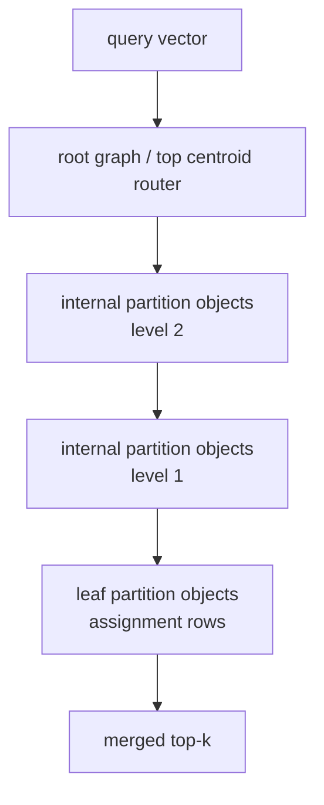

# FR-040: SPIRE Routing and Search Execution

## Requirement

`ec_spire` SHALL route query vectors through SPIRE-owned root and hierarchy metadata, fetch selected partition objects by PID, score candidates near the partition data, deduplicate boundary replicas, and return ordered results through PostgreSQL execution.

## Behavior

1. PostgreSQL's planner SHALL only decide whether to use the SPIRE access path.
2. SPIRE SHALL choose PIDs from the query vector using root graph or centroid routing plus hierarchy metadata.
3. Single-level v1 MAY use a flat centroid router before the root graph lands.
4. Recursive SPIRE SHALL route top-down from root graph to internal partition objects to leaf partition objects.
5. Leaf scoring SHALL use the selected quantizer/profile payload stored in assignment/posting rows.
6. Boundary replicas SHALL be deduplicated by stable `vec_id` before final top-k emission.
7. Local heap visibility SHALL remain PostgreSQL executor responsibility for local rows.
8. If a candidate carries a heap TID that no longer identifies the indexed row version, the scan SHALL suppress or repair that candidate through the update/vacuum policy instead of emitting a wrong tuple.

## Search Sequence

## Routing Topology

## Acceptance Criteria

### FR-040-AC-1

Single-level SPIRE can route to leaf PIDs, score candidates, and return ordered local heap TIDs.

### FR-040-AC-2

Recursive SPIRE can route through at least two hierarchy levels before leaf scoring.

### FR-040-AC-3

Boundary replica deduplication keeps the best candidate for a `vec_id` and exposes diagnostics for duplicate candidates suppressed.
