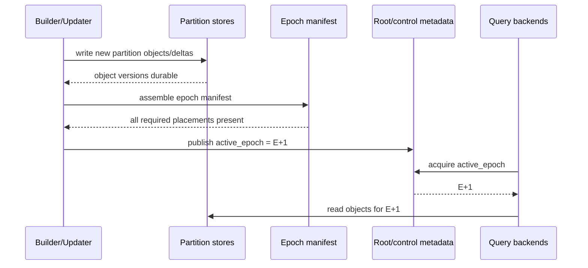
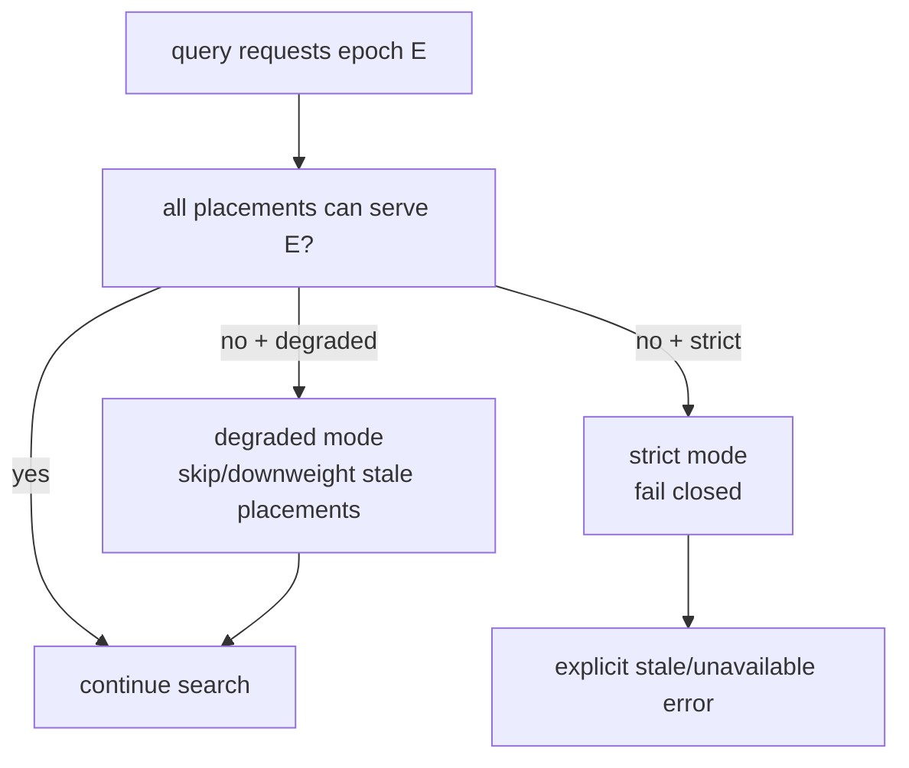

# FR-041: SPIRE Epoch Consistency and Retention

## Requirement

`ec_spire` SHALL expose a configurable consistency model based on published epochs so queries can choose between strict coherent index state and graceful degraded search when stores or nodes are stale or unavailable.

## Behavior

1. A SPIRE epoch SHALL identify compatible root metadata, hierarchy metadata, placement metadata, and partition-object versions.
2. Queries SHALL acquire an epoch at search start.
3. Strict mode SHALL fail if any required local store or remote node cannot serve the requested epoch.
4. Degraded mode SHALL continue when configured by skipping or downweighting stale/unavailable placements with explicit diagnostics.
5. Local single-store deployments SHALL default to strict mode.
6. Graceful degradation SHALL be the preferred operational posture for large remote deployments when explicitly configured.
7. A failed or partial epoch publication SHALL remain in `failed` or `building` state and SHALL NOT become the active epoch.
8. The first baseline MAY use a simpler epoch path, such as immutable offline-built epochs, before live delta/manifest optimization.
9. Old epochs SHOULD retain for a configurable minimum wall-clock interval and until no active query is registered against them.
10. The initial suggested default retention policy is `min_epoch_retention = 10 minutes`, `max_retained_epochs = 2`, and cleanup only when no active backend reports the old epoch.
11. Operators SHALL be able to inspect active epoch, retained epochs, pending epochs, stale placements, and cleanup eligibility through SQL diagnostics.

## Epoch Schema

```text
spire_epoch
  index_oid oid
  epoch bigint
  state building | published | retired | failed
  consistency_mode strict | degraded
  published_at timestamptz
  retain_until timestamptz
  active_query_count bigint

spire_epoch_placement_status
  index_oid oid
  epoch bigint
  pid bigint
  node_id int
  store_id int
  status available | stale | unavailable | skipped
  object_version bigint
```

## Epoch Publication Sequence



## Consistency Modes



## Acceptance Criteria

### FR-041-AC-1

Every SPIRE search records the epoch it attempted to serve.

### FR-041-AC-2

Strict mode never silently mixes incompatible root, placement, and partition-object versions.

### FR-041-AC-3

Degraded mode reports skipped or stale stores/nodes and surfaces that the result may have reduced recall.

### FR-041-AC-4

Epoch cleanup does not remove an epoch still held by an active query.

### FR-041-AC-5

A failed or partial epoch publication does not replace the active epoch and remains visible through diagnostics for retry or cleanup.
