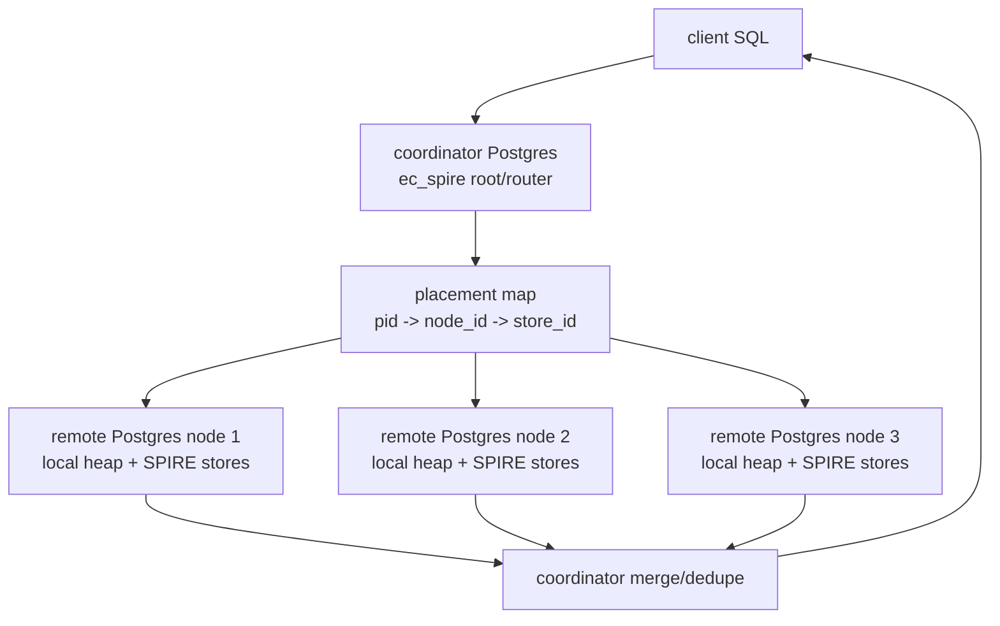
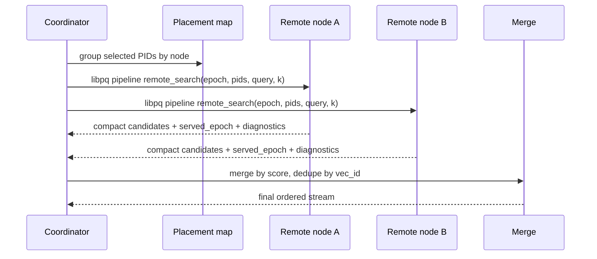

# FR-042: SPIRE Distributed libpq Coordinator

## Requirement

Distributed `ec_spire` SHALL use a coordinator PostgreSQL instance to route selected PIDs to remote PostgreSQL storage nodes over libpq, merge compact candidate streams, and return one ordered result stream to the client.

## Behavior

1. The first remote transport SHALL use libpq and SHOULD use pipeline mode for batched remote calls.
2. Remote nodes SHALL be PostgreSQL instances with the SPIRE extension installed and local heap rows or local row locators for their owned vector data.
3. Remote nodes SHALL expose a SPIRE remote-search SQL function or equivalent extension entrypoint that accepts query vector, selected PIDs, requested epoch, top-k budget, and consistency mode.
4. Remote nodes SHALL score partition objects near their data and return compact candidates rather than full heap rows by default.
5. The coordinator SHALL merge local and remote candidates by stable `vec_id`, dedupe boundary replicas, and organize final delivery as a single ordered stream.
6. Final row delivery SHALL be organized by the coordinator as one result stream to the client. The first implementation MAY use `(node_id, vec_id, score, row_locator)` candidate records internally, but any remote row fetch needed for the SQL result SHALL happen through coordinator-managed libpq calls or an explicitly documented coordinator path.
7. Distributed v1 assumes one primary node placement per PID. Replicated partition objects are deferred future work for read throughput and availability.

## Remote Configuration Schema

```text
spire_remote_node
  index_oid oid
  node_id int
  conninfo text
  state active | disabled | draining | failed
  consistency_mode strict | degraded
  last_seen_at timestamptz
  last_error text

spire_remote_search_request
  epoch bigint
  query_vector bytea
  pid_list bigint[]
  top_k int
  consistency_mode strict | degraded

spire_remote_candidate
  served_epoch bigint
  node_id int
  pid bigint
  vec_id bytea
  row_locator bytea
  score float8
  flags int
```

## Distributed Architecture



## Remote Search Sequence



## Acceptance Criteria

### FR-042-AC-1

The coordinator can call at least two remote PostgreSQL SPIRE search endpoints over libpq and merge their candidate rows.

### FR-042-AC-2

Remote responses include served epoch and stale/unavailable diagnostics.

### FR-042-AC-3

The coordinator can return one ordered candidate stream with node identity and row locator sufficient for final row delivery.
