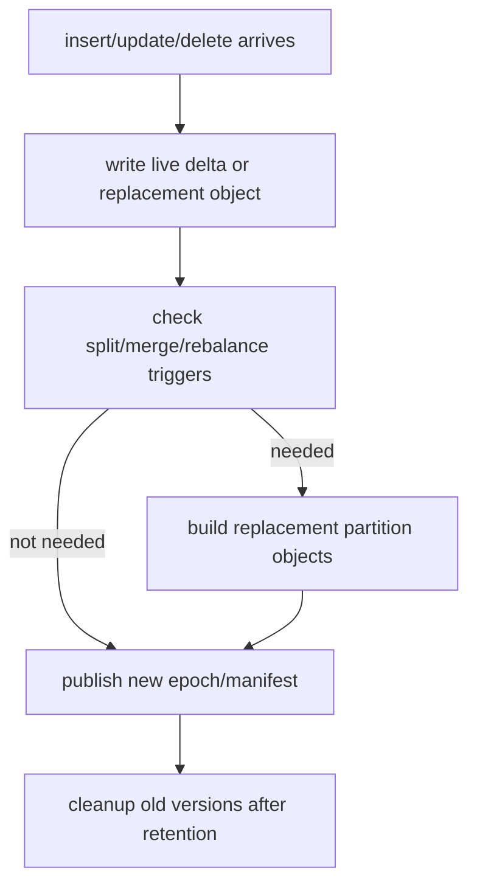
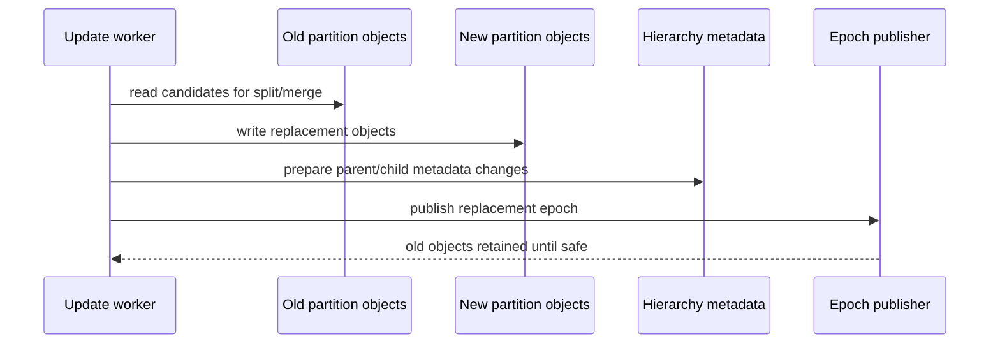

# FR-043: SPIRE Update, Split, Merge, and Cleanup Lifecycle

## Requirement

`ec_spire` SHALL define how inserts, deletes, updates, partition split/merge, rebalancing, vacuum, and epoch cleanup modify partition objects without making active queries observe incoherent index state.

## Behavior

1. The first baseline MAY prioritize the easiest path that proves functionality, including offline build plus simple insert/delete support.
2. Inserts SHALL assign new vectors to one or more leaf PIDs according to the current router and boundary-replication policy.
3. Deletes SHALL remove or tombstone assignment rows without breaking active epoch reads.
4. Updates SHALL be represented as delete-old plus insert-new unless a narrower optimization is accepted later.
5. Split and merge operations SHALL create replacement partition objects and publish hierarchy/placement changes through an epoch transition.
6. Vacuum SHALL compact tombstones and reclaim obsolete partition-object versions only after retention and active-query checks pass.
7. Rebalance SHALL copy or rewrite partition objects to target stores or nodes, then publish a placement epoch.

## Delta Schema

```text
spire_delta_row
  index_oid oid
  target_epoch bigint
  pid bigint
  op insert | delete | update | boundary_replica
  vec_id bytea
  heap_tid tid
  encoded_payload bytea
  flags int

spire_rewrite_job
  index_oid oid
  job_id bigint
  kind split | merge | rebalance | compact
  source_pids bigint[]
  target_pids bigint[]
  state pending | running | ready_to_publish | published | failed
```

## Update Lifecycle



## Split/Merge Sequence



## Acceptance Criteria

### FR-043-AC-1

The first local implementation documents whether inserts/deletes use live deltas, mutable partition objects, or replacement epochs.

### FR-043-AC-2

Split and merge never silently change PID child/leaf meaning for active strict-epoch queries.

### FR-043-AC-3

Vacuum and cleanup can prove an old epoch or partition-object version is no longer needed before reclaiming it.
