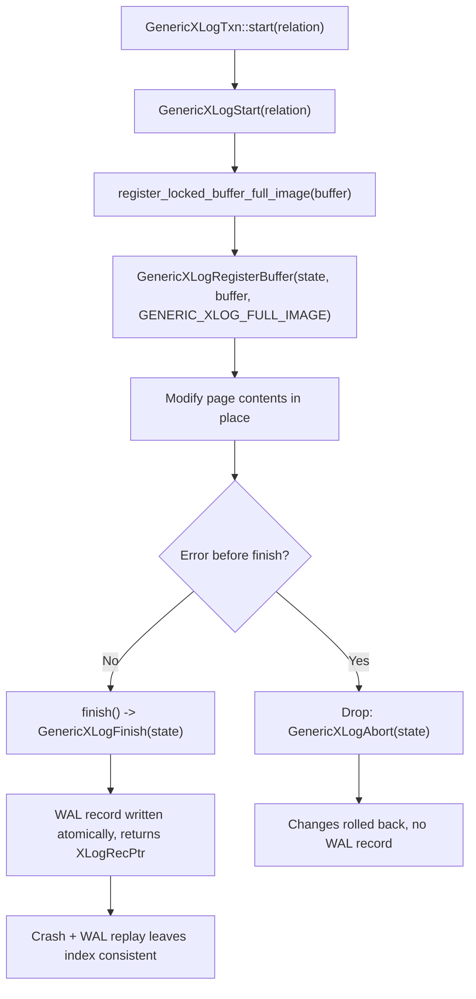

# FR-011: WAL Safety — GenericXLog Usage

## Description

All page modifications within the `ec_hnsw` index access method SHALL use PostgreSQL's GenericXLog facility for crash-safe durability.

### Pattern (from pgvector)

```rust
// Before modifying any page:
let state = GenericXLogStart(index);
let page = GenericXLogRegisterBuffer(state, buffer, flags);

// ... modify page contents ...

GenericXLogFinish(state);  // atomically writes WAL record
```

### Rules

1. No page SHALL be modified outside a GenericXLog transaction
2. If an error occurs between `GenericXLogStart` and `GenericXLogFinish`, the changes SHALL be rolled back automatically (standard GenericXLog guarantee)
3. After a crash and WAL replay, the index SHALL be in a consistent state
4. pgrx wraps these C functions — use the pgrx wrappers

## Workflow

The `GenericXLogTxn` RAII wrapper (`src/storage/wal.rs`) drives every page
modification: `start(relation)` opens the WAL state, `register_locked_buffer_full_image`
yields the writable page image, the caller mutates it in place, and `finish()`
atomically emits the WAL record. Any early return drops the txn, whose `Drop`
impl calls `GenericXLogAbort` to roll back.



## Acceptance Criteria

| ID | Criteria | Verification |
|----|----------|--------------|
| FR-011-AC-1 | After index build, simulated crash (kill -9), and restart, the index passes `REINDEX` without errors | Demonstration |
| FR-011-AC-2 | Code audit confirms no index page is modified without GenericXLog wrapping | Inspection |

### FR-011-AC-1: Crash recovery
After building an index, simulating a crash (kill -9), and restarting PostgreSQL, the index SHALL pass `REINDEX` without errors.

### FR-011-AC-2: No direct page writes
A code audit SHALL confirm that no index page is modified without GenericXLog wrapping.

## Dependencies

- **Upstream**: US-003, US-005 (traces)
- **Downstream**: none identified
