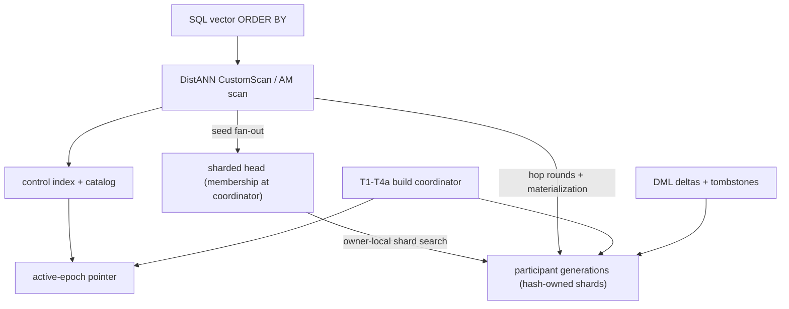
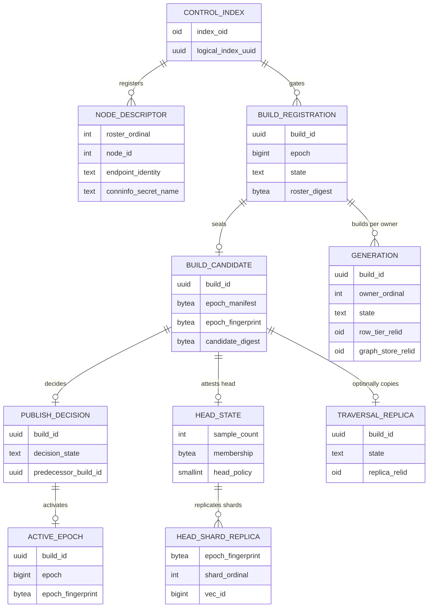

# FR-085: DistANN Domain Model

## Description

`ec_distann` SHALL model distributed vector search as one global Vamana graph
whose node records are hash-placed across a registered roster, published as
immutable per-owner generations bound to a coordinator-decided epoch, searched
through a sharded membership-only head followed by owner-fanned hop rounds,
and mutated only by building and publishing a successor epoch.

## Domain Terms

| Term | Definition |
| --- | --- |
| Control index | Coordinator-side `ec_distann` index built with `distributed_control=true`; owns the v5 control metadata (97-byte common prefix + logical index UUID) and the catalog surface, holds no local graph state. |
| Logical index UUID | RFC 4122 v4 identity minted at control build/REINDEX; scopes every catalog row, wire envelope, and lock for one logical distributed index. |
| Participant | A roster node holding one hash-owned slice of the global graph as physical generations; addressed by a node descriptor (ordinal, node id, endpoint identity, conninfo secret reference). |
| Roster | The registered set of node descriptors for a logical index; snapshotted per build into participant bindings; revision-fenced by the registry state row. |
| Hash placement | Owner selection by `fmix64(vec_id XOR domain)` modulo roster size; ownership is disjoint — exactly one owner per vec_id per epoch. |
| vec_id | Stable global `u64` vector identity derived from the ADR-063 source-identity contract; unique per logical row across nodes and epochs. |
| Generation | Immutable per-owner physical shard of one build: row tier, graph store, and directory relations plus a catalog row advancing Building → Ready → Published → Retired. |
| Build epoch | One coordinator-driven build attempt: T1 register (gate + roster snapshot), T2 build/stage/seal (per-owner streams → Ready receipts → build candidate), T3 decide (durable publish decision), T4a recover/activate (pointer swap + predecessor dispositions). |
| Epoch manifest | Canonical v2 description of a published epoch (roster, per-owner generations, digest chain); its 32-byte digest seeds the epoch fingerprint. |
| Epoch fingerprint | 34-byte value `u16_le(2) \|\| manifest_digest`; the identity every remote call, cache key, and catalog row validates against. |
| Active-epoch pointer | Single row per logical index naming the currently published (build, epoch, fingerprint); advanced only by the T4a state machine. |
| Head | Bounded navigation sample (capacity C) over the global graph selected at T2; persisted on the coordinator as membership only (vec_id list + digest), never landmark vectors, on multi-owner rosters. |
| Head shard | The subset of head landmarks a participant owns; served from owner-local vectors as a per-shard navigable graph keyed and seeded by the members-derived shard ordinal. |
| Head replica | An attested copy of a head shard on a non-owner node; population is recorded per epoch only after every (shard, replica) pair imports, and routing consults the attestation. |
| Gateway copy | Bounded coordinator-resident routing payload (landmark neighbor ids + quantized codes, never vectors) letting owners omit neighbor payloads the coordinator can reconstruct. |
| Hop round | One synchronized traversal step: coordinator batches frontier candidates per owner, owners expand and code-score neighbors under pushed-down threshold and limit, coordinator merges. |
| Traversal replica | Opt-in, non-authoritative, rebuildable coordinator copy of the graph (FR-084); non-conforming under the distribution invariant and never decision-bearing. |
| Crown | Fixed-capacity coordinator navigation cache over a subset of head landmarks, codes only (FR-089); capacity independent of N and C; narrows the protocol, never substitutes. |
| Fused head hop | First traversal expansion carrying the seed work: crown codes answer the candidate half at the coordinator, exact seed distances return with the first owner expansion (FR-090). |
| Scan pin | Shared-memory registration binding an open scan to its epoch fingerprint so retirement fences observe in-flight readers. |

## Architecture

## Domain Rules

1. The graph SHALL be one global Vamana graph: sharded build output is
   stitched into a single adjacency structure whose records are then
   hash-partitioned; shards are placement units, not independent indexes.
2. Record ownership SHALL be disjoint per epoch: the hash owner of a vec_id
   is the only authority for its record, exact distances, and row payload.
3. Published generations and the head membership SHALL be immutable within
   an epoch; visible change happens only by publishing a successor epoch
   (build → decide → activate) or by tombstone flags carried to the owner.
4. Epoch activation SHALL be a durable decision followed by a single
   compare-and-swap of the active-epoch pointer; predecessor generations
   retire only after their dispositions settle and scan pins drain.
5. Every remote interaction SHALL bind the logical index UUID and the epoch
   fingerprint and SHALL fail closed on mismatch rather than serve mixed
   epochs.
6. The coordinator SHALL NOT hold unsharded vector-bearing state for a
   multi-owner roster: head persistence is membership-only, gateway copies
   and caches hold bounded code-only payloads, and any exception (the
   traversal replica) is opt-in and non-conforming per
   [NFR-021](../../non-functional/NFR-021-distann-distribution-invariant.md).
7. Bounded coordinator structures SHALL narrow the distributed protocol,
   never substitute for it: a miss or unpopulated structure falls back to
   the full owner fan-out with identical results.
8. Scans SHALL pin the epoch they open against and SHALL observe retirement
   fences; retirement SHALL NOT reclaim a generation with live pins.
9. Seed selection SHALL fan the head search to owners (and attested
   replicas), each searching only landmarks it holds locally; the
   coordinator merges at most a bounded seed count per owner.
10. All traversal SHALL follow the candidate/result split: candidate ranking
    may use quantized codes wherever they reside; exact distances and row
    payloads come only from the owning node.

## Entity Model

## Bounded Context

The DistANN bounded context owns everything between a vector `ORDER BY` over
an `ec_distann`-indexed relation and the candidate rows reaching PostgreSQL's
executor: the access-method surface
([FR-075](./FR-075-ec-distann-access-method-surface.md)), record and handoff
formats ([FR-076](./storage/FR-076-distann-graph-node-record-format.md)),
sharded build and stitch
([FR-077](./build/FR-077-distann-sharded-build-and-stitch.md)), placement,
registry, and coordinator build protocol
([FR-078](./build/FR-078-distann-hash-placement.md)), the remote expansion
protocol ([FR-079](./read/FR-079-distann-remote-expansion-protocol.md)), the
head ([FR-080](./read/FR-080-distann-coordinator-head-index.md)), query
orchestration ([FR-081](./read/FR-081-distann-query-orchestration.md)), the
epoch lifecycle ([FR-082](./lifecycle/FR-082-distann-epoch-lifecycle.md)),
the DML path ([FR-083](./lifecycle/FR-083-distann-dml-path.md)), the
opt-in traversal replica
([FR-084](./read/FR-084-distann-coordinator-traversal-replica.md)),
bounded gateway copies
([FR-086](./read/FR-086-distann-gateway-copies.md)), the catalog surface
([FR-087](./storage/FR-087-distann-catalog-relations.md)), the head
scaling law ([FR-088](./read/FR-088-distann-head-scaling-law.md)), the
crown cache ([FR-089](./read/FR-089-distann-crown-cache.md)), and the
fused head hop ([FR-090](./read/FR-090-distann-fused-head-hop.md)).

Inside the boundary, "epoch" always means a published build epoch (the only
visibility boundary for coherent graph state), "owner" always means the hash
owner of a vec_id, and "head" always means the bounded navigation sample —
sharded across owners in the shipped default, resident on the coordinator
only for single-owner rosters.

Outside the boundary remain: quantizer math and block kernels (quant context
via `QuantCodec`), generic AM contracts and WAL discipline (common context),
heap storage and visibility (PostgreSQL), and benchmark orchestration
(operator context). The pre-generation single-node lane
(`distributed_control=false`) and the session-GUC loopback roster are
fixture/bootstrap substrates, not part of the distributed domain model; the
conformance envelope for benchmark evidence is
[NFR-021](../../non-functional/NFR-021-distann-distribution-invariant.md) /
[NFR-022](../../non-functional/NFR-022-distann-control-validity.md).

## Acceptance Criteria

| ID | Criteria | Verification |
|----|----------|--------------|
| FR-085-AC-1 | The spec defines the DistANN bounded context using control index, logical index UUID, roster, hash placement, vec_id, generation, build epoch, manifest, fingerprint, active-epoch pointer, head, head shard, head replica, gateway copy, crown, fused head hop, hop round, traversal replica, and scan pin | Inspection |
| FR-085-AC-2 | The spec states the single-global-graph rule and disjoint per-epoch hash ownership, never describing shards as independent indexes | Inspection |
| FR-085-AC-3 | The spec defines epoch publication (durable decision + pointer CAS) as the only visibility boundary for coherent graph state | Inspection |
| FR-085-AC-4 | The spec states the coordinator distribution invariant: membership-only head persistence, bounded code-only structures, and the opt-in non-conforming status of any coordinator graph copy | Inspection |
| FR-085-AC-5 | The spec states the narrowed-never-substituted rule for every bounded coordinator structure, with fallback to full owner fan-out | Inspection |
| FR-085-AC-6 | The spec requires fingerprint-bound fail-closed remote interactions and pinned-scan retirement fencing | Inspection |
| FR-085-AC-7 | The spec distinguishes the candidate half (code-scored anywhere) from the result half (owner-exact distances and payloads) across head descent and hop rounds | Inspection |
| FR-085-AC-8 | The spec names the fixture/bootstrap substrates (single-node lane, loopback roster) as outside the distributed domain model | Inspection |

## Dependencies

- **Upstream**: [StR-008](../../stakeholder/StR-008-distributed-search-single-instance-economics.md)
  distributed search at single-instance economics.
- **Downstream**: FR-075..FR-090 (the requirements scoped by the Bounded
  Context section above); [NFR-017](../../non-functional/NFR-017-distann-latency-recall-gate.md)..[NFR-022](../../non-functional/NFR-022-distann-control-validity.md);
  ADR-085 (single global graph), ADR-086 (traversal replica), ADR-087
  (sharded head default, replica demotion).
