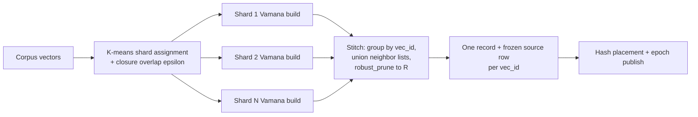

# FR-077: Distann Sharded Clustered Build with Closure Overlap and Stitch

## Description

The index build SHALL construct one coherent global Vamana graph via sharded
parallel builds followed by a stitch pass: cluster the corpus into build
shards with closure overlap, build an independent Vamana graph per shard,
then merge duplicated vectors' neighbor lists into a single record per
vec_id.

## Workflow

## Behavior

- The build SHALL assign vectors to spherical k-means build shards; a vector
  whose distance to a non-primary shard centroid is within
  `(1 + closure_epsilon)` of its best centroid distance SHALL be inserted into
  that shard as well (closure overlap). The ε band is a fresh implementation
  against the already-plumbed `closure_epsilon` reloption: the distance-ratio
  machinery ADR-085 cited lives on the unmerged
  `task-144-spire-closure-ratio-pruning` branch, so no shared helper is
  extracted and SPIRE's build path (whose specs remain APPROVED) is untouched.
  Negative `closure_epsilon` values SHALL be clamped to `+0.0` at assignment
  time; a node excluded from every band by non-finite distances SHALL still be
  assigned to its primary shard.
- Each shard SHALL be built with the shared Vamana core
  (`build_vamana_graph_with_stats`, `robust_prune`) independently; shard
  builds MAY run in parallel.
- The stitch pass SHALL: group per-shard records by vec_id; take the union
  of each duplicated vec_id's neighbor lists; re-prune the union with
  `robust_prune` under the global distance function to at most
  `graph_degree` edges; and emit exactly one record per vec_id.
- When a vector appears in only one shard, the stitch SHALL pass its record
  through unchanged (stitch idempotence).
- The build SHALL emit one canonical source-row payload alongside each stitched
  record.
- The source-row payload SHALL include the full-precision indexed vector and
  every non-dropped source attribute from the same MVCC build snapshot.
- The build SHALL encode the source-row payload as the versioned handoff entry
  from [FR-076](../storage/FR-076-distann-graph-node-record-format.md).
- The build SHALL carry one source-row payload per vec_id rather than one per
  neighbor or closure-overlap copy.
- The full build (shard assignment, per-shard builds, stitch) SHALL be
  deterministic under a fixed seed: identical corpus + seed + options yield
  an identical stitched graph (this is what makes FR-081-AC-1's
  single-vs-multinode result-identity test possible).
- A single-shard (monolithic) build SHALL remain available as the fallback
  path: a stitch-quality failure degrades build parallelism, not the
  program (ADR-085 Consequences).
- **Shard-count selection.** When the `build_shards` reloption is at least 1,
  the build SHALL use exactly that shard count, clamped to the node count.
  When it is `0` (auto), the build SHALL use one shard (the monolithic path)
  for corpora of at most 20,000 nodes and otherwise
  `(node_count / 25_000).clamp(2, 16)` shards (integer division: roughly one
  shard per 25k rows, floored at 2 and capped at 16 so per-shard Vamana builds
  stay large enough to be coherent).
- **Reachability repair.** After the stitch, the build SHALL run a
  reachability-repair pass: BFS from the entry medoid over the stitched graph;
  for each unreached node in ascending node order, append one in-edge from the
  nearest reached source node that can accept it — a source with a free
  adjacency slot, or otherwise a source whose farthest non-repair edge is
  evicted to make room. The pass SHALL protect repair-added edges from
  eviction by later repairs. The pass SHALL propagate reachability forward
  from each repaired node before the next repair. The pass SHALL apply to
  single-membership passthrough records as well as unioned records.
  The pass SHALL never exceed `graph_degree` (CON-1). If a repair cannot be
  placed without exceeding the degree bound, then the build SHALL fail rather
  than emit an unreachable or over-degree graph. The pass is deterministic, and its repair
  count is reported in the build statistics (`reachability_repairs`, expected
  0 at corpus scale). This pass is what guarantees CON-3 mechanically.
- The build SHALL record in the epoch manifest: shard count,
  closure duplication factor, stitch edge-union statistics, and build wall
  time.
  > **Implementation gap (Task 214 audit F2):** the shipped build computes
  > shard count, duplication factor, stitch edge-union stats, peak-memory
  > figures, and repair counts in `ShardBuildStats`, but emits them only as
  > build-time log lines; the epoch manifest (`DistannEpochManifestV2`)
  > carries no such fields and build wall time is not measured anywhere.
  > AC-3 and the CON-4 manifest row are therefore unsatisfiable as written
  > until the manifest (or an equivalent durable artifact) gains these fields.
  > The requirement stands as an open obligation; it does not describe
  > shipped behavior.

## Constraints

| ID | Constraint | Type | Validation |
|----|------------|------|------------|
| FR-077-CON-1 | Post-stitch out-degree SHALL NOT exceed `graph_degree` for any node | Integrity | Property test |
| FR-077-CON-2 | Every vec_id SHALL appear exactly once in the stitched output | Integrity | Property test |
| FR-077-CON-3 | Every node SHALL be reachable from the entry medoid in the stitched graph | Integrity | Property test (BFS) |
| FR-077-CON-4 | Stitch memory usage SHALL stay within the bound set by ADR-085 decision D8 (streamed by vec_id group: peak ≤ one vec_id group + prune working set) | Performance | Analysis (peak-memory row in the epoch manifest, cited in the owning packet manifest) |

## Acceptance Criteria

| ID | Criteria | Verification |
|----|----------|--------------|
| FR-077-AC-1 | Stitched-build recall@10 at 100k is within 0.001 of a monolithic single-shard build at equal search parameters | Test (bench A/B) |
| FR-077-AC-2 | Stitching an already-stitched graph is a no-op | Test (property) |
| FR-077-AC-3 | Closure duplication factor and stitch statistics are present in the epoch manifest | Inspection |
| FR-077-AC-4 | All FR-077-CON property tests pass across randomized corpora | Test (proptest) |
| FR-077-AC-5 | Stitched output contains exactly one canonical handoff entry per vec_id, with the vector and source-row payload captured from the same build snapshot | Test (TC-038, TC-040) |
| FR-077-AC-6 | The reachability-repair pass makes every node reachable from the entry medoid without exceeding `graph_degree`, never evicts a repair edge, and reports its repair count in the build statistics | Test (property) |

> AC-3 and the CON-4 peak-memory manifest row are currently unsatisfiable:
> the statistics exist but reach only the build log, not the epoch manifest
> (see the implementation-gap note under Behavior).

## Dependencies

- **Upstream**: [FR-076](../storage/FR-076-distann-graph-node-record-format.md);
  ADR-085 decision D8 (stitch memory bound)
- **Downstream**: [FR-078](./FR-078-distann-hash-placement.md),
  [FR-080](../read/FR-080-distann-coordinator-head-index.md)
