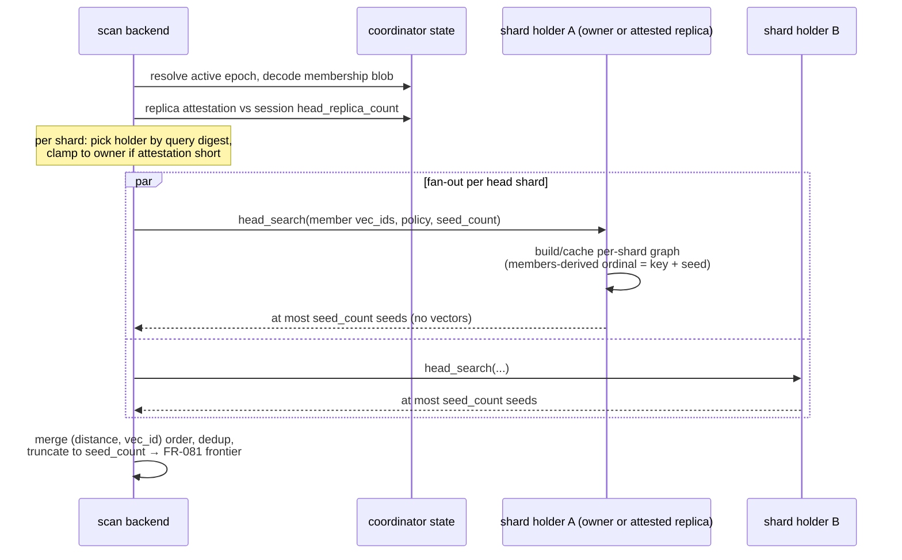
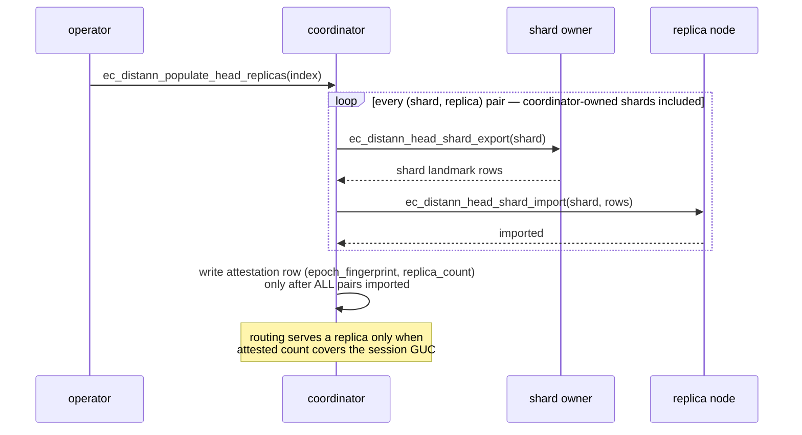

# FR-080: DistANN Sharded Head Index

## Description

The build SHALL select a bounded navigation sample (the head, capacity
`head_index_cap` = C) over the global graph, and queries SHALL seed the
hop-round frontier from it. On a multi-owner roster the head SHALL be
sharded: the coordinator persists head membership only (never landmark
vectors), each owner serves the head landmarks it hash-owns from locally
held vectors, and the coordinator merges a bounded number of seeds per
owner. The coordinator-resident head is the degenerate single-owner shape,
not the distributed design
([NFR-021](../../../non-functional/NFR-021-distann-distribution-invariant.md)
clause 3).

## Behavior

- **Selection (T2).** The pipeline SHALL select up to C sample members by
  breadth-first regions over the stitched global graph: seeded at the global
  entry medoid plus one seed per remaining connected component (vec_id
  order), regions filled round-robin by depth to the cap, deterministic
  under a fixed seed. Every connected component of the stitched graph SHALL
  be represented. A `head_construction=partition_union` arm instead takes a
  deterministic round-robin union of the per-build-partition prefixes, with
  up to C candidates supplied by each partition before global deduplication
  and capping. The persisted metadata marker
  `DISTANN_METADATA_FLAG_HEAD_PARTITION_UNION` proves which construction was
  active; the default remains `stitched_bfs`.
- **Trained selection.** An explicit `training_landmarks_exact` generation
  MAY instead select the same bounded cap from exactly 200 ordered, finite,
  dimension-matched training queries supplied by a PostgreSQL relation. The
  builder SHALL rank each query's top 32 source RaBitQ codes,
  frequency/rank/vec_id order the union, and deterministically fill unused
  slots from geometry landmarks. The relation is build input under the build
  snapshot; its canonical query digest, count, policy, and selected head
  digest SHALL be fingerprint-bound. Evaluation-query training and
  server-local file inputs are forbidden.
- **Persistence — multi-owner default (membership-only).** When
  `ec_distann.shard_head_storage` is on (the default) and the build roster
  has more than one owner, head persistence at the coordinator SHALL be
  exactly one bounded membership value on the head state row —
  `u32_le(count) || count × u64_le(vec_id)` — plus the head policy fields;
  the per-landmark sample rows SHALL be empty and the persisted head graph
  SHALL be empty. The membership digest SHALL be bound into the build spec
  and manifest digest chain. Single-owner rosters SHALL persist the full
  sample (vectors and neighbors) as the degenerate local shape. The
  persisted shape, not the session GUC, SHALL govern the read path.
- **Serving — sharded search.** When the persisted head is membership-only
  (and `ec_distann.sharded_head_search` is on, the default), seed selection
  SHALL fan a head-search request (`ec_distann_head_search_physical`) to
  every head-shard holder — except where an explicitly enabled
  [FR-089](./FR-089-distann-crown-cache.md) width-pruning arm narrows the
  fan-out or [FR-090](./FR-090-distann-fused-head-hop.md) fuses the hop
  entirely: each holder
  materializes its shard's landmarks from locally held vectors, builds (and
  caches per backend) a navigable per-shard graph, exact-scores or
  code-scores per the bound head policy, and returns at most `seed_count`
  seeds. The per-shard graph SHALL be keyed and seeded by the
  members-derived shard ordinal (derived from the shard's member vec_ids
  via hash placement; mixed-ownership member lists are rejected) so owner
  and replica serve identical topology. The coordinator SHALL merge
  per-holder seeds deterministically — (distance, vec_id) order, dedup,
  truncate to `seed_count` — and SHALL NOT receive landmark vectors.
  `seed_count` is fixed internal policy, `max(2 × BW, 32)` for the
  session's beam width, not a reloption or production GUC (a
  benchmark-feature override is compile-gated out of production builds).
  Landmarks tombstoned mid-epoch remain head members for the epoch (D10
  frozen membership) and are not excluded from head search on any path —
  fused, unfused, or crown-assisted identically; result-half tombstone
  authority is always the owner's at expansion time.
- **Head-shard replicas.** Where `ec_distann.head_replica_count` > 0, each
  head shard MAY additionally be served by that many replica nodes.
  Population SHALL export/import per (shard, replica) pair — including
  coordinator-owned shards — and the per-epoch population attestation row
  SHALL be written only after every pair has imported. Routing SHALL serve
  a shard from a replica only when the attested replica count covers the
  session's requested count, choosing the serving node by deterministic
  query digest; otherwise routing SHALL clamp to the shard owner. Replicas
  are non-authoritative and rebuildable. Attestation proves import
  completed, not perpetual servability: a serve failure on a selected
  replica SHALL fall back to the shard owner for that request; a failure
  on the owner path surfaces as the ordinary owner-path error. Replica
  copy and attestation rows are epoch-scoped and SHALL be reclaimed at
  epoch retirement and index drop
  ([FR-082](../lifecycle/FR-082-distann-epoch-lifecycle.md) owns the
  reclaim step).
- **Coordinator caches.** The physical epoch/head cache SHALL be keyed on
  the exact `(index_oid, logical_index_uuid, build_id, epoch_fingerprint)`
  identity, retain at most two immutable epoch entries per backend with LRU
  eviction, validate the immutable candidate/descriptor/head digest chain on
  cold fill, and never cache raw conninfo, relation handles, active-pointer
  state, or scan tokens. The cache SHALL have a Userset off switch
  (`ec_distann.physical_epoch_cache`); disabling it restores cold
  validation on every scan without changing results. Owner-side per-backend
  head-shard caches SHALL be bounded and keyed on a digest of the shard
  ordinal, member list, build parameters, and head policy.

  The shipped local head cache currently uses the legacy metadata tuple as
  the build/epoch surrogate until the physical-generation catalog is active;
  it still includes index OID and logical UUID, validates the metadata
  fingerprint on hits, and bounds entries to two per index rather than two
  globally. The Userset switch is implemented and applies to this cache as
  well as the physical-generation cache.
- **Query seeding.** A query SHALL apply the active generation's bound head
  policy first; the merged seeds feed the hop-round frontier of
  [FR-081](./FR-081-distann-query-orchestration.md). Under
  `training_landmarks_exact`, each holder exact-scores at most its shard's
  landmarks and the merged, policy-bound prefix is at most 32 seeds.
  Unknown or inconsistent policy metadata fails closed.
- **Strictness.** If the persisted membership or sample is missing or fails
  to decode, scans SHALL error (no silent medoid-entry fallback).
- **Pre-sharding head shape.** The coordinator-resident shape (full
  vectors persisted at the coordinator, searched locally with zero remote
  calls) SHALL remain reachable only as the single-owner degenerate case
  and as an explicit fixture context arm; on a multi-owner roster it is
  non-conforming under NFR-021 and SHALL NOT be a decision-bearing
  benchmark arm
  ([NFR-022](../../../non-functional/NFR-022-distann-control-validity.md)).
  (Terminology: "legacy lane" is reserved for the v4
  `distributed_control=false` fixture substrate — see FR-085's bounded
  context; this pre-sharding shape lives inside the physical lane.)

## Flows

Sharded head search (default multi-owner path):

Head-shard replica population and attestation:

## Constraints

| ID | Constraint | Type | Validation |
|----|------------|------|------------|
| FR-080-CON-1 | Coordinator-resident head state on a multi-owner roster SHALL be O(C) identifiers (4 + 8·C bytes membership) plus merged seeds bounded by seed_count; landmark vectors SHALL reside only on owners (~C/roster each) and attested replicas | Memory | Analysis + storage audit |
| FR-080-CON-2 | C is the capacity resolved per [FR-088](./FR-088-distann-head-scaling-law.md) (the explicit `head_index_cap` reloption when the law is disabled, its default documented); head-shard serving state per node SHALL be bounded by its shard size and replica assignments, independent of total N | Memory | Analysis + unit test |

## Acceptance Criteria

| ID | Criteria | Verification |
|----|----------|--------------|
| FR-080-AC-1 | On a multi-owner roster, no landmark vector crosses the wire to the coordinator: holders return at most seed_count seeds each and coordinator head relations hold zero derived bytes | Test + storage audit |
| FR-080-AC-2 | Selection and per-shard graph construction are deterministic for a fixed seed, epoch, and member list; owner and replica serve identical shard topology via the members-derived ordinal | Test |
| FR-080-AC-3 | Every connected component of the stitched graph is represented in the head sample | Test (property/BFS); partition-union activation is additionally marker-verified |
| FR-080-AC-4 | Recall sensitivity to C is measured and recorded (informs the default) | Analysis (bench) |
| FR-080-AC-5 | Warm repeated scans reuse one validated epoch entry; cache identity cannot alias OID/UUID/build/fingerprint changes; at most two epoch entries per backend | Test + benchmark |
| FR-080-AC-6 | Trained policy input/count/digest and selected head are deterministic and fingerprint-bound; replay with different input fails | Test |
| FR-080-AC-7 | Replica routing engages only when the per-epoch attestation covers the requested replica count, and clamps to the shard owner otherwise; an incomplete population can never enable replica serving | Test |
| FR-080-AC-8 | The membership blob decodes to exactly sample_count ids and its digest is bound into the manifest chain; a membership-only head cannot take the coordinator-local search path | Test |

## Dependencies

- **Upstream**: [FR-077](../build/FR-077-distann-sharded-build-and-stitch.md)
  (stitched graph), [FR-078](../build/FR-078-distann-hash-placement.md)
  (placement, build spec digests); ADR-085 decision D3 (C policy) as amended
  by ADR-087 (sharded head default).
- **Downstream**: [FR-081](./FR-081-distann-query-orchestration.md) (frontier
  seeding);
  [NFR-021](../../../non-functional/NFR-021-distann-distribution-invariant.md)
  clause 3 (distribution invariant this FR realizes).

## Measured head-cap outcome

The Task 179 real three-owner PG18 suite in
`reviews/task-179/038-head-cap-sensitivity/` measured caps 64, 256, and 4096
at 10k, 50k, and 100k using 20 held-out queries (200 recall trials) and 20
latency iterations per cell. Physical recall for 64 / 256 / 4096 was
respectively 0.995 / 0.995 / 1.000 at 10k, 0.975 / 0.980 / 0.980 at 50k, and
0.920 / 0.945 / 0.950 at 100k. All nine cells had exact disjoint topology and
two proven remote owners. The 100k result rejects 64 and retains the D3
default of 4096 over 256 for its final 0.005 recall increment; warm physical
p50 at 4096 was also no worse in this matrix (70.7, 100.8, and 78.9 ms).
Head sizing as a scaling law (rate × N with bounds) is owned by
[FR-088](./FR-088-distann-head-scaling-law.md), which resolves C at T2;
this measured outcome fixes the law's floor default (4096).
