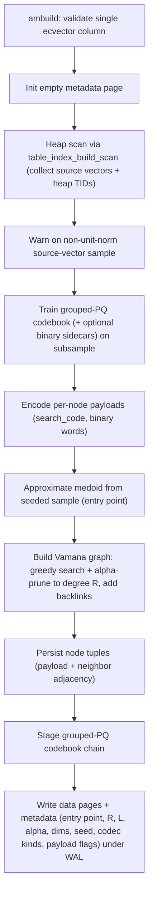

# FR-034: DiskANN Build and Persisted Vamana Storage

## Description

`ec_diskann` SHALL implement a Vamana/DiskANN-style access method with AM-owned
persisted graph storage. The build path SHALL construct the graph via the
current deterministic single-process Vamana core and, when enabled, the Task
65b parallel graph-construction stepping-stone.

## Behavior

1. `ec_diskann` SHALL support `ecvector_diskann_ip_ops` and `tqvector_diskann_ip_ops`.
2. Build reloptions SHALL include `graph_degree`, `build_list_size`, `list_size`, `rerank_budget`, `top_k`, `alpha`, and `storage_format`.
3. `storage_format` SHALL currently accept `pq_fastscan`.
4. Build SHALL validate finite unit-normalized source vectors for the v0 distance wrapper.
5. The persisted format SHALL include graph nodes, medoid metadata, grouped-PQ codebook chain, binary sidecars, and duplicate overflow state where needed.
6. Parallel graph construction SHALL preserve deterministic persisted adjacency
   equality on validation fixtures before it can support product build-time
   claims.
7. Build diagnostics SHALL expose enough phase timing to let `ecaz bench suite`
   parse DiskANN build-time evidence.

## Acceptance Criteria

| ID | Criteria | Verification |
|---|---|---|
| FR-034-AC-1 | `CREATE INDEX ... USING ec_diskann` succeeds for unit-normalized `ecvector` data and writes readable graph metadata | Test |
| FR-034-AC-2 | Non-unit or non-finite source vectors are rejected or warned according to the build/insert context | Test |
| FR-034-AC-3 | Invalid DiskANN reloption values raise ERROR during index creation | Test |
| FR-034-AC-4 | Parallel DiskANN build evidence proves serial/parallel persisted graph equivalence for the accepted stepping-stone configuration | Analysis |
| FR-034-AC-5 | Suite build artifacts include parseable DiskANN phase timing for build benchmark packets | Inspection |

### FR-034-AC-1

`CREATE INDEX ... USING ec_diskann` succeeds for unit-normalized `ecvector` data and writes readable graph metadata.

### FR-034-AC-2

Non-unit or non-finite source vectors are rejected or warned according to the build/insert context.

### FR-034-AC-3

Invalid DiskANN reloption values raise ERROR during index creation.

### FR-034-AC-4

Parallel DiskANN build evidence proves serial/parallel persisted graph
equivalence for the accepted stepping-stone configuration.

### FR-034-AC-5

Suite build artifacts include parseable DiskANN phase timing for build
benchmark packets.

## Workflow

## Dependencies

- **Upstream**: US-014 (implements relationship)
- **Downstream**: none identified
