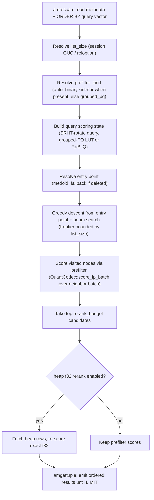

# FR-035: DiskANN Scan, Prefilter, and Rerank

## Description

`ec_diskann` SHALL implement ordered scan over the persisted Vamana graph using a configurable traversal prefilter and heap rerank.

## Behavior

1. Scan breadth SHALL resolve from relation `list_size` unless `ec_diskann.list_size` session override is set.
2. `ec_diskann.prefilter_kind` SHALL accept `auto`, `binary_sidecar`, and `grouped_pq`.
3. `auto` SHALL use persisted binary sidecars when available and fall back to grouped-PQ behavior when required.
4. `rerank_budget` SHALL bound final exact heap rerank before executor LIMIT truncation.
5. Costing SHALL model DiskANN scan behavior without replacing HNSW as the default guidance.
6. Binary sidecar, grouped-PQ, RaBitQ, and TurboQuant search-code scoring SHALL
   route through the index-local `QuantCodec` adapter when the persisted search
   payload is present.
7. DiskANN graph traversal batching SHALL use the shared candidate-batch
   counter surface for batchable prefilter/scoring families and SHALL report
   small-flush width buckets when partial dispatch is material to the result.
8. DiskANN scan-kernel optimization claims SHALL preserve recall floors and
   identify whether latency changed because of scoring-share, frontier
   management, heap rerank, or I/O.

## Acceptance Criteria

| ID | Criteria | Verification |
|---|---|---|
| FR-035-AC-1 | `ORDER BY embedding <#> query LIMIT k` returns ordered results through `ec_diskann` | Test |
| FR-035-AC-2 | Session `ec_diskann.list_size` changes the effective scan breadth | Test |
| FR-035-AC-3 | Binary sidecar prefilter and grouped-PQ fallback are selectable through `ec_diskann.prefilter_kind` | Test |
| FR-035-AC-4 | DiskANN block-kernel benchmark evidence includes `surface=diskann` rows with quant kind, ISA, scalar/kernel counters, and width buckets | Analysis |
| FR-035-AC-5 | DiskANN scan optimization packets preserve recall and attribute latency changes to the dominant scan stage | Analysis |

### FR-035-AC-1

`ORDER BY embedding <#> query LIMIT k` returns ordered results through `ec_diskann`.

### FR-035-AC-2

Session `ec_diskann.list_size` changes the effective scan breadth.

### FR-035-AC-3

The binary sidecar prefilter path and grouped-PQ fallback are selectable through `ec_diskann.prefilter_kind`.

### FR-035-AC-4

DiskANN block-kernel benchmark evidence includes `surface=diskann` rows with
quant kind, ISA, scalar/kernel counters, and width buckets for claimed
compressed-domain batch-scoring wins.

### FR-035-AC-5

DiskANN scan optimization packets preserve recall and attribute end-to-end
latency changes to the dominant scan stage rather than only reporting aggregate
p50/p95/p99.

## Workflow

## Dependencies

- **Upstream**: US-014 (implements relationship)
- **Downstream**: none identified
