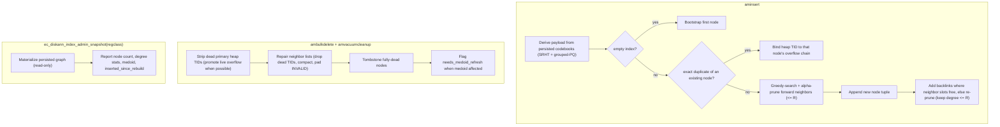

# FR-036: DiskANN Insert, Vacuum, and Diagnostics

## Description

`ec_diskann` SHALL support live insert, duplicate handling, vacuum repair, and graph diagnostics for the persisted Vamana format.

## Behavior

1. Live insert SHALL add a new node or duplicate overflow entry according to persisted duplicate state.
2. Insert SHALL maintain Vamana lock ordering and graph-degree constraints.
3. Vacuum SHALL remove dead primary heap TIDs, promote duplicate overflow entries when possible, tombstone dead nodes, repair neighbor slots, and mark medoid refresh when needed.
4. Diagnostics SHALL expose graph summary state for review packets and tuning.

## Acceptance Criteria

| ID | Criteria | Verification |
|---|---|---|
| FR-036-AC-1 | Rows inserted after DiskANN index creation are reachable through the index | Test |
| FR-036-AC-2 | DELETE plus VACUUM removes dead DiskANN entries and repairs affected neighbor slots | Test |
| FR-036-AC-3 | DiskANN diagnostics expose graph summary metadata without mutating the index | Test |

### FR-036-AC-1

Rows inserted after DiskANN index creation are reachable through the index.

### FR-036-AC-2

DELETE plus VACUUM removes dead DiskANN entries and repairs affected neighbor slots.

### FR-036-AC-3

DiskANN diagnostics expose graph summary metadata without mutating the index.

## Workflow

## Dependencies

- **Upstream**: US-014 (implements relationship)
- **Downstream**: none identified
