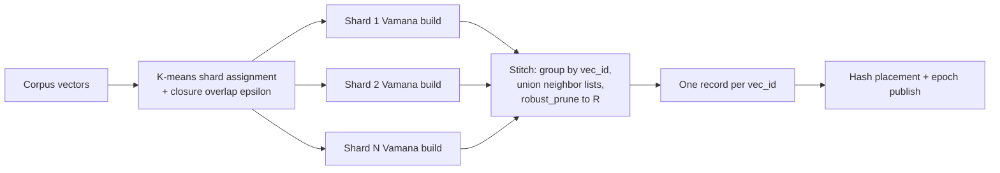

# FR-077: Distann Sharded Clustered Build with Closure Overlap and Stitch

## Description

The index build SHALL construct one coherent global Vamana graph via sharded
parallel builds followed by a stitch pass: cluster the corpus into build
shards with closure overlap, build an independent Vamana graph per shard,
then merge duplicated vectors' neighbor lists into a single record per
vec_id.

## Workflow

## Behavior

- The build SHALL assign vectors to k-means build shards; a vector whose
  distance to a non-primary shard centroid is within `(1 + closure_epsilon)`
  of its best centroid distance SHALL be inserted into that shard as well
  (closure overlap), reusing the distance-ratio assignment machinery
  established on branch `task-144-spire-closure-ratio-pruning`
  (`src/am/ec_spire/build/routing_plan.rs`). Reuse mode is **extract-to-shared**
  (lift the pure distance-ratio helper into a shared module consumed by both
  AMs), not a fork and not an in-place edit under SPIRE's spec ownership — so
  SPIRE's behavior (whose specs remain APPROVED) is unchanged.
- Each shard SHALL be built with the shared Vamana core
  (`build_vamana_graph_with_stats`, `robust_prune`) independently; shard
  builds MAY run in parallel.
- The stitch pass SHALL: group per-shard records by vec_id; take the union
  of each duplicated vec_id's neighbor lists; re-prune the union with
  `robust_prune` under the global distance function to at most
  `graph_degree` edges; and emit exactly one record per vec_id.
- When a vector appears in only one shard, the stitch SHALL pass its record
  through unchanged (stitch idempotence).
- The build SHALL emit, alongside each stitched record, that vec_id's
  full-precision vector as the co-placed rerank (heap) tier
  ([FR-076](./FR-076-distann-graph-node-record-format.md), ADR-085 D11), so
  the FR-078 hand-off can place record and vector together on one node. The
  vector is carried once per vec_id (never per neighbor).
- The full build (shard assignment, per-shard builds, stitch) SHALL be
  deterministic under a fixed seed: identical corpus + seed + options yield
  an identical stitched graph (this is what makes FR-081-AC-1's
  single-vs-multinode result-identity test possible).
- A single-shard (monolithic) build SHALL remain available as the fallback
  path: a stitch-quality failure degrades build parallelism, not the
  program (ADR-085 Consequences).
- The build SHALL record in the epoch manifest: shard count,
  closure duplication factor, stitch edge-union statistics, and build wall
  time.

## Constraints

| ID | Constraint | Type | Validation |
|----|------------|------|------------|
| FR-077-CON-1 | Post-stitch out-degree SHALL NOT exceed `graph_degree` for any node | Integrity | Property test |
| FR-077-CON-2 | Every vec_id SHALL appear exactly once in the stitched output | Integrity | Property test |
| FR-077-CON-3 | Every node SHALL be reachable from the entry medoid in the stitched graph | Integrity | Property test (BFS) |
| FR-077-CON-4 | Stitch memory usage SHALL stay within the bound set by ADR-085 decision D8 (streamed by vec_id group: peak ≤ one vec_id group + prune working set) | Performance | Analysis (peak-memory row in the epoch manifest, cited in the owning packet manifest) |

## Acceptance Criteria

| ID | Criteria | Verification |
|----|----------|--------------|
| FR-077-AC-1 | Stitched-build recall@10 at 100k is within 0.001 of a monolithic single-shard build at equal search parameters | Test (bench A/B) |
| FR-077-AC-2 | Stitching an already-stitched graph is a no-op | Test (property) |
| FR-077-AC-3 | Closure duplication factor and stitch statistics are present in the epoch manifest | Inspection |
| FR-077-AC-4 | All FR-077-CON property tests pass across randomized corpora | Test (proptest) |

## Dependencies

- **Upstream**: [FR-076](./FR-076-distann-graph-node-record-format.md);
  ADR-085 decision D8 (stitch memory bound)
- **Downstream**: [FR-078](./FR-078-distann-hash-placement.md),
  [FR-080](./FR-080-distann-coordinator-head-index.md)
