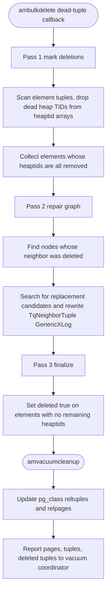

# FR-010: HNSW Index Access Method — Vacuum

## Description

The extension SHALL implement `ambulkdelete` and `amvacuumcleanup` using the three-pass algorithm from pgvector's `hnswvacuum.c`.

On partitioned tables, vacuuming one partition index SHALL NOT read or modify any other partition's index pages.

### `ambulkdelete` — Three-Pass Delete

**Pass 1 — Mark deletions:**
- Scan element tuples, compare heap TIDs against the dead-tuple bitmap
- Remove dead TIDs from element tuples' heaptid arrays
- Build a hash table of elements to delete (elements with all heaptids removed)

**Pass 2 — Repair graph:**
- For each node whose neighbor was deleted: find replacement neighbors
- Use HNSW search to discover new candidates for broken connections
- Update neighbor tuples with replacement TIDs
- All page writes use GenericXLog

**Pass 3 — Finalize:**
- Set `deleted = true` on element tuples with no remaining heaptids
- Deleted elements become eligible for space reclamation

### `amvacuumcleanup` — Statistics Update

- Update `pg_class.reltuples` and `pg_class.relpages` for the index
- Report number of pages, tuples, deleted tuples to the vacuum coordinator

### Concurrency

- Vacuum SHALL NOT block concurrent INSERT or SELECT operations
- Scans that started before vacuum began SHALL still see consistent results (MVCC)
- All page modifications SHALL use GenericXLog

## Workflow

`ec_hnsw_ambulkdelete` and `ec_hnsw_amvacuumcleanup` (`src/am/ec_hnsw/vacuum.rs`) implement the three-pass delete plus the cleanup statistics update. Every page modification is GenericXLog-wrapped and MVCC-safe so concurrent INSERT and SELECT are not blocked.

## Acceptance Criteria

| ID | Criteria | Verification |
|---|---|---|
| FR-010-AC-1 | After DELETE + VACUUM, a search does not return the deleted row | Test |
| FR-010-AC-2 | After vacuuming 10% of rows, remaining rows stay reachable and recall stays >= 80% of pre-vacuum recall under NFR-003 conditions | Analysis |
| FR-010-AC-3 | VACUUM concurrent with INSERT and SELECT for 60 seconds produces no errors, panics, or corrupted results (`ecaz stress vacuum` harness) | Demonstration |

### FR-010-AC-1: Deleted rows removed from results
After DELETE + VACUUM, a search SHALL NOT return the deleted row.

### FR-010-AC-2: Graph connectivity maintained
After vacuuming 10% of rows, the remaining rows SHALL still be reachable. Recall SHALL NOT drop below 80% of pre-vacuum recall when measured using the same dataset, query set, ground-truth method, `m`, `ef_construction`, `ef_search`, and reporting conditions required by NFR-003.

### FR-010-AC-3: No corruption under concurrent load
Running VACUUM concurrently with INSERT and SELECT for 60 seconds SHALL NOT produce errors, panics, or corrupted results.

Current validation note:
- `main` now carries `ecaz stress vacuum`, a CLI harness that runs concurrent
  INSERT, ec_hnsw graph scan, and VACUUM for 60 seconds using the live
  `ambeginscan/amrescan/amgettuple` path through `pg_test`-only SQL surfaces,
  then issues one final post-quiesce `VACUUM (ANALYZE)` and checks that the
  live index's reachable live-element count stays within 90% of a freshly
  rebuilt reference ec_hnsw index on the same final table data.

## Dependencies

- **Upstream**: US-005, FR-007, StR-003 (traces); NFR-003 (recall reporting conditions) referenced in prose
- **Downstream**: none identified
