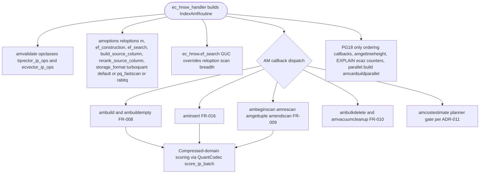

# FR-030: Current HNSW Access Method Surface

## Description

`ec_hnsw` SHALL remain the default general-purpose ANN access method and SHALL support the current main-branch build, scan, insert, vacuum, planner, diagnostics, parallel-build, storage-format, and compressed-domain scoring surfaces.

## Behavior

1. `ec_hnsw` SHALL support `ecvector` and `tqvector` opclasses.
2. Reloptions SHALL include `m`, `ef_construction`, `ef_search`, `build_source_column`, `rerank_source_column`, and `storage_format`.
3. `ec_hnsw.ef_search` SHALL override relation scan breadth when set.
4. PG18 SHALL expose planner ordering callbacks, tree-height callback, custom EXPLAIN counters, and stats where configured.
5. Eligible PG18 builds SHALL support parallel heap ingestion and concurrent DSM graph assembly, with a diagnostic fallback GUC.
6. HNSW scan scoring SHALL route TurboQuant, QJL, RaBitQ, grouped-PQ codec parity, and exact-score mode surfaces through the shared `QuantCodec` / candidate-batch scoring contract where a batch boundary exists.
7. `ec_hnsw.turboquant_exact_score_mode` SHALL select among `exact`, `full_lut`, `tiled_lut`, and `int8_approx` exact-score strategies for measurement and diagnostics, where `exact` is the raw uncompressed scoring path and the other three are compressed-domain modes.
8. HNSW block-kernel acceptance SHALL disclose frontier batch-width distribution because graph-frontier batches often limit 32-wide kernel coverage.
9. Parallel index scan is not part of the active requirement set.

## Workflow

`ec_hnsw_handler` (`src/am/ec_hnsw/routine.rs`) builds the `IndexAmRoutine` that dispatches every AM callback. Reloptions and the `ec_hnsw.ef_search` GUC are parsed in `options.rs`; build/insert/scan/vacuum handlers route compressed-domain scoring through the shared `QuantCodec` batch contract. The diagram is the high-level handler dispatch surface, not the per-handler internals (covered by FR-008/009/010/016).

## Acceptance Criteria

| ID | Criteria | Verification |
|---|---|---|
| FR-030-AC-1 | `CREATE INDEX ... USING ec_hnsw` succeeds for documented `ecvector` and `tqvector` opclasses | Test |
| FR-030-AC-2 | `SET ec_hnsw.ef_search = value` changes the effective scan breadth reported by HNSW diagnostics | Test |
| FR-030-AC-3 | On PG18, `EXPLAIN (ecaz)` can emit HNSW scan counters for an HNSW index scan | Test |
| FR-030-AC-4 | Parallel HNSW build can be enabled or disabled through the documented diagnostic GUC | Test |
| FR-030-AC-5 | HNSW compressed-domain batch scoring emits block-kernel counter rows with surface `hnsw` and the applicable quant kind | Test |
| FR-030-AC-6 | HNSW exact-mode benchmark evidence reports width buckets and avoids SVE/32-wide claims when the `>=32` flush share is below the task gate | Analysis |

### FR-030-AC-1

`CREATE INDEX ... USING ec_hnsw` succeeds for documented `ecvector` and `tqvector` opclasses.

### FR-030-AC-2

`SET ec_hnsw.ef_search = value` changes the effective scan breadth reported by HNSW diagnostics.

### FR-030-AC-3

On PG18, `EXPLAIN (ecaz)` can emit HNSW scan counters for an HNSW index scan.

### FR-030-AC-4

Parallel HNSW build can be enabled or disabled through the documented diagnostic GUC.

### FR-030-AC-5

HNSW compressed-domain batch scoring emits block-kernel counter rows with
surface `hnsw` and the applicable quant kind when the selected scan path reaches
the shared batch scorer.

### FR-030-AC-6

HNSW exact-mode benchmark evidence reports width buckets and does not claim SVE
or 32-wide kernel wins when the measured `>=32` flush share is below the task
gate.

## Dependencies

- **Upstream**: US-003, US-008 (implements relationships)
- **Downstream**: none identified
