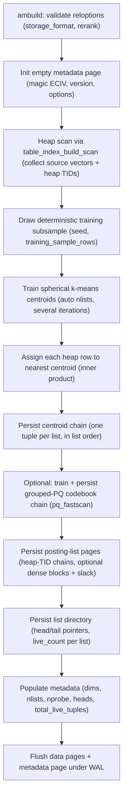

# FR-031: IVF Build and Storage

## Description

`ec_ivf` SHALL implement a PostgreSQL index access method that trains centroids,
assigns heap rows to posting lists, and persists AM-owned metadata and
posting-list pages. Eligible PG18 builds SHALL use the current parallel
heap-ingestion and tuple-buffer capture surface when enabled.

## Behavior

1. `ec_ivf` SHALL support `ecvector_ip_ops` and `tqvector_ip_ops`.
2. Build reloptions SHALL include `nlists`, `nprobe`, `rerank_width`, `training_sample_rows`, `seed`, `pq_group_size`, `posting_slack_percent`, `storage_format`, and `rerank`.
3. `storage_format` SHALL accept `auto`, `turboquant`, `pq_fastscan`, and `rabitq`.
4. `rerank` SHALL accept `auto`, `off`, and `heap_f32`. `source_column` SHALL be rejected until implemented.
5. Training and assignment SHALL be deterministic for the same data and seed.
6. Posting slack pages SHALL be reserved when configured for churn reuse.
7. Parallel IVF build SHALL preserve serial/parallel equivalence for centroid
   assignment and posting-list metadata before it is used for product-scale
   build-time claims.

## Acceptance Criteria

| ID | Criteria | Verification |
|---|---|---|
| FR-031-AC-1 | `CREATE INDEX ... USING ec_ivf` produces readable IVF metadata with centroid/list counts and storage-format metadata | Test |
| FR-031-AC-2 | Invalid reloption values raise ERROR during index creation | Test |
| FR-031-AC-3 | `rerank = 'source_column'` raises a clear unsupported-mode ERROR | Test |
| FR-031-AC-4 | Parallel IVF build diagnostics prove live worker tuple capture and serial/parallel equivalence on the Task 71 validation fixtures | Analysis |

### FR-031-AC-1

`CREATE INDEX ... USING ec_ivf` produces readable IVF metadata with centroid/list counts and storage-format metadata.

### FR-031-AC-2

Invalid reloption values raise ERROR during index creation.

### FR-031-AC-3

`rerank = 'source_column'` raises a clear unsupported-mode ERROR.

### FR-031-AC-4

Parallel IVF build diagnostics can prove that worker tuple capture is live and
that serial and parallel build paths produce equivalent index-visible results
on the validation fixtures used for Task 71.

## Workflow

## Dependencies

- **Upstream**: US-013 (implements relationship)
- **Downstream**: none identified
