# FR-033: IVF Insert, Vacuum, and Admin Snapshots

## Description

`ec_ivf` SHALL support live insert, vacuum cleanup, and read-only admin/debug snapshots for drift and page ownership.

## Behavior

1. Live insert SHALL assign new tuples to a valid posting list without duplicating heap TIDs.
2. Insert SHALL reject dimensional or storage-format mismatches.
3. Vacuum SHALL remove dead heap TIDs from posting lists and update vacuum statistics.
4. Admin snapshots SHALL expose metadata, drift, cost, and page-ownership state for review and tuning.

## Acceptance Criteria

| ID | Criteria | Verification |
|---|---|---|
| FR-033-AC-1 | Rows inserted after index creation are reachable through the IVF index | Test |
| FR-033-AC-2 | DELETE plus VACUUM removes dead heap TIDs from IVF posting lists | Test |
| FR-033-AC-3 | IVF admin snapshots reject non-IVF indexes with a clear error | Test |

### FR-033-AC-1

Rows inserted after index creation are reachable through the IVF index.

### FR-033-AC-2

DELETE plus VACUUM removes dead heap TIDs from IVF posting lists.

### FR-033-AC-3

IVF admin snapshots reject non-IVF indexes with a clear error.

## Workflow

```mermaid
flowchart TD
    subgraph Insert["aminsert"]
        IA["Read metadata + build index tuple"] --> IB{"index trained (dimensions > 0)?"}
        IB -->|"no"| IC["Bootstrap empty index (build single-tuple plan)"]
        IB -->|"yes"| ID["Validate tuple (dimension / storage-format match)"]
        ID --> IE["Score vs centroids, assign to nearest list"]
        IE --> IF["Append heap TID to that list's posting chain"]
        IF --> IG["Update directory + metadata live/insert stats"]
    end
    subgraph Vacuum["ambulkdelete + amvacuumcleanup"]
        VA["Walk each list's posting blocks"] --> VB["Drop dead heap TIDs (bulk-delete callback)"]
        VB --> VC["Rewrite postings, update directory live/dead counts"]
        VC --> VD["Tombstone dead rerank-group entries"]
        VD --> VE["Update metadata totals + pg_class stats"]
    end
    subgraph Admin["ec_ivf_index_admin_snapshot(regclass)"]
        AA["Reject non-IVF index"] --> AB["Read metadata + directory drift"]
        AB --> AC["Report nlists, nprobe, drift, reindex recommendation"]
    end
```

## Dependencies

- **Upstream**: US-013 (implements relationship)
- **Downstream**: none identified
