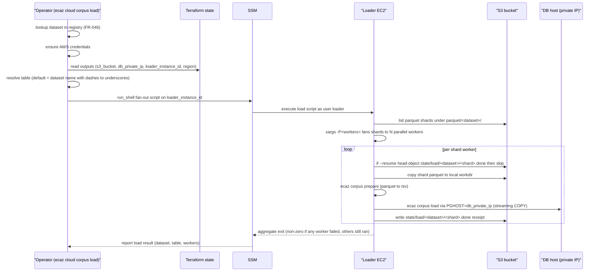

# FR-047: In-VPC Corpus Load Fan-Out

## Description

`ecaz cloud corpus load` SHALL execute parquet → COPY ingestion
inside the database VPC by fanning out parallel workers on the
loader EC2, never streaming corpus bytes from the operator
workstation.

## Behavior

1. The loader EC2 SHALL be running and reachable via SSM during a
   `corpus load` (provisioned by `ecaz cloud up` and resumed by
   `ecaz cloud resume`); `corpus load` dispatches the load over SSM
   and does not itself start or stop the instance.
2. Parquet shards staged in S3 SHALL be loaded by N parallel workers
   on the loader EC2 (the `--workers` flag, default `8`, fanned out
   via `xargs -P<workers>`).
3. Each worker SHALL invoke the existing
   `ecaz corpus prepare` + `ecaz corpus load` code paths against
   the DB's private IP, reusing the streaming COPY implementation
   in `crates/ecaz-cli/src/corpus/load.rs` unchanged.
4. Index builds SHALL run after load, not during. Build time SHALL
   be measured and recorded as a separate artifact.
5. Worker progress (shard id, rows loaded, bytes streamed) SHALL be
   reported back to the operator's terminal in real time and
   persisted to S3 so a re-run with `--resume` skips completed
   shards.
6. When a single worker fails, other workers SHALL continue. The
   overall command SHALL exit non-zero with a summary of failed
   shards.

## Acceptance Criteria

| ID | Criteria | Verification |
|---|---|---|
| FR-047-AC-1 | A `dev`-profile load with 4 parquet shards spawns 4 concurrent workers on the loader EC2 (SSM exec history) | Demonstration |
| FR-047-AC-2 | After a `corpus load`, the DB row counts match the registry's declared `row_count` for the dataset | Demonstration |
| FR-047-AC-3 | Killing a worker mid-load and re-running with `--resume` completes the load without duplicating rows in already-loaded shards | Demonstration |
| FR-047-AC-4 | Load throughput meets or exceeds NFR-011 targets for the profile | Analysis |

### FR-047-AC-1

A `dev`-profile load with 4 parquet shards spawns 4 concurrent
workers on the loader EC2 (verified via SSM exec history).

### FR-047-AC-2

After a `corpus load`, the DB row counts match the registry's
declared `row_count` for the dataset.

### FR-047-AC-3

Killing a worker mid-load and re-running with `--resume` completes
the load without duplicating rows in already-loaded shards.

### FR-047-AC-4

Load throughput meets or exceeds NFR-011 targets for the profile.

## Workflow

## Dependencies

- **Upstream**: US-021 (implements), FR-044 (supports), FR-045 (loader EC2 provisioning), FR-046 (dataset registry), NFR-011 (throughput targets)
- **Downstream**: none identified
