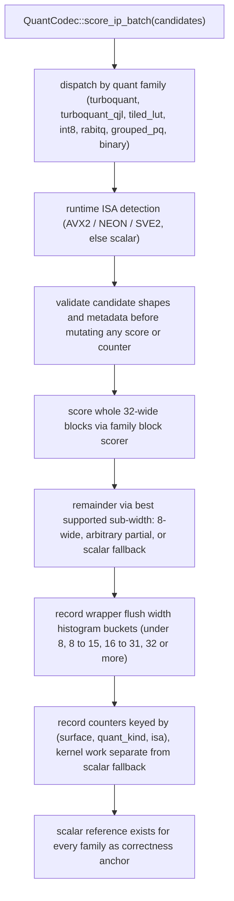

# FR-014: SIMD Acceleration

## Description

The extension SHALL provide scalar-correct compressed-domain scoring and
SIMD-accelerated block kernels for access-method batch scoring where a shipped
quantized storage surface can form candidate batches.

The primary integration point is `QuantCodec::score_ip_batch`. Access methods
SHALL route compressed-domain scan scoring through the selected codec batch
method rather than calling ISA-specific functions directly.

### Accelerated Surfaces

| Family | Quant kind | Current owner | Required behavior |
| --- | --- | --- | --- |
| TurboQuant no-QJL 4-bit LUT | `turboquant` | Task 87 / 102 | Shared batch route; real AVX2/NEON/SVE kernels landed in Task 102 (AVX2 measured and approved; NEON/SVE2 static-reviewed pending Graviton 4 evidence). |
| TurboQuant QJL | `turboquant_qjl` | Task 97 | Gamma-aware current surfaces only; QJL side data is prevalidated before scoring. |
| HNSW tiled LUT exact mode | `turboquant_tiled_lut` | Task 98 / 103 | HNSW exact-score mode with distinct counters and width histogram; Task 103 packet 001 marks this lane retire/deprioritize (47-48% slower than `full_lut` at byte-identical recall), so no further ISA kernels are planned for it. |
| HNSW int8 approximate exact mode | `turboquant_int8` | Task 98 / 103 | Integer-exact HNSW exact-score mode with distinct counters and width histogram; the missing AVX2 kernel is the Task 103 AC1 highest-value cell. |
| RaBitQ bits=1 | `rabitq` | Task 93 / 103 | IVF, HNSW, and DiskANN batch scoring with partial-width dispatch; Intel validation/bench evidence is owed under Task 103 AC4. |
| Grouped-PQ / PqFastScan | `grouped_pq` | Task 94 | IVF and DiskANN batch scoring; HNSW codec parity remains scalar until a traversal batch boundary exists. |
| Binary sidecar / Hamming | `binary` | Task 95 / 103 | DiskANN binary-sidecar prefilter batch scoring; Task 103 packet 001 records a documented AVX2 skip (scalar POPCNT is within noise end-to-end). |

Structural absences SHALL be recorded as absent cells in the Task 99 matrix
rather than hidden by omitted rows. The raw fp32 `ecvector` path does not need a
compressed-domain block kernel.

### Width Cascade

The shared candidate-batch driver SHALL use the Task 101 width cascade:

1. Validate all candidate metadata and code shapes before mutating any output
   score or counter.
2. Score the largest whole 32-candidate block range through the family block
   scorer.
3. Score remainders through the best family-supported sub-width path:
   octet, arbitrary partial, or scalar fallback.
4. Record the wrapper flush width in histogram buckets `<8`, `8..15`,
   `16..31`, and `>=32`.
5. Record scalar fallback work separately from kernel work unless the family
   intentionally returns `isa=scalar` as a scalar block-kernel row for legacy
   comparability.

### Runtime ISA Detection

The extension SHALL use runtime CPU feature detection
(`std::is_x86_feature_detected!` / `std::arch::is_aarch64_feature_detected!`)
and a shared ISA label set: `scalar`, `neon`, `sve`, `sve2`, and `avx2`.

Kernel modules SHALL return the ISA that actually scored the candidates. A
fallback stub that delegates to scalar SHALL return `scalar`, not the host's
highest detected capability. SVE/SVE2 claims SHALL report measured runtime
vector length when making width-specific performance claims.

### Counter Surface

The extension SHALL expose a block-kernel scoring snapshot keyed by:

```text
(surface, quant_kind, isa)
```

The snapshot SHALL include total flush/candidate/time fields, kernel
flush/candidate/time fields, scalar fallback flush/candidate/time fields, and
the width histogram buckets. `ecaz bench suite` result extraction SHALL preserve
these fields in normalized result rows.

### Correctness Guarantees

Every kernel family SHALL define a scalar reference and one of the accepted
anchor modes:

1. bit-exact scalar-order reference;
2. forced-scalar bit-exact anchor plus ADR-076 `4 ULP or 1e-6 relative`
   dispatch tolerance;
3. production-same-order equivalence plus a documented wider envelope when the
   algebra requires it, with benchmark-level recall preservation as the binding
   acceptance gate.

Integer and Hamming-style kernels SHALL match exact integer counts before score
polarity conversion. Any SIMD implementation that can exceed the accepted
tolerance for a family SHALL be blocked, tightened to a stricter anchor, or
documented as a partial/deferred matrix cell.

### Build Configuration

The extension SHALL NOT require AVX2, NEON, SVE, or SVE2 at compile time. A
pure scalar build SHALL produce correct results on every supported
architecture, with degraded throughput. SIMD functions SHALL use
`#[target_feature(enable = "...")]` guarded by runtime detection at the call
site or safe family-local dispatch wrappers.

## Workflow



## Acceptance Criteria

| ID | Criteria | Verification |
|---|---|---|
| FR-014-AC-1 | On a CPU without a family-supported SIMD ISA, every quantized scoring path produces correct results via scalar fallback | Test |
| FR-014-AC-2 | Each accelerated family proves scalar/SIMD equivalence under its accepted anchor mode and preserves recall in acceptance benchmark cells | Test |
| FR-014-AC-3 | Running on a CPU without AVX2, NEON, SVE, or SVE2 does not produce an illegal instruction fault | Test |
| FR-014-AC-4 | Accepted benchmark evidence includes `(surface, quant_kind, isa)` rows with kernel/scalar counters and width buckets for claimed block-kernel results | Inspection |
| FR-014-AC-5 | The Task 99 matrix identifies every shipped `(AM, quant, ISA)` cell as complete, partial, missing-kernel, structurally absent, or deferred, with source packets | Inspection |

### FR-014-AC-1: Scalar fallback correctness
On a CPU without a family-supported SIMD ISA, every quantized scoring path
SHALL produce correct results using scalar fallback.

### FR-014-AC-2: SIMD-scalar equivalence
Each accelerated family SHALL prove scalar/SIMD equivalence under its accepted
anchor mode and SHALL preserve recall in benchmark cells used for acceptance.

### FR-014-AC-3: No SIGILL on unsupported CPU
Running the extension on a CPU without AVX2, NEON, SVE, or SVE2 support SHALL
NOT produce an illegal instruction fault.

### FR-014-AC-4: Counter attribution

Accepted benchmark evidence SHALL include `(surface, quant_kind, isa)` rows
with kernel/scalar counters and width buckets for any claimed block-kernel
latency or coverage result.

### FR-014-AC-5: Completeness matrix

The project-level Task 99 matrix SHALL identify every shipped
`(AM, quant, ISA)` cell as complete, partial, missing-kernel, structurally
absent, or deferred, with source packets for measured claims.

## Dependencies

- **Upstream**: NFR-001 (traces), FR-013 (quantization pipeline), FR-005 (code-to-code scoring), FR-017 (prepared-query scoring)
- **Downstream**: FR-015 (`QuantCodec` adapters expose the counter surface defined here)
