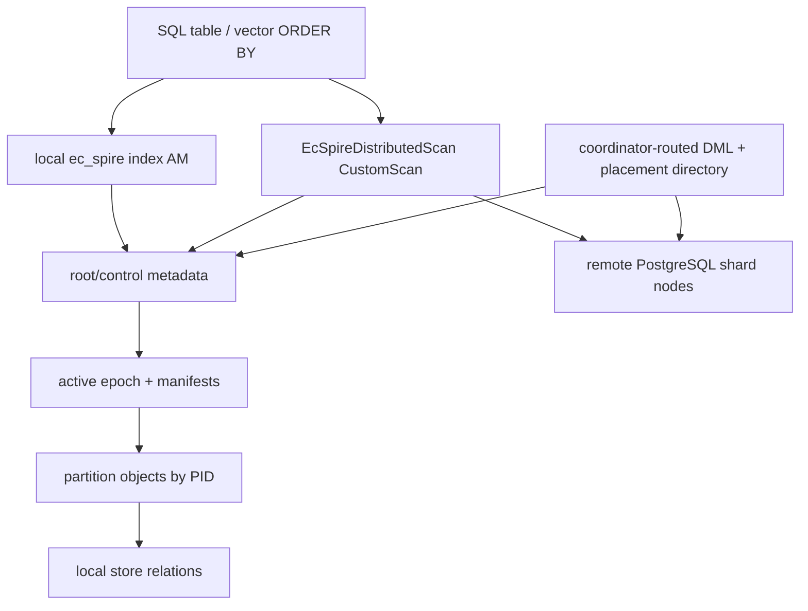
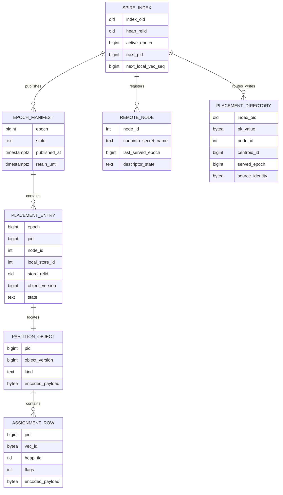

# FR-048: SPIRE Domain Model

## Requirement

`ec_spire` SHALL model distributed vector search as epoch-published,
PID-addressed partition objects with stable vector identity, explicit
placement metadata, and separate local index-AM and distributed CustomScan
execution paths.

## Domain Terms

| Term | Definition |
| --- | --- |
| SPIRE partition | Index-internal cluster object addressed by PID; not a PostgreSQL declarative table partition. |
| PID | Durable nonzero `u64` partition object identifier scoped to one SPIRE index. |
| Partition object | Immutable object bytes for root, internal routing, leaf, delta, or top-graph state. |
| Object version | Monotonic nonzero physical version of a partition object. A PID may receive a new version through replacement publication. |
| Epoch | Published index version that binds root/control state, object manifests, placement entries, remote descriptors, and retained object versions. |
| Placement entry | Mapping from `(epoch, pid, object_version)` to `(node_id, local_store_id, store_relid, object locator, state)`. |
| Local store | Bounded PostgreSQL-managed relation-backed partition-object container; `local_store_id = 0` is valid for single-store indexes. |
| `SpireVecId` | Stable vector identity used for scan dedupe and remote merge. Local IDs are `0x01 || little_endian_u64`; global IDs are `0x02 || stable_global_payload`. |
| Boundary replica | Additional assignment row for the same `SpireVecId` in another PID to improve border recall. |
| Placement directory | Coordinator-local SQL table that maps distributed primary keys to owning nodes for writes and PK reads. |

## Architecture

## Domain Rules

1. SPIRE partition selection SHALL be performed by SPIRE routing logic, not by PostgreSQL declarative table partition pruning.
2. A published epoch SHALL identify one coherent root/control state, hierarchy, object manifest, placement map, local store generation, and remote readiness surface.
3. Published partition objects SHALL be immutable. Inserts, deletes, vacuum compaction, split, merge, rebalance, and store movement SHALL publish deltas, replacement objects, or replacement epochs.
4. Local-only scans SHALL use the `ec_spire` index AM and return local heap TIDs.
5. Distributed reads with active remote placements SHALL use `EcSpireDistributedScan` and return tuple payloads through the CustomScan tuple interface.
6. Distributed reads SHALL NOT require coordinator-side mirror heap rows for remote-origin tuples.
7. Remote row locators SHALL remain opaque to the coordinator; origin-node heap visibility resolution owns remote physical tuple interpretation.
8. Local `0x01` vector IDs SHALL dedupe only within the origin node during remote merge. Global `0x02` vector IDs SHALL dedupe across nodes.
9. Strict consistency SHALL fail closed when required placements, stores, remote descriptors, epoch windows, endpoint identities, or tuple payloads are stale or unavailable.
10. Degraded consistency MAY skip unavailable remote work only when explicitly configured and SHALL report the skipped node, PID count, category, and operator hint.

## Entity Model

## Acceptance Criteria

### FR-048-AC-1

The spec defines the SPIRE bounded context using PIDs, partition objects,
object versions, epochs, placements, local stores, vector identity, remote
nodes, and placement directory rows.

### FR-048-AC-2

The spec distinguishes local index-AM scans from distributed CustomScan reads
and does not describe remote-origin tuple delivery as index-AM heap-TID
materialization.

### FR-048-AC-3

The spec defines local and global vector identity semantics, including
node-scoped local ID dedupe and cross-node global ID dedupe.

### FR-048-AC-4

The spec requires fail-closed strict behavior and explicit degraded diagnostics
for stale or unavailable placements and remotes.

### FR-048-AC-5

The spec defines epoch publication as the only visibility boundary for
coherent partition-object sets.

### FR-048-AC-6

The spec identifies all SPIRE object families required to reproduce the
storage model: root/control, routing, leaf, delta, top-graph, replacement, and
placement objects.

### FR-048-AC-7

The spec distinguishes read placement metadata from write placement-directory
metadata and states when each is consulted.

### FR-048-AC-8

The spec records the explicit v1 deferrals for product-scale evidence, true
parallel local-store execution, cross-shard non-vector SQL, automatic DDL, and
cross-shard embedding moves.
