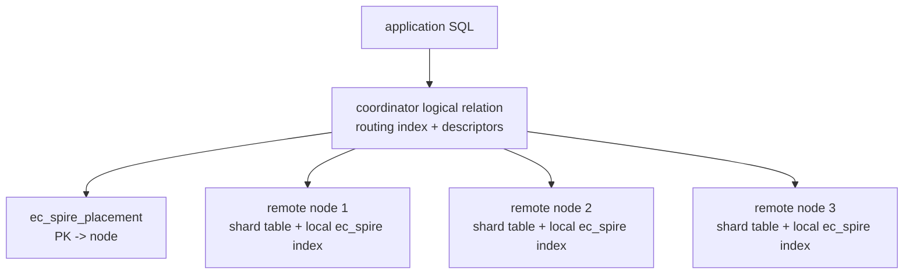

# FR-055: SPIRE Distributed Topology and Placement Directory

## Requirement

Distributed SPIRE SHALL use a coordinator PostgreSQL instance for routing
metadata and one or more remote PostgreSQL shard nodes for row storage and
near-data SPIRE scoring. The coordinator SHALL maintain placement-directory
state for writes and PK-keyed reads, not for vector-read candidate routing.

## Topology

## Coordinator Role

The coordinator SHALL host:

1. the logical relation used by applications;
2. routing centroids, placement metadata, remote descriptors, and epoch
   readiness state;
3. the `ec_spire_placement` table for coordinator-routed INSERT, UPDATE,
   DELETE, bulk placement registration, and PK-keyed reads;
4. optional local shard rows when `node_id = 0` placements are configured.

The coordinator SHALL NOT mirror every remote-origin row merely to make
distributed vector reads work.

## Remote Role

Each remote node SHALL host:

1. a shard table with the same relevant column shape as the coordinator logical
   relation;
2. a local `ec_spire` index over shard rows;
3. a remote descriptor/announce surface reporting endpoint identity, served
   epoch, extension version, tuple transport capability, and schema
   fingerprint state.

## Placement Directory Schema

`ec_spire_placement` SHALL contain:

| Column | Type | Rule |
| --- | --- | --- |
| `index_oid` | `oid` | coordinator SPIRE index |
| `pk_value` | `bytea` | canonical primary-key encoding; v1 bigint uses PostgreSQL `int8send` bytes |
| `node_id` | `integer` | `0` for coordinator-local, positive for remotes |
| `centroid_id` | `bigint` | active-epoch routing leaf identity, opaque across retraining |
| `served_epoch` | `bigint` | positive remote/coordinator epoch |
| `source_identity` | `bytea` | exact 16-byte stable identity payload |

Primary key SHALL be `(index_oid, pk_value)`. A secondary identity index SHALL
support lookup by `(index_oid, source_identity)`.

## Acceptance Criteria

### FR-055-AC-1

The topology distinguishes coordinator routing metadata from remote shard row
storage and local SPIRE scoring.

### FR-055-AC-2

The placement directory is defined as the write-routing and PK-read source of
truth, not as a read-path materialization catalog.

### FR-055-AC-3

The v1 schema states that non-vector non-PK scatter-gather reads and automatic
DDL propagation are out of scope.
