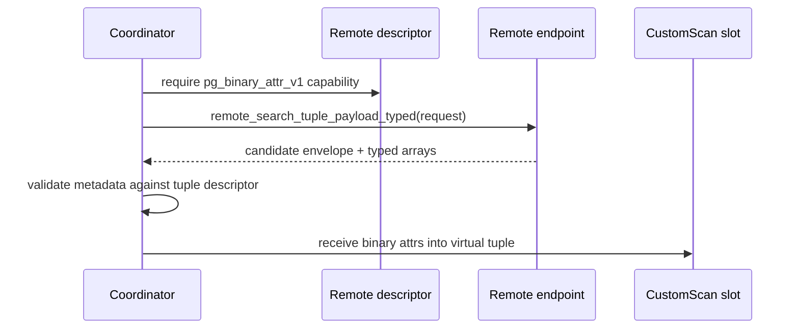

# FR-056: SPIRE Remote Endpoint and Typed Tuple Transport

## Requirement

Remote SPIRE endpoints SHALL return validated candidate identity, score,
diagnostics, and typed tuple payloads using per-attribute PostgreSQL binary I/O
for the production distributed read path.

## Remote Search Request

| Field | Type | Rule |
| --- | --- | --- |
| `transport_version` | `integer` | `1` for this contract |
| `index_oid` | `oid` | remote SPIRE index |
| `requested_epoch` | `bigint` | positive coordinator-requested epoch |
| `query` | `real[]` or equivalent vector bytes | query vector |
| `selected_pids` | `bigint[]` | selected leaf/routing PIDs for this remote |
| `top_k` | `integer` | positive result budget |
| `consistency_mode` | `text` | `strict` or `degraded` |
| `requested_columns` | `text[]` | heap columns required by CustomScan projection |
| `request_id` | `uuid` or 16 opaque bytes | coordinator-generated request identity for logs and cancellation |

## Candidate Envelope

Remote responses SHALL preserve candidate identity fields:

| Field | Rule |
| --- | --- |
| `served_epoch` | epoch actually served by the remote |
| `node_id` | origin node identity |
| `pid` | partition object PID |
| `vec_id` | valid `SpireVecId` bytes |
| `row_locator` | opaque origin-node row locator bytes |
| `score` | finite score using SPIRE sign convention |
| `flags` | assignment role and status flags |
| `status` | stable receive/fault label |
| `request_id` | request identity echoed from the request |

## Typed Tuple Payload

The production read transport SHALL be `pg_binary_attr_v1` with aligned arrays:

| Field | Type |
| --- | --- |
| `payload_attnums` | `int2[]` |
| `payload_names` | `text[]` |
| `payload_type_oids` | `oid[]` |
| `payload_typmods` | `int4[]` |
| `payload_collations` | `oid[]` |
| `payload_nulls` | `bool[]` |
| `payload_values` | `bytea[]` |
| `payload_formats` | `text[]` |
| `tuple_transport` | `text = 'pg_binary_attr_v1'` |
| `tuple_transport_status` | stable status label |

For non-null attributes, the remote SHALL encode values with the attribute
type's binary send function. For SQL NULL attributes, `payload_nulls[i]` SHALL
be true and the coordinator SHALL ignore `payload_values[i]`.

All payload arrays SHALL have identical length equal to the number of requested
attributes for the candidate row. `payload_attnums` SHALL match the remote heap
tuple descriptor. `payload_names`, `payload_type_oids`, `payload_typmods`, and
`payload_collations` SHALL match the coordinator's expected CustomScan output
descriptor before any binary value is decoded.

`payload_formats[i]` SHALL be `pg_binary_send` for every non-null value.
Unsupported binary send functions, by-value/by-reference layout differences,
domain/base-type mismatches, and collation mismatches SHALL fail closed with a
stable typed-transport status. The coordinator SHALL NOT decode `bytea` payload
bytes with text I/O, JSON, or Rust-specific struct layout assumptions.

## Transport Flow

## Behavior

1. Production dispatch SHALL fail closed when a selected endpoint does not
   advertise ready `pg_binary_attr_v1`.
2. The legacy JSON tuple endpoint MAY remain for compatibility/measurement, but
   SHALL NOT be selected by the production tuple-payload dispatch path.
3. Typed metadata mismatch SHALL report schema drift or typed-transport failure
   instead of falling back after malformed typed rows are received.
4. Payload row and batch byte caps SHALL fail closed before accepting oversized
   decoded payloads into coordinator merge state.

## Acceptance Criteria

### FR-056-AC-1

The endpoint request, candidate envelope, and typed tuple payload arrays are
defined without relying on JSON as the production read transport.

### FR-056-AC-2

The coordinator validates name, type OID, typmod, collation, NULL status, and
binary payload shape before constructing a CustomScan tuple.

### FR-056-AC-3

Unsupported typed transport, unsupported binary I/O, payload caps, and schema
drift have stable fail-closed status labels.
