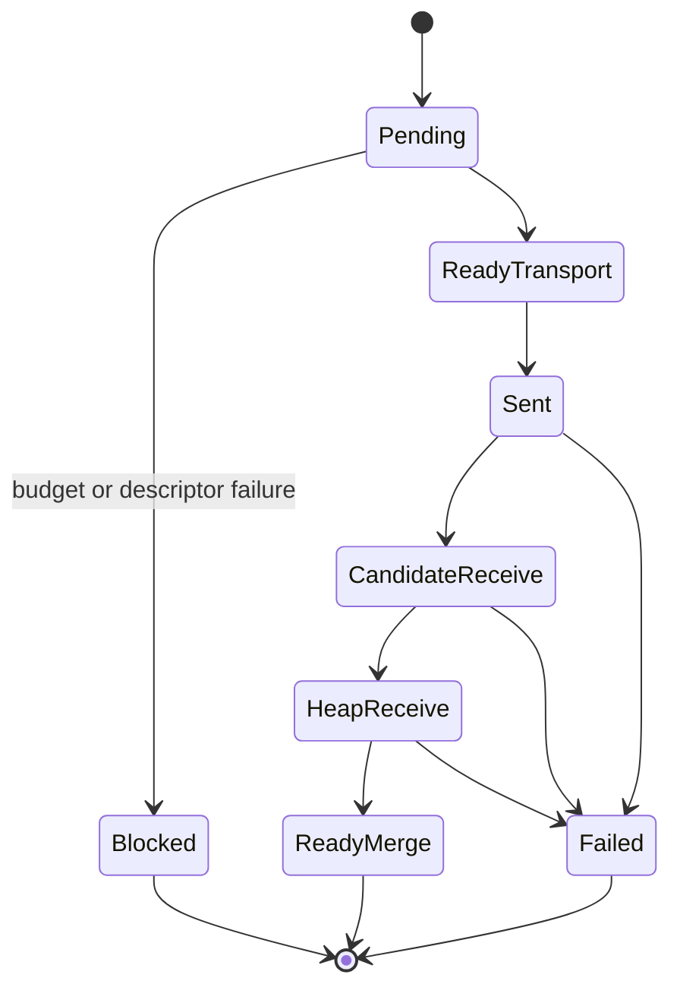

# FR-057: SPIRE Production Remote Executor

## Requirement

Distributed SPIRE SHALL use a production remote executor that resolves sanitized
libpq/TLS connection state, enforces fanout and governance budgets, validates
endpoint identity, propagates timeout/cancel behavior, and returns validated
candidate/tuple batches to the coordinator merge path.

## Executor State Model

## Behavior

1. Raw conninfo SHALL be resolved inside executor code from
   `conninfo_secret_name` and SHALL NOT be returned through SQL-visible rows,
   logs, or unsanitized errors.
2. TLS/libpq connection policy SHALL preserve libpq security parameters from
   resolved conninfo.
3. Static fanout limits SHALL bound selected remote nodes, total remote PIDs,
   and PIDs per node before socket open.
4. Advisory governance SHALL bound concurrent dispatches globally and per
   remote node using the reserved SPIRE advisory-lock namespace.
5. Endpoint identity validation SHALL bind coordinator descriptor state to
   remote index identity, extension version, served epoch, tuple transport
   capability, and schema fingerprint state.
6. Strict mode SHALL fail the query when required remote work is stale,
   unavailable, overloaded, or identity-incompatible.
7. Degraded mode MAY skip failed remote work only when the selected query path
   permits degraded execution and SHALL report one row per skipped node.
8. PostgreSQL interrupt/cancel and configured connect/statement timeouts SHALL
   move affected remote work to explicit failure states.
9. Diagnostic functions SHALL distinguish dry planning surfaces from live
   libpq/TLS surfaces that open sockets.

## Acceptance Criteria

### FR-057-AC-1

Remote execution exposes pending, transport-ready, sent, receive, ready, failed,
blocked, strict, and degraded statuses with stable labels.

### FR-057-AC-2

Budget and governance overload fail before raw conninfo exposure and before
candidate batches enter merge state.

### FR-057-AC-3

Endpoint identity mismatch, stale epoch, timeout, cancellation, transport
failure, and degraded skip are observable through operator diagnostics.
