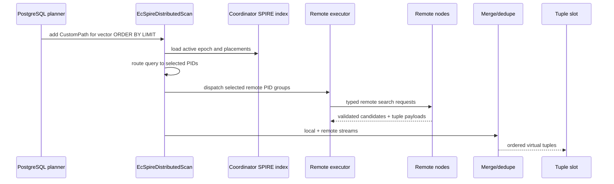

# FR-058: SPIRE CustomScan Distributed Read

## Requirement

SPIRE distributed vector reads SHALL use `EcSpireDistributedScan`, a PostgreSQL
CustomScan node, to route selected PIDs to local and remote stores, merge
candidate streams, and return virtual tuple payloads directly to the executor.

## Planner And Execution Flow

## Behavior

1. The planner SHALL select `EcSpireDistributedScan` for eligible vector-ordered
   queries against a distributed SPIRE relation with active remote placements.
2. Local-only SPIRE indexes SHALL continue to use the local index AM path.
3. Distributed CustomScan SHALL NOT consult coordinator-side mirror rows or
   `ec_spire_remote_row_materialization` for tuple delivery.
4. CustomScan SHALL return tuple payloads directly through the CustomScan tuple
   interface, not via index-AM `xs_heaptid`.
5. CustomScan output order SHALL follow score and the deterministic merge
   tie-break order: assignment role, served epoch, node ID, PID, object version,
   row index, and row locator where applicable.
6. CustomScan EXPLAIN SHALL identify `EcSpireDistributedScan` and expose
   enough planning/private metadata to debug path selection and execution.
7. V1 distributed reads SHALL document that remote statements use remote
   snapshots, not the coordinator transaction snapshot; `REPEATABLE READ` and
   `SERIALIZABLE` on the coordinator do not provide cross-shard repeatability.
8. V1 CustomScan recheck SHALL validate the already-returned virtual payload
   shape; it SHALL NOT claim PostgreSQL EvalPlanQual revalidation of the remote
   heap row under coordinator snapshot semantics.

## Acceptance Criteria

### FR-058-AC-1

Eligible distributed vector queries produce an `EcSpireDistributedScan` plan
instead of a local index scan.

### FR-058-AC-2

Remote-origin rows are returned as virtual tuple payloads without requiring a
coordinator-local heap TID.

### FR-058-AC-3

The spec states the v1 distributed read isolation limitation and the absence of
cross-shard EvalPlanQual semantics.
