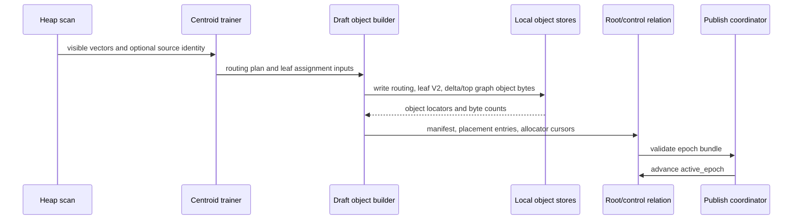

# FR-052: SPIRE Build and Epoch Publish

## Requirement

`ec_spire` SHALL build relation-backed partition objects from heap vectors,
write a validated manifest bundle, and publish a coherent active epoch only
after all required root/control, object, placement, and store metadata is
durable.

## Build Flow

## Behavior

1. Build SHALL reject unsupported index shapes before object publication.
2. Build SHALL allocate PIDs and local vector IDs from root/control allocator
   state, never from heap TIDs.
3. Build SHALL write relation-backed object tuples before publishing placement
   entries that reference them.
4. Single-level builds SHALL create a root routing object and leaf V2 objects.
5. Recursive builds SHALL create root/internal routing objects and leaves
   according to the configured hierarchy plan.
6. Top-graph builds SHALL publish exactly one active top-graph object when the
   top-graph option is enabled.
7. Source identity SHALL use local `0x01` IDs unless the configured writer
   provider can produce stable 16-byte source identity for global `0x02` IDs.
8. Publish SHALL fail if any manifest entry references a missing, unreadable,
   stale, or wrong-version placement.
9. Old epochs SHALL remain retained until the epoch retention and active-query
   rules permit cleanup.

## Acceptance Criteria

### FR-052-AC-1

An empty or populated build publishes a root/control state, active epoch,
manifest, and placement set that diagnostics can read back.

### FR-052-AC-2

Build publication fails closed when required partition-object bytes, placement
entries, object versions, or store descriptors are inconsistent.

### FR-052-AC-3

The build flow can be reproduced from heap scan through centroid training,
draft object creation, object writes, manifest validation, and active epoch
publication.
