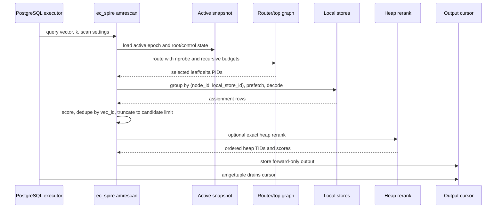

# FR-053: SPIRE Local Search

## Requirement

Local `ec_spire` index scans SHALL use an eager bounded scan contract:
`amrescan` loads the active epoch, routes the query, reads selected objects,
scores and deduplicates candidates, performs heap rerank when configured, and
prepares a forward-only cursor that `amgettuple` drains.

## Search Flow

## Behavior

1. `amrescan` SHALL replace all previous scan-local work.
2. `amgettuple` SHALL require a completed `amrescan` and SHALL support only
   forward scan direction.
3. `amgettuple` SHALL NOT perform routing expansion, object reads, delta decode,
   scoring, or heap rerank under the eager contract.
4. Route budgets SHALL bound recursive frontier work using effective `nprobe`,
   `beam_width`, `max_leaf_routes`, and `max_routing_expansions`.
5. Candidate budgets SHALL bound rows before heap rerank using effective
   `rerank_width` and `max_candidate_rows`.
6. Local store reads SHALL group selected placements by `(node_id,
   local_store_id)` and prefetch selected relation blocks before decode.
7. Local store object decode and candidate scoring SHALL remain sequential
   inside one backend until a later parallel-store ADR lands.
8. Boundary replicas SHALL be deduplicated by `SpireVecId`, keeping the best
   score and deterministic tie-break.
9. Stale heap locators SHALL be suppressed or repaired by the update/vacuum
   policy; scans SHALL NOT emit unrelated heap rows.

## Acceptance Criteria

### FR-053-AC-1

Local scans expose route, store, candidate, dedupe, truncation, rerank, and
cursor-drain diagnostics sufficient to identify the limiting stage.

### FR-053-AC-2

`amgettuple` drains a pre-ranked cursor and does not perform object-store or
heap-rerank work.

### FR-053-AC-3

Store-grouped prefetch is distinguishable from true parallel multi-store
execution in diagnostics and product claims.
