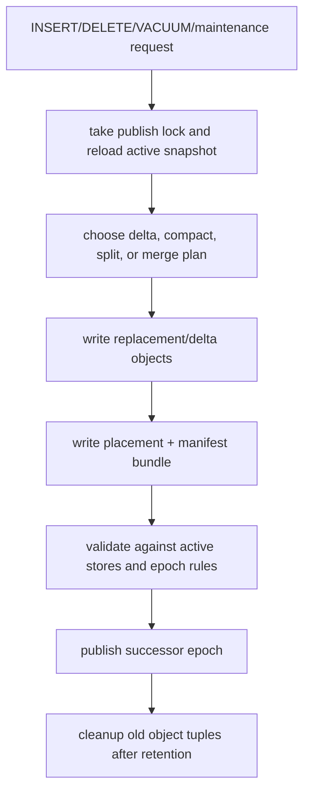
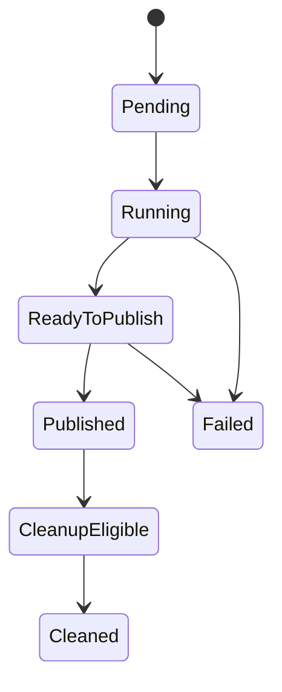

# FR-054: SPIRE Update Maintenance and Cleanup

## Requirement

`ec_spire` SHALL represent inserts, deletes, split, merge, compaction, and
cleanup as epoch-safe delta or replacement-object publication, never as
in-place mutation of objects visible to active queries.

## Maintenance Flow

## Behavior

1. Published partition objects SHALL be immutable.
2. Inserts SHALL allocate a stable `SpireVecId`, route to a target leaf, and
   publish an insert delta or replacement object.
3. Deletes SHALL publish delete deltas or replacement objects that suppress the
   target vector identity without breaking retained epochs.
4. Updates SHALL be delete-old plus insert-new unless a later ADR accepts a
   narrower optimization.
5. Split operations SHALL allocate new replacement leaf PIDs when coverage
   changes.
6. Merge operations SHALL allocate a replacement leaf PID for merged coverage.
7. PID-preserving rebalance MAY increment object version only when routing
   coverage and parent centroid semantics do not change.
8. Maintenance SHALL recheck the selected plan after acquiring the publish lock.
9. Vacuum and cleanup SHALL reclaim only epochs and object tuples that pass
   retention and active-query safety checks.
10. Failed maintenance SHALL leave `active_epoch` unchanged and expose retry or
    cleanup diagnostics.

## State Machine

## Acceptance Criteria

### FR-054-AC-1

Insert and delete paths become visible through a successor epoch or fail
explicitly; they do not mutate active published objects in place.

### FR-054-AC-2

Split and merge publish replacement routing and leaf objects without changing
the meaning of PIDs still referenced by retained epochs.

### FR-054-AC-3

Cleanup can prove retained epochs are no longer needed before removing old
object tuples.

### FR-054-AC-4

Maintenance diagnostics expose planned action, lock-time recheck result,
publication result, cleanup eligibility, and failure reason.
