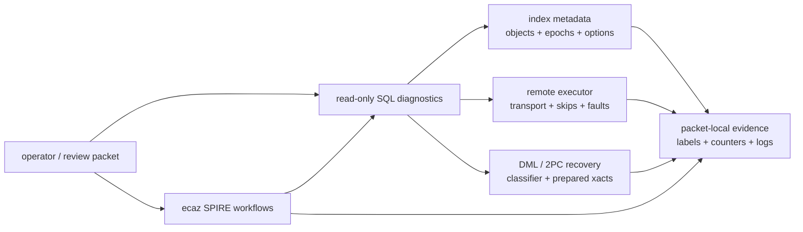

# FR-060: SPIRE Diagnostics Configuration and Operator Surface

## Requirement

SPIRE SHALL expose read-only SQL diagnostics, bounded configuration, and
operator command surfaces that explain active index state, routing behavior,
remote readiness, DML/recovery posture, and evidence labels without exposing
raw secrets or making performance claims by inspection alone.

## Diagnostic Groups

| Group | Examples | Purpose |
| --- | --- | --- |
| Health and active state | `ec_spire_index_health_snapshot`, `ec_spire_index_active_snapshot_diagnostics` | One-row state, epoch, object, placement, and byte-count overview. |
| Storage and epoch cleanup | `ec_spire_index_relation_storage_snapshot`, `ec_spire_index_epoch_cleanup_summary`, `ec_spire_index_epoch_cleanup_run` | Old epoch retention, cleanup debt, and safe reclamation. |
| Routing and scan | `ec_spire_index_scan_routing_snapshot`, `ec_spire_index_scan_placement_snapshot`, `ec_spire_index_scan_local_store_execution_snapshot` | Route budgets, selected PIDs, local store grouping, candidate counts. |
| Boundary replica | `ec_spire_index_boundary_replica_identity_snapshot`, `ec_spire_index_boundary_replica_placement_diagnostics` | Replica identity and placement health. |
| Remote executor | `ec_spire_remote_search_production_executor_state_summary`, `ec_spire_remote_search_degraded_skip_report`, `ec_spire_remote_pipeline_steps` | Dry and live remote readiness, strict/degraded status, pipeline stages. |
| DML and recovery | `ec_spire_dml_frontdoor_*`, `ec_spire_reap_orphaned_remote_prepared_xacts` | DML classifier, primitive plans, 2PC recovery. |
| Cost and options | `ec_spire_index_options_snapshot`, `ec_spire_index_cost_tuning_snapshot` | Effective reloptions, GUCs, payload scannability, cost constants. |

## Configuration Contract

SPIRE configuration SHALL include bounded reloptions and GUCs for:

- `nlists`, `nprobe`, recursive fanout, top-graph controls, route budgets, and
  candidate limits;
- local store count and local store tablespaces;
- source identity provider and boundary replica count;
- remote consistency mode, remote node/PID fanout limits, payload byte caps,
  connect/statement timeouts, and advisory governance limits;
- planner cost constants and storage/rerank multipliers.

Defaults MAY be permissive for development, but local readiness packets SHALL
record explicit nonzero fanout, concurrency, timeout, and payload caps.

## Stable Labels

Diagnostic status labels SHALL be treated as operator-facing contracts. A new
meaning SHALL use a new label rather than reusing an existing label.

Superseded materialization labels SHALL NOT be used for current distributed
CustomScan behavior. Current distributed read blockers use CustomScan tuple
delivery, typed-transport, endpoint identity, schema drift, budget/governance,
timeout, or degraded-skip labels.

## Operator CLI And Evidence

The `ecaz` CLI SHALL own repeatable SPIRE operator workflows where a shell
script or SQL sequence becomes part of review evidence. Current surfaces include
SPIRE pipeline counters and `ecaz dev spire-multicluster` wrappers for smoke,
CustomScan read, insert-read-after-CustomScan, transport overlap, fault, and
lifecycle fixtures.

Measurement and readiness claims SHALL cite packet-local artifacts and one of
the evidence labels defined by the SPIRE readiness docs.

## Acceptance Criteria

### FR-060-AC-1

An operator can inspect active epoch, object, placement, scan, route, local
store, remote, DML, cost, and cleanup state through SQL diagnostics.

### FR-060-AC-2

Diagnostics do not expose raw conninfo secrets or raw remote error text.

### FR-060-AC-3

Stable labels and evidence labels are documented as public contracts and stale
row-materialization labels are not used as the current distributed read path.

### FR-060-AC-4

Effective SPIRE reloptions and GUCs can be inspected with enough detail to
reproduce routing, fanout, timeout, payload, and degraded-mode behavior.

### FR-060-AC-5

Remote executor diagnostics expose endpoint identity, transport readiness,
timeout/cancel state, strict failures, degraded skips, and tuple-payload
compatibility without exposing raw secrets.

### FR-060-AC-6

DML diagnostics expose classifier outcome, primitive plan inputs, placement
directory state, prepared transaction intent state, and operator-owned recovery
actions.

### FR-060-AC-7

Repeatable SPIRE operator workflows can write packet-local logs and cite stable
evidence labels for local readiness, distributed read, transport fault, and DML
lifecycle fixtures.

### FR-060-AC-8

Diagnostics distinguish implementation readiness from benchmark claims and do
not imply product-scale performance without packet-local measurement artifacts.
