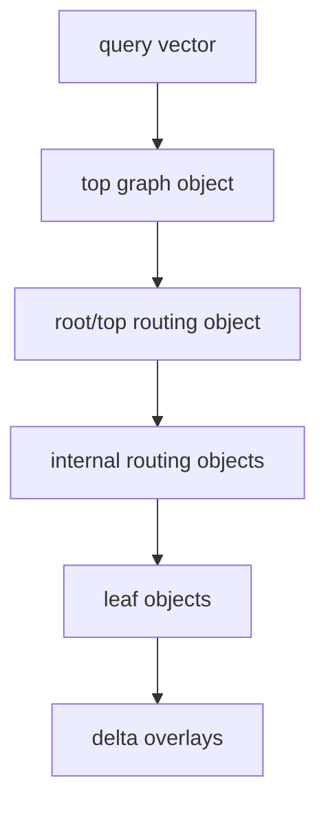

# FR-051: SPIRE Routing Delta and Top Graph Formats

## Requirement

SPIRE SHALL persist routing, delta, and top-graph objects as typed partition
objects with explicit binary payloads so hierarchy reconstruction and query
routing do not depend on transient builder state.

## Routing Object Format

Routing objects use `format_version = 1` and `kind = root` or `internal`.

Payload:

| Field | Type | Rule |
| --- | --- | --- |
| dimensions | `u16` | Positive vector dimension. |
| reserved | `u16` | zero |
| repeated child entries | `child_count` entries | each entry is `centroid_ordinal: u32`, `child_pid: u64`, `centroid: float4[dimensions]` |

Root objects SHALL have `parent_pid = 0`. Internal routing objects SHALL have a
nonzero parent PID. Routing object child PIDs SHALL refer to internal or leaf
partition objects in the same epoch manifest.

## Delta Object Format

Delta objects use `format_version = 1`, `kind = delta`, `level = 0`, and a
nonzero parent leaf PID. A delta object contains assignment rows encoded with
the same row fields as leaf assignments, but:

- insert rows SHALL set `delta_insert` and a primary or boundary-replica role;
- delete rows SHALL set `delta_delete` and tombstone semantics;
- delete rows SHALL use `payload_format = none`;
- one row SHALL NOT set both `delta_insert` and `delta_delete`;
- stale locator rows SHALL suppress affected candidates until repair or
  replacement publication.

## Top Graph Format

Top graph objects use `format_version = 1`, `kind = top_graph`, and
`assignment_count = 0`.

Payload:

| Field | Type | Rule |
| --- | --- | --- |
| root_pid | `u64` | PID of the active root/top routing object. |
| dimensions | `u16` | Positive vector dimension. |
| reserved | `u16` | zero |
| graph_degree | `u32` | positive |
| build_list_size | `u32` | positive |
| alpha | `float4` | finite and `>= 1.0` |
| entry_node | `u32` | `< node_count` |
| repeated nodes | `child_count` entries | each entry is `child_pid: u64`, `centroid_ordinal: u32`, `neighbor_count: u32`, `neighbors: u32[]` |

The top graph node set SHALL equal the active root/top routing object's child
frontier. Diagnostics SHALL distinguish root child count, graph node count,
frontier level, and active leaf count.

## Routing Topology

## Acceptance Criteria

### FR-051-AC-1

Routing object payloads define dimensions, child PIDs, centroid ordinals, and
centroid vectors with enough precision to rebuild the routing hierarchy.

### FR-051-AC-2

Delta object rows distinguish insert, delete, tombstone, stale-locator, primary,
and boundary-replica semantics without mutating published base leaves.

### FR-051-AC-3

Top graph objects validate root PID, node count, entry node, graph degree,
neighbor ordinals, finite alpha, and the root/top frontier ownership contract.
