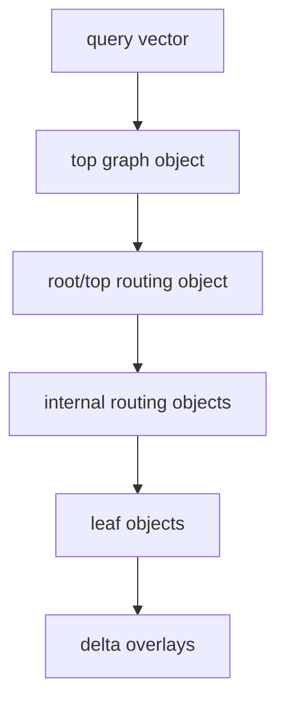

# FR-051: SPIRE Routing Delta and Top Graph Formats

## Requirement

SPIRE SHALL persist routing, delta, and top-graph objects as typed partition
objects with explicit binary payloads so hierarchy reconstruction and query
routing do not depend on transient builder state.

## Routing Object Format

Routing objects use `format_version = 1` and `kind = root` or `internal`.

Payload bytes after the `FR-049` common header use no implicit padding:

| Offset expression | Field | Encoding | Rule |
| --- | --- | --- | --- |
| `0` | `dimensions` | `u16le` | Positive vector dimension. |
| `2` | `reserved` | `u16le` | zero |
| `4 + n * child_stride` | child entry `n` | `centroid_ordinal: u32le`, `child_pid: u64le`, `centroid: float4le[dimensions]` | `n < child_count` |

`child_stride` SHALL equal `12 + 4 * dimensions`. Decode SHALL reject payloads
whose byte length is not exactly `4 + child_count * child_stride`.

Root objects SHALL have `parent_pid = 0`. Internal routing objects SHALL have a
nonzero parent PID. Routing object child PIDs SHALL refer to internal or leaf
partition objects in the same epoch manifest.

## Delta Object Format

Delta objects use `format_version = 1`, `kind = delta`, `level = 0`, and a
nonzero parent leaf PID. A delta object contains a Leaf V2 segment payload as
defined by `FR-050` with `segment_no = 0`, `row_base = 0`, and no segment chain,
but:

- insert rows SHALL set `delta_insert` and a primary or boundary-replica role;
- delete rows SHALL set `delta_delete` and tombstone semantics;
- delete rows SHALL use `payload_format = none`;
- one row SHALL NOT set both `delta_insert` and `delta_delete`;
- stale locator rows SHALL suppress affected candidates until repair or
  replacement publication.

## Top Graph Format

Top graph objects use `format_version = 1`, `kind = top_graph`, and
`assignment_count = 0`.

Payload bytes after the `FR-049` common header use no implicit padding:

| Offset expression | Field | Encoding | Rule |
| --- | --- | --- | --- |
| `0` | `root_pid` | `u64le` | PID of the active root/top routing object. |
| `8` | `dimensions` | `u16le` | Positive vector dimension. |
| `10` | `reserved` | `u16le` | zero |
| `12` | `graph_degree` | `u32le` | positive |
| `16` | `build_list_size` | `u32le` | positive |
| `20` | `alpha` | `float4le` | finite and `>= 1.0` |
| `24` | `entry_node` | `u32le` | `< child_count` |
| `28` | repeated nodes | variable | see below |

Each top-graph node is encoded as `child_pid: u64le`,
`centroid_ordinal: u32le`, `neighbor_count: u32le`, followed by
`neighbor_count` `u32le` neighbor ordinals. Decode SHALL reject neighbor
ordinals `>= child_count`, self-neighbor duplicates, duplicate child PIDs, and
payloads with trailing bytes.

The top graph node set SHALL equal the active root/top routing object's child
frontier. Diagnostics SHALL distinguish root child count, graph node count,
frontier level, and active leaf count.

## Routing Topology

## Acceptance Criteria

### FR-051-AC-1

Routing object payloads define dimensions, child PIDs, centroid ordinals, and
centroid vectors with enough precision to rebuild the routing hierarchy.

### FR-051-AC-2

Delta object rows distinguish insert, delete, tombstone, stale-locator, primary,
and boundary-replica semantics without mutating published base leaves.

### FR-051-AC-3

Top graph objects validate root PID, node count, entry node, graph degree,
neighbor ordinals, finite alpha, and the root/top frontier ownership contract.
