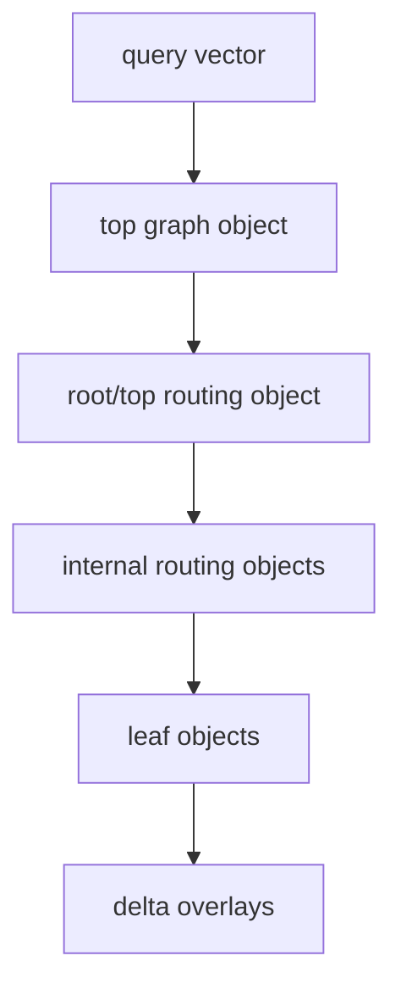

# FR-051: SPIRE Routing Delta and Top Graph Formats

## Description

SPIRE SHALL persist routing, delta, and top-graph objects as typed partition
objects with explicit binary payloads so hierarchy reconstruction and query
routing do not depend on transient builder state.

## Routing Object Format

Routing objects use `format_version = 1` and `kind = root` or `internal`.

Payload bytes after the `FR-049` common header use no implicit padding:

| Offset expression | Field | Encoding | Rule |
| --- | --- | --- | --- |
| `0` | `dimensions` | `u16le` | Positive vector dimension. |
| `2` | `reserved` | `u16le` | zero |
| `4 + n * child_stride` | child entry `n` | `centroid_ordinal: u32le`, `child_pid: u64le`, `centroid: float4le[dimensions]` | `n < child_count` |

`child_stride` SHALL equal `12 + 4 * dimensions`. Decode SHALL reject payloads
whose byte length is not exactly `4 + child_count * child_stride`.

Root objects SHALL have `parent_pid = 0`. Internal routing objects SHALL have a
nonzero parent PID. Routing object child PIDs SHALL refer to internal or leaf
partition objects in the same epoch manifest.

## Delta Object Format

Delta objects use `format_version = 1`, `kind = delta`, `level = 0`, and a
nonzero parent leaf PID. A delta object contains a Leaf V2 segment payload as
defined by `FR-050` with `segment_no = 0`, `row_base = 0`, and no segment chain,
but:

- insert rows SHALL set `delta_insert` and a primary or boundary-replica role;
- delete rows SHALL set `delta_delete` and tombstone semantics;
- delete rows SHALL use `payload_format = none`;
- one row SHALL NOT set both `delta_insert` and `delta_delete`;
- stale locator rows SHALL suppress affected candidates until repair or
  replacement publication.

## Top Graph Format

Top graph objects use `format_version = 1`, `kind = top_graph`, and
`assignment_count = 0`.

Payload bytes after the `FR-049` common header use no implicit padding:

| Offset expression | Field | Encoding | Rule |
| --- | --- | --- | --- |
| `0` | `root_pid` | `u64le` | PID of the active root/top routing object. |
| `8` | `dimensions` | `u16le` | Positive vector dimension. |
| `10` | `reserved` | `u16le` | zero |
| `12` | `graph_degree` | `u32le` | positive |
| `16` | `build_list_size` | `u32le` | positive |
| `20` | `alpha` | `float4le` | finite and `>= 1.0` |
| `24` | `entry_node` | `u32le` | `< child_count` |
| `28` | repeated nodes | variable | see below |

Each top-graph node is encoded as `child_pid: u64le`,
`centroid_ordinal: u32le`, `neighbor_count: u32le`, followed by
`neighbor_count` `u32le` neighbor ordinals. Decode SHALL reject neighbor
ordinals `>= child_count`, self-neighbor duplicates, duplicate child PIDs, and
payloads with trailing bytes.

The top graph node set SHALL equal the active root/top routing object's child
frontier. Diagnostics SHALL distinguish root child count, graph node count,
frontier level, and active leaf count.

## Routing Topology


```mermaid
flowchart TD
    Q["query vector"]
    TG["top graph object"]
    Root["root/top routing object"]
    Internal["internal routing objects"]
    Leaf["leaf objects"]
    Delta["delta overlays"]

    Q --> TG
    TG --> Root
    Root --> Internal
    Internal --> Leaf
    Leaf --> Delta
```

## Layout

```yaml
format: spire-routing-delta-topgraph
title: SPIRE routing, delta, and top-graph object payloads
endianness: little
encoding: "binary, no implicit padding, after the FR-049 common header"
record_types:
  - name: routing_object
    header: { $ref: "ix://agent-ix/ecaz/spire-partition-object-header", kind: [root, internal], format_version: 1 }
    fields:
      - { name: dimensions, offset: 0, type: u16, minimum: 1 }
      - { name: reserved, offset: 2, type: u16, const: 0 }
      - { name: children, offset: 4, type: "child_entry[child_count]", stride: "child_stride = 12 + 4*dimensions" }
    child_entry:
      - { name: centroid_ordinal, type: u32 }
      - { name: child_pid, type: u64, description: internal or leaf partition object in the same epoch manifest }
      - { name: centroid, type: "f32[dimensions]" }
    validation: "payload byte length must equal exactly 4 + child_count*child_stride; root has parent_pid=0, internal has nonzero parent_pid"
  - name: delta_object
    header: { $ref: "ix://agent-ix/ecaz/spire-partition-object-header", kind: delta, format_version: 1, level: 0, parent_pid: nonzero parent leaf PID }
    payload: { $ref: "ix://agent-ix/ecaz/spire-leaf-v2#segment_tuple", segment_no: 0, row_base: 0, segment_chain: none }
    row_rules:
      - insert rows set delta_insert plus a primary or boundary_replica role
      - delete rows set delta_delete with tombstone semantics and payload_format=none
      - a row never sets both delta_insert and delta_delete
      - stale_locator rows suppress affected candidates until repair or replacement publication
  - name: top_graph_object
    header: { $ref: "ix://agent-ix/ecaz/spire-partition-object-header", kind: top_graph, format_version: 1, assignment_count: 0 }
    fields:
      - { name: root_pid, offset: 0, type: u64, description: PID of the active root/top routing object }
      - { name: dimensions, offset: 8, type: u16, minimum: 1 }
      - { name: reserved, offset: 10, type: u16, const: 0 }
      - { name: graph_degree, offset: 12, type: u32, minimum: 1 }
      - { name: build_list_size, offset: 16, type: u32, minimum: 1 }
      - { name: alpha, offset: 20, type: f32, constraint: finite and >= 1.0 }
      - { name: entry_node, offset: 24, type: u32, constraint: "< child_count" }
      - { name: nodes, offset: 28, type: "top_graph_node[child_count]", variable_length: true }
    top_graph_node:
      - { name: child_pid, type: u64, constraint: no duplicate child PIDs }
      - { name: centroid_ordinal, type: u32 }
      - { name: neighbor_count, type: u32 }
      - { name: neighbors, type: "u32[neighbor_count]", constraint: "ordinals < child_count; no self-neighbor duplicates" }
    validation: "reject trailing bytes; node set must equal the active root/top routing object's child frontier"
```

## Acceptance Criteria

| ID | Criteria | Verification |
|----|----------|--------------|
| FR-051-AC-1 | Routing object payloads define dimensions, child PIDs, centroid ordinals, and centroid vectors precisely enough to rebuild the routing hierarchy | Inspection |
| FR-051-AC-2 | Delta object rows distinguish insert, delete, tombstone, stale-locator, primary, and boundary-replica semantics without mutating published base leaves | Test |
| FR-051-AC-3 | Top graph objects validate root PID, node count, entry node, graph degree, neighbor ordinals, finite alpha, and frontier ownership | Test |

### FR-051-AC-1: Routing payload completeness

Routing object payloads define dimensions, child PIDs, centroid ordinals, and
centroid vectors with enough precision to rebuild the routing hierarchy.

### FR-051-AC-2: Delta row semantics

Delta object rows distinguish insert, delete, tombstone, stale-locator, primary,
and boundary-replica semantics without mutating published base leaves.

### FR-051-AC-3: Top-graph validation

Top graph objects validate root PID, node count, entry node, graph degree,
neighbor ordinals, finite alpha, and the root/top frontier ownership contract.

## Dependencies

- **Upstream**: FR-048 (domain model: routing hierarchy, deltas, epochs),
  FR-049 (common partition object header), FR-050 (Leaf V2 segment payload
  reused by delta objects).
- **Downstream**: FR-052 (build writes routing, delta, and top-graph objects)
  and FR-053 (local search routes queries through these objects), per their
  declared dependencies on this FR.
