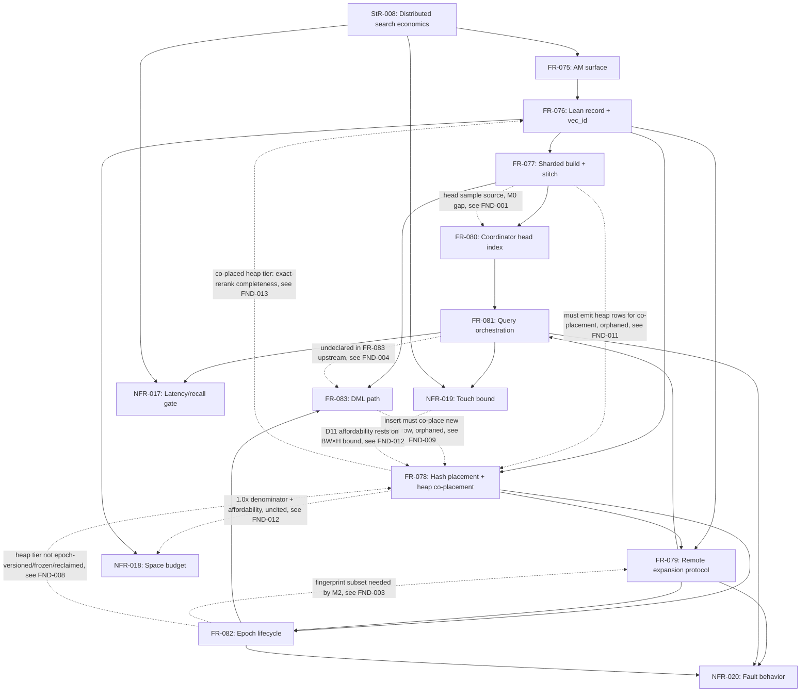

# SR-004: Dependency and Ordering Analysis — ec_distann Spec Batch

## Summary

Dependency analysis of the ec_distann batch (StR-008, FR-075..FR-083,
NFR-017..NFR-020, ADR-085) against the planned milestone order
M0 (FR-075/076/080 single-node) → M1 (FR-077 stitch) → M2 (FR-078/079/081
two-node) → M3 (FR-082 lifecycle+faults) → M4 (bench gate) → M5 (FR-083
incremental insert).

This is a re-run after revision **d25ea9e0c**, which moved ec_distann from
inline full-precision vectors in the graph record to a **co-placed heap
rerank tier**: FR-076 records are now lean (coarse `search_code` + adjacency
+ neighbor codes, no inline vector); FR-078 co-places each record's
full-precision heap row on the same `hash(vec_id)`-owned node; FR-079 reads
`exact_dist` from that co-located local heap row; ADR-085 gains decision D11
(and D1 drops ~5.0× → ~4.0×); NFR-018 names the heap tier as the 1.0× ratio
denominator.

**Acyclicity: PASS (re-verified for the revision).** The declared
`depends_on` prerequisite graph is still a DAG. The revision did **not** add a
frontmatter `depends_on` edge FR-076 → FR-078: FR-076's frontmatter still
declares only FR-075, while FR-078 continues to `depends_on` FR-076 — so the
FR-076/FR-078 pair carries exactly one build-order edge and **no 2-node
cycle** exists (FND-013). The valid topological order is unchanged
(StR-008 → FR-075 → FR-076 → {FR-077, FR-078} → {FR-079, FR-080} → FR-081 →
FR-082 → FR-083).

**Revision introduced a new artifact — the co-placed heap tier — that is not
yet fully owned across the batch.** Five orphaned-assumption / broken-edge
findings result (FND-008..FND-012): FR-082's epoch lifecycle does not version,
freeze, fingerprint, or reclaim the heap tier (FND-008); FR-083's incremental
insert / write endpoint writes the new record but never co-places its heap row
(FND-009); the tests.md traceability matrix omits the three new
co-placement/no-inline-vector ACs (FND-010); FR-077's emitted-artifact
description does not acknowledge the heap-tier co-placement obligation FR-078
now hangs off it (FND-011); and NFR-018/NFR-019 gain load-bearing dependencies
on FR-078/D11 that their own Dependencies do not cite (FND-012).

**Milestone consistency: the 4 prior medium findings survive the revision
unchanged** (FND-001..FND-004). **FND-005 is RESOLVED** by the revision (the
FR-076 ↔ FR-078 downstream edge is now declared both ways). FND-006 and
FND-007 (identity-citation precision, uncited lifted transport NFR-014) are
unaffected and still open.

## Classification

| Requirement | Class | Rationale |
|-------------|-------|-----------|
| StR-008 | Feature (stakeholder need) | Business-visible outcome: distributed search at single-instance economics |
| FR-075 | Enablement | AM registration, reloptions, GUCs, IndexAmRoutine scaffold — no standalone business behavior |
| FR-076 | Enablement | On-disk record format (now lean: coarse `search_code` + adjacency + neighbor codes, no inline vector) + global vec_id identity; schema-class work all other FRs consume. Exact-rerank completeness now depends on FR-078's co-placed heap tier (semantic, not build-order — FND-013) |
| FR-077 | Feature | Sharded build + stitch — the user-visible CREATE INDEX behavior and its recall-parity guarantee; its emitted artifact now feeds FR-078 record+heap co-placement (FND-011) |
| FR-078 | Enablement | Deterministic placement + directory metadata; now also co-places the full-precision heap row on the record's owning node (D11). Load-balance plumbing, invisible to results by design |
| FR-079 | Enablement | Remote expansion SQL endpoint; `exact_dist` now from the co-located local heap read, not an inline vector. Protocol surface consumed by FR-081, no user-visible behavior alone |
| FR-080 | Enablement | Coordinator-local head index; seeds FR-081, not independently observable |
| FR-081 | Feature | Top-k scan semantics — the query behavior StR-008 is satisfied by |
| FR-082 | Enablement | Epoch lifecycle/consistency machinery; governs FR-079/FR-081/FR-083 but does not yet own the co-placed heap tier (FND-008) |
| FR-083 | Feature | DML behavior (delete visibility, interim insert, incremental insert); insert path must now also co-place the new vector's heap row but does not (FND-009) |
| NFR-017 | Gate (constrains FR-081, StR-008) | M4 latency/recall bar |
| NFR-018 | Gate (constrains FR-076) | Space-amplification budget; the co-placed heap tier is now the 1.0× denominator (D11), a dependency on FR-078 its Dependencies omit (FND-012) |
| NFR-019 | Gate (constrains FR-081, StR-008) | BW×H touch bound; now the load-bearing justification for D11's affordability (reads==expansions==reranks==materialized), an edge D11 cites but NFR-019 does not record (FND-012) |
| NFR-020 | Gate (constrains FR-079/081/082) | Fault-behavior drills, M3 (+M5 insert cases) |

## Dependency Graph

Solid edges are declared `depends_on`/downstream relationships; dotted edges
are undeclared or newly implied by the revision (findings). The
FR-078 ⇢ FR-076 dotted edge is a **semantic completeness** edge (the lean
record cannot supply an exact distance without its co-placed heap row), and is
deliberately *not* a `depends_on` — the only build-order edge in that pair is
FR-078 `depends_on` FR-076, so no cycle forms.

External contracts consumed (not part of this batch): ADR-068/ADR-063
source identity + FR-055 topology (FR-076 vec_id, FR-075 reloption);
ADR-056 eager-scan pattern (FR-081); ADR-067/post-142 SPIRE
CustomScan/transport pooling (FR-079/FR-081); SPIRE epoch-manifest
machinery (FR-082); `SpirePlacementDirectory` (FR-078); task-144
distance-ratio closure machinery (FR-077); Vamana core
`build_vamana_graph_with_stats`/`robust_prune` (FR-077/FR-080/FR-083);
`QuantCodec` (FR-076/FR-079). The co-placed heap tier reuses the
`ec_diskann` coarse-in-index / exact-from-heap split (ADR-085 D11).

## Topological Order (suggested implementation sequence)

1. FR-075, FR-076 — enablement (AM scaffold, then lean record format) [M0]
2. FR-077 — build + stitch (monolithic degenerate case first for M0, full stitch M1); must also emit/co-place heap rows per FR-078 (see FND-011)
3. FR-080 — head index [spec says M0; requires the FND-001 degenerate-case fix]
4. FR-081 local-expansion slice — single-node scan closing FR-075-AC-3/4 [M0, see FND-002]
5. FR-078 — placement + heap co-placement (enablement) [M2]
6. FR-082 publish/fingerprint subset — enablement for FR-079 validation; must also version/freeze the co-placed heap tier [see FND-003, FND-008]
7. FR-079 — expansion protocol (enablement), exact_dist from co-located heap read [M2]
8. FR-081 multinode — full orchestration [M2]
9. FR-082 full lifecycle + NFR-020 drills; heap-tier reclaim on retire [M3, see FND-008]
10. NFR-017/018/019 gate matrix [M4]
11. FR-083 incremental insert — must co-place the new vector's heap row (delete + interim posture land earlier per D5) [M5, see FND-009]

## Cycles

None detected in declared `depends_on` edges, re-verified for revision
d25ea9e0c. The revision introduces two body-level references worth checking:

- **FR-076 → FR-078/FR-079 (co-placement, exact rerank).** FR-076's prose and
  Layout now cite FR-078/FR-079 as the source of the exact-rerank vector, and
  FR-076's Downstream lists FR-078. These are *downstream* (consumers of
  FR-076) plus a *semantic completeness* reliance, **not** a build-order
  `depends_on`. FR-076's frontmatter still declares only FR-075. The revision
  correctly did **not** add a `depends_on` FR-076 → FR-078; had it, the
  existing FR-078 `depends_on` FR-076 would close a 2-node cycle. No cycle.
- The FR-079 ↔ FR-082 fingerprint mutual reference remains the same latent
  cross-milestone edge as before (FND-003); still not a declared cycle.

## Findings

| ID | Severity | Summary | Refs |
|----|----------|---------|------|
| FND-001 | medium | FR-080 is milestoned M0 but its declared upstream is FR-077 (M1): the head sample is "breadth-first sample … union across build shards' top layers", which does not exist under an M0 monolithic build, yet FR-080-AC-4 and ADR-085 D3 require the C-sensitivity measurement at M0. Add a single-shard degenerate-case clause to FR-080 or move its shard-union behavior to M1. UNCHANGED by d25ea9e0c. | FR-080, FR-077, ADR-085 D3 |
| FND-002 | medium | M0's single-node query path has no owner. FR-075-AC-3/AC-4 (ordered top-k, recall parity vs ec_diskann) need a search loop, but the loop and its local-expansion function are specified only in FR-081 (M2). An M0 local-expansion slice of FR-081 (or an explicit local-scan behavior owned by FR-075) must precede FR-075 closeout. UNCHANGED by d25ea9e0c. | FR-075, FR-081 |
| FND-003 | medium | FR-079 (M2) SHALL validate `epoch_fingerprint` before any read and FR-078 (M2) requires an epoch-stamped manifest, but publish atomicity and fingerprint semantics are owned by FR-082 (M3), which declares FR-079 upstream (latent cross-milestone cycle). Declare the split (FR-082a publish/fingerprint at M2, lifecycle transitions + drills at M3) or an M2 single-epoch stub. UNCHANGED by d25ea9e0c. | FR-079, FR-078, FR-082 |
| FND-004 | medium | FR-083 spans milestones but is scheduled wholly at M5, while ADR-085 commits "tombstone deletes now" and D5's interim insert exists to exercise DML visibility early, and FR-075 registers insert/bulkdelete at M0 — so delete + interim-insert slices are M0–M3 prerequisites. Also FR-083's incremental insert "SHALL run the FR-081 beam search" but FR-083 now declares FR-081 in frontmatter (edge present); keep the milestone-split note. UNCHANGED by d25ea9e0c. | FR-083, FR-081, ADR-085 D5, FR-075 |
| FND-005 | low | RESOLVED by d25ea9e0c. Prior one-sided edges are now bidirectional: FR-076's Downstream now lists FR-078 ("co-places the heap row"), matching FR-078's existing `depends_on` FR-076; and FR-078's `depends_on` FR-077 (pre-existing) matches FR-077's Downstream FR-078. Both FR-076↔FR-078 and FR-077↔FR-078 edges extract mechanically. No action. | FR-076, FR-077, FR-078 |
| FND-006 | low | Identity-contract citation imprecision: FR-075/FR-076 cite "the ADR-068 source-identity contract", but ADR-068 delegates identity to ADR-063; ADR-068 is the topology/placement ADR. Cite ADR-063 where the identity contract is consumed (vec_id derivation, D6) and reserve ADR-068/FR-055 for topology/roster reuse. UNCHANGED by d25ea9e0c. | FR-075, FR-076, ADR-068, ADR-063, FR-055 |
| FND-007 | low | The lifted SPIRE transport is cited operationally (FR-079 "pooled libpq transport", ADR-085 "post-142 pooling", FR-082 "SPIRE epoch-manifest machinery") but NFR-014 (spire transport security and operations) is cited nowhere in the distann batch. Cite NFR-014 as constraining FR-079/FR-081 or record why it does not apply. UNCHANGED by d25ea9e0c. | FR-079, FR-081, NFR-014, ADR-085 |
| FND-008 | medium | **Orphaned artifact — the co-placed heap tier is not owned by the epoch lifecycle.** d25ea9e0c makes each record's full-precision heap row a per-epoch, hash-co-placed artifact (FR-078 build→publish writes "each record AND its full-precision vector"; ADR-085 D11), but FR-082 was not revised: "assemble the full record set, placement metadata, and head sample" and the publish tuple "(manifest, placement, head sample)" omit the heap tier; D10 immutability freezes "graph-node records and adjacency" but not the heap rows; the epoch fingerprint attests to "roster, placement, format version, and the build-time record set" — not the heap tier; and Retired-epoch reclaim enumerates "records" only. The heap tier is thus unversioned, unfrozen (no D10 coverage against under-epoch mutation), unattested by the fingerprint, and its reclaim on retire is unspecified. Extend FR-082 (assemble/publish/D10/fingerprint/reclaim) to cover the co-placed heap tier, or state where its lifecycle is owned. | FR-082, FR-078, ADR-085 D10, ADR-085 D11 |
| FND-009 | medium | **Broken edge — FR-083 incremental insert does not co-place the new vector's heap row.** Post-D11, FR-078 co-placement applies to every vec_id, including live inserts, or FR-079 exact rerank of a freshly inserted node has no node-local heap source. But FR-083 (unrevised) says incremental insert "write[s] the new record to its hash-owned node" and its write endpoint `ec_distann_apply_record_writes` lists only "new-record append, tombstone set, back-edge amendment" — the co-placed full-precision heap row for the inserted vector (and for the re-inserted vector on UPDATE) is unstated. FR-083-AC-4 (post-insert recall parity) implicitly needs it. Add heap-row co-placement to FR-083's insert path / write endpoint (FR-078/D11). | FR-083, FR-078, FR-079, ADR-085 D11 |
| FND-010 | medium | **Traceability orphan — tests.md does not cover the three new co-placement ACs.** d25ea9e0c added FR-076-AC-5 (no inline vector field), FR-078-AC-4 (record and heap row co-resolve to one node), and FR-079-AC-5 (`exact_dist` == co-placed heap distance, no vector read from the record), but spec/tests.md still maps FR-076→AC-1..4, FR-078→AC-1..3, and FR-079→AC-1..4. The load-bearing co-placement / no-inline-vector guarantees have no test-matrix row. Update the FR-076/FR-078/FR-079 traceability rows (TC-037/TC-040) to include the new ACs. | spec/tests.md, FR-076, FR-078, FR-079 |
| FND-011 | low | **FR-077's emitted artifact no longer matches FR-078's co-placement contract.** FR-078's build→publish hand-off now requires writing "each record AND its full-precision vector (heap row)" co-placed, "after the FR-077 stitch emits records". But FR-077 (unrevised) emits "exactly one record per vec_id" (workflow node E → F "Hash placement + epoch publish") and its recorded build outputs (shard count, duplication factor, edge-union stats, wall time) do not enumerate the co-placed heap tier as a build product. The FR-077 → FR-078 edge now carries a heap-tier obligation FR-077's own text does not acknowledge. State the heap-tier co-placement as an FR-077 build output (or explicitly locate it in FR-078). | FR-077, FR-078, ADR-085 D11 |
| FND-012 | low | **Uncited new gate dependencies on FR-078/D11.** NFR-018 now defines its ratio *denominator* as the co-placed 1.0× heap tier (ADR-085 D11, owned by FR-078), but its Dependencies cite only FR-076, D1, D7 — not FR-078 or D11. Symmetrically, ADR-085 D11's affordability is stated to rest on NFR-019's BW×H bound (the new "records read == nodes expanded == nodes exact-reranked == nodes materialized" equality that bounds the heap-rerank fetch count), yet NFR-019's scope/relationships do not record that it now underwrites the rerank-read count, not only the expansion count. Add the FR-078/D11 citation to NFR-018 Dependencies and the D11↔NFR-019 dependency to NFR-019 (or ADR-085). | NFR-018, NFR-019, FR-078, ADR-085 D1, ADR-085 D11 |
| FND-013 | low | **Cycle check (informational, no defect).** FR-076's body/Layout now cite FR-078/FR-079 for exact-rerank co-placement and FR-076's Downstream lists FR-078; the record's exact-rerank *completeness* is now provided by FR-078. The revision correctly kept this out of FR-076's frontmatter `depends_on` (still FR-075 only), so no FR-076↔FR-078 build-order cycle exists against FR-078's `depends_on` FR-076. This dependency graph represents that reliance as a dotted semantic-completeness edge (FR-078 ⇢ FR-076) distinct from the solid build-order edge, so the analysis stays faithful to the lean-record/co-placed-heap split without implying a cycle. | FR-076, FR-078, FR-079 |
