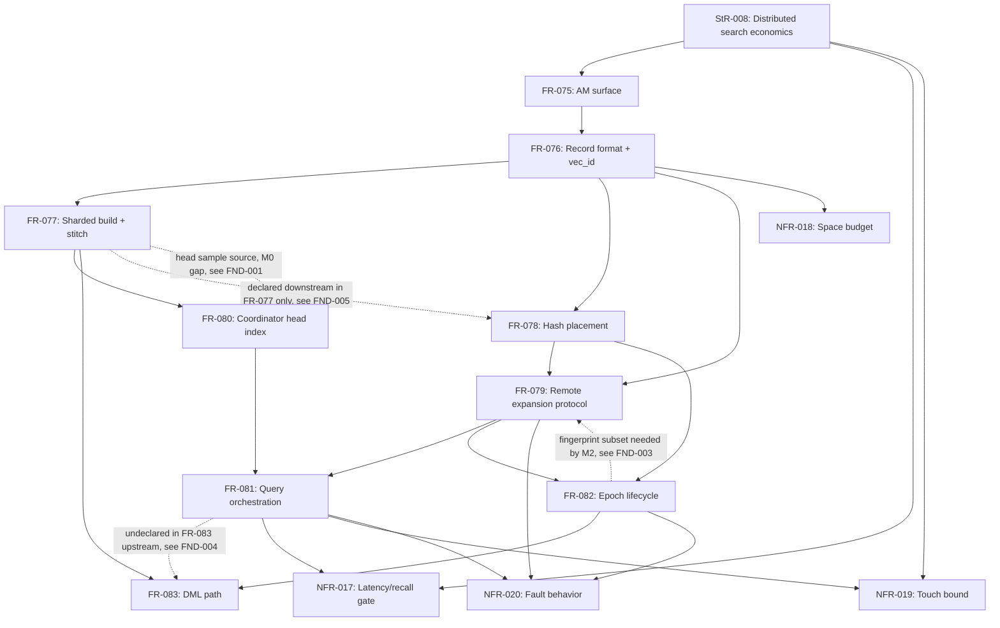

# SR-004: Dependency and Ordering Analysis — ec_distann Spec Batch

## Summary

Dependency analysis of the ec_distann batch (StR-008, FR-075..FR-083,
NFR-017..NFR-020, ADR-085) against the planned milestone order
M0 (FR-075/076/080 single-node) → M1 (FR-077 stitch) → M2 (FR-078/079/081
two-node) → M3 (FR-082 lifecycle+faults) → M4 (bench gate) → M5 (FR-083
incremental insert).

**Acyclicity: PASS.** The declared prerequisite graph is a DAG; a valid
topological order exists (StR-008 → FR-075 → FR-076 → {FR-077, FR-078} →
{FR-079, FR-080} → FR-081 → FR-082 → FR-083, with NFR-017/018/019/020
verified against their constrained FRs and the M4 gate consuming FR-081).

**Milestone consistency: 4 medium findings.** The declared graph and the
milestone order disagree in four places, all of the same shape — a
requirement scheduled early consumes a slice of a requirement scheduled
later: (1) FR-080 (M0) depends on FR-077's shard-top-layer head sample
(M1); (2) M0's single-node scan needs FR-081's local-expansion search loop
(M2); (3) FR-079 (M2) mandates epoch-fingerprint validation whose
publish/fingerprint semantics are owned by FR-082 (M3); (4) FR-083's D5
interim insert + tombstone delete are exercised from M0/M3 while all of
FR-083 sits at M5. None of these requires reordering milestones — each
requires either a degenerate-case clause in the early FR or an explicit
milestone-split note, so the DAG and the plan stop contradicting each
other. Three low findings cover one-sided dependency declarations and
external-contract citation precision (ADR-063 vs ADR-068 identity;
NFR-014 uncited on the lifted transport).

## Classification

| Requirement | Class | Rationale |
|-------------|-------|-----------|
| StR-008 | Feature (stakeholder need) | Business-visible outcome: distributed search at single-instance economics |
| FR-075 | Enablement | AM registration, reloptions, GUCs, IndexAmRoutine scaffold — no standalone business behavior |
| FR-076 | Enablement | On-disk record format + global vec_id identity; schema-class work all other FRs consume |
| FR-077 | Feature | Sharded build + stitch — the user-visible CREATE INDEX behavior and its recall-parity guarantee |
| FR-078 | Enablement | Deterministic placement + directory metadata; load-balance plumbing, invisible to results by design |
| FR-079 | Enablement | Remote expansion SQL endpoint; protocol surface consumed by FR-081, no user-visible behavior alone |
| FR-080 | Enablement | Coordinator-local head index; seeds FR-081, not independently observable |
| FR-081 | Feature | Top-k scan semantics — the query behavior StR-008 is satisfied by |
| FR-082 | Enablement | Epoch lifecycle/consistency machinery; infrastructure governing FR-079/FR-081/FR-083 |
| FR-083 | Feature | DML behavior (delete visibility, interim insert, incremental insert) |
| NFR-017 | Gate (constrains FR-081, StR-008) | M4 latency/recall bar |
| NFR-018 | Gate (constrains FR-076) | Space-amplification budget, validated from M0 storage step |
| NFR-019 | Gate (constrains FR-081, StR-008) | BW×H touch bound, asserted every benchmarked cell |
| NFR-020 | Gate (constrains FR-079/081/082) | Fault-behavior drills, M3 (+M5 insert cases) |

## Dependency Graph

External contracts consumed (not part of this batch): ADR-068/ADR-063
source identity + FR-055 topology (FR-076 vec_id, FR-075 reloption);
ADR-056 eager-scan pattern (FR-081); ADR-067/post-142 SPIRE
CustomScan/transport pooling (FR-079/FR-081); SPIRE epoch-manifest
machinery (FR-082); `SpirePlacementDirectory` (FR-078); task-144
distance-ratio closure machinery (FR-077); Vamana core
`build_vamana_graph_with_stats`/`robust_prune` (FR-077/FR-080/FR-083);
`QuantCodec` (FR-076/FR-079).

## Topological Order (suggested implementation sequence)

1. FR-075, FR-076 — enablement (AM scaffold, then record format) [M0]
2. FR-077 — build + stitch (monolithic degenerate case first for M0, full stitch M1)
3. FR-080 — head index [spec says M0; requires the FND-001 degenerate-case fix]
4. FR-081 local-expansion slice — single-node scan closing FR-075-AC-3/4 [M0, see FND-002]
5. FR-078 — placement (enablement) [M2]
6. FR-082 publish/fingerprint subset — enablement for FR-079 validation [see FND-003]
7. FR-079 — expansion protocol (enablement) [M2]
8. FR-081 multinode — full orchestration [M2]
9. FR-082 full lifecycle + NFR-020 drills [M3]
10. NFR-017/018/019 gate matrix [M4]
11. FR-083 incremental insert (delete + interim posture land earlier per D5) [M5]

## Cycles

None detected in declared edges. The FR-079 ↔ FR-082 mutual reference
(FR-079's behavior mandates fingerprint validation defined by FR-082;
FR-082 declares FR-079 upstream) is not a declared cycle — FR-079 does not
declare FR-082 upstream — but it is a latent one; FND-003 resolves it by
splitting FR-082's publish/fingerprint subset as an M2 enablement.

## Findings

| ID | Severity | Summary | Refs |
|----|----------|---------|------|
| FND-001 | medium | FR-080 is milestoned M0 but its declared upstream is FR-077 (M1): the head sample is defined as "breadth-first sample … union across build shards' top layers", which does not exist under an M0 monolithic build. Yet FR-080-AC-4 and ADR-085 D3 both require the C-sensitivity measurement at M0. Add a single-shard degenerate-case clause to FR-080 (sample = top of the monolithic graph's entry region) or move FR-080's shard-union behavior to M1; as written the DAG and the milestone order contradict each other. | FR-080, FR-077, ADR-085 D3 |
| FND-002 | medium | M0's single-node query path has no owner. FR-075 requires single-node scans to "serve the same plan shape with local expansion" and FR-075-AC-3/AC-4 (ordered top-k, recall parity vs ec_diskann) cannot be verified without a search loop — but the loop, including the local expansion function of identical signature, is specified only in FR-081 (M2, upstream FR-079/FR-080). Missing edge/milestone split: an M0 local-expansion slice of FR-081 (or an explicit local-scan behavior owned by FR-075) must precede FR-075 closeout. | FR-075, FR-081 |
| FND-003 | medium | FR-079 (M2) SHALL validate `epoch_fingerprint` before any read and FR-078 (M2) requires an epoch-stamped manifest — but publish atomicity and fingerprint semantics are owned by FR-082, milestoned M3, which itself declares FR-079 upstream (latent cycle across the milestone boundary). M2 needs at least a static published-epoch/fingerprint subset of FR-082 as enablement; neither FR-079 nor the milestone plan states this. Declare the split (FR-082a publish/fingerprint at M2, lifecycle transitions + drills at M3) or an M2 single-epoch stub. | FR-079, FR-078, FR-082 |
| FND-004 | medium | FR-083 spans milestones but is scheduled wholly at M5: ADR-085 commits "tombstone deletes now" and D5's interim insert exists so "DML tests exercise visibility semantics early", and FR-075's IndexAmRoutine registers insert/bulkdelete callbacks at M0 — so the delete + interim-insert slices are prerequisites of the M0–M3 read-path milestones, only incremental distributed insert belongs to M5. Additionally FR-083's incremental insert "SHALL run the FR-081 beam search" but FR-083's Dependencies omit FR-081 (edge exists only one-sided via FR-081's downstream list). | FR-083, FR-081, ADR-085 D5, FR-075 |
| FND-005 | low | One-sided dependency declarations: FR-076's Downstream lists FR-077/FR-079 but omits FR-078 (which declares FR-076 upstream); FR-077's Downstream lists FR-078 (its workflow ends in "Hash placement + epoch publish", so stitched output → placement is a real edge) but FR-078 declares only FR-076 upstream. Make each edge bidirectionally declared so the DAG can be mechanically extracted. | FR-076, FR-077, FR-078 |
| FND-006 | low | Identity-contract citation imprecision: FR-075/FR-076 cite "the ADR-068 source-identity contract", but ADR-068 itself delegates identity to ADR-063 (spire-source-identity-provider) — ADR-068 is the topology/placement ADR. FR-076's frontmatter also declares depends_on FR-055 (SPIRE topology/placement directory) without naming it in prose. Cite ADR-063 where the identity contract is consumed (vec_id derivation, D6) and reserve ADR-068/FR-055 for the topology/roster reuse. | FR-075, FR-076, ADR-068, ADR-063, FR-055 |
| FND-007 | low | The lifted SPIRE transport is cited operationally (FR-079 "pooled libpq transport", ADR-085 "post-142 pooling", FR-082 "SPIRE epoch-manifest machinery") but NFR-014 (spire transport security and operations) is cited nowhere in the distann batch. If the transport is reused, its security/operations NFR travels with it — either cite NFR-014 as constraining FR-079/FR-081 or record why it does not apply. | FR-079, FR-081, NFR-014, ADR-085 |
