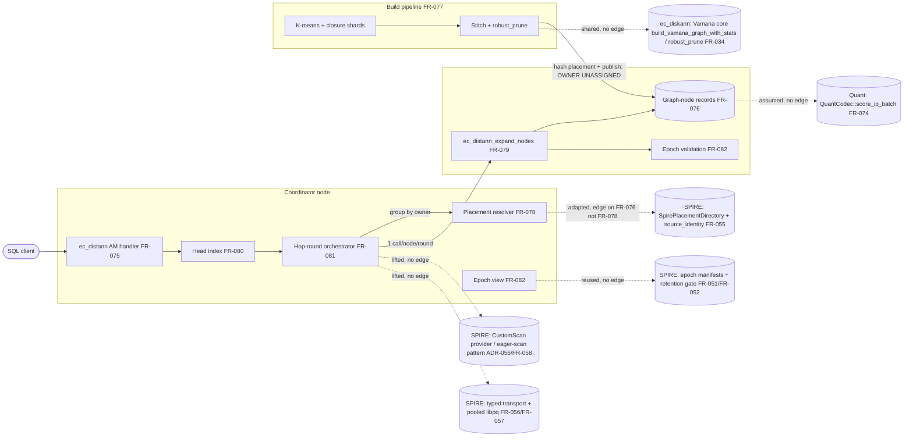

# SR-007: Scope and Boundary Analysis — ec_distann Spec Batch

## Summary

Scope-boundary analysis of the ec_distann batch (StR-008, FR-075..FR-083,
NFR-017..NFR-020, ADR-085) covering: (1) explicitness of boundaries between
ec_distann and the reused SPIRE/ec_diskann subsystems, (2) the coordinator
vs data-node responsibility split per FR, (3) recorded out-of-scope items,
and (4) silent expansion into neighboring spec territory.

**What is well-bounded.** The read-path split is unambiguous: the data node
validates the epoch fingerprint before any read and raises placement errors
for non-owned vec_ids (FR-079); the coordinator owns visited-set dedupe by
vec_id, frontier selection, per-node batching, and the single refresh-retry
on epoch mismatch (FR-081, FR-082). FR-078's "placement affects load balance
only — never recall or graph structure" is an exemplary boundary statement,
and its topology-only directory ("SHALL NOT store per-record entries")
explicitly diverges from `SpirePlacementDirectory` rather than silently
inheriting it. Two of the three requested out-of-scope items are durably
recorded in ADR-085: BatANN baton passing (D4, with a reopen trigger) and
injected-latency gating (D2, informational netem run only). The
partitioned-SPIRE lane is explicitly shelved-with-evidence, so the batch
does not reopen SPIRE's routing scope.

**Where boundaries are soft.** Seven findings. The most serious: the
committed incremental-insert milestone (FR-083) specifies distributed
remote *writes* (back-edge read-modify-write with degree re-pruning) with no
owning component or protocol requirement — the read path has FR-079, the
write path has nothing (FND-001). The build→publish hand-off that physically
places stitched records onto their hash-owned nodes is owned by no FR
(FND-002). The reuse posture toward SPIRE machinery is described with four
different verbs ("lifted", "adapted", "reusing", "repurposed") and, except
for FR-076→FR-055, carries no relationship edges to the owning SPIRE,
ec_diskann, or quant FRs, so shared-vs-forked is undecided per subsystem
(FND-003) and two FRs name SPIRE-owned source files/components directly
without an edge (FND-004). Learned routing is not recorded as
rejected/out-of-scope anywhere (FND-005).

## System Context

## In-Scope Responsibilities

- One global Vamana graph; self-sufficient node records keyed by global
  vec_id (FR-075, FR-076; ADR-085 D1/D6).
- Sharded closure-overlap build and stitch to one record per vec_id
  (FR-077, D8).
- Deterministic hash placement + topology-only placement directory (FR-078).
- Data-node batch expansion endpoint with epoch/placement validation
  (FR-079).
- Coordinator head index, hop-round beam search, BW×H cap, convergence
  early-exit (FR-080, FR-081, D3/D9).
- Epoch lifecycle Building→Published→Retired with fingerprint-checked reads
  (FR-082).
- Tombstone delete, interim insert posture (D5), committed incremental
  distributed insert (FR-083).
- Gates: NFR-017 (recall/latency vs IVF anchor), NFR-018 (≤4× space),
  NFR-019 (touch bound), NFR-020 (error-not-partial fault behavior).

## External Dependencies

| Dependency | Type | Assumed or Guaranteed | Contract |
|------------|------|------------------------|----------|
| SPIRE CustomScan provider / eager-scan pattern (ADR-056, FR-058) | Reused code ("lifted") | Assumed — reuse mode and edge missing (FND-003) | None declared |
| SPIRE typed transport + post-142 pooled libpq (FR-056, FR-057) | Reused code ("lifted") | Assumed — no edge (FND-003) | FR-079-AC via drills, indirectly |
| SPIRE epoch-manifest machinery + retention gate (FR-051, FR-052) | Reused code ("reusing") | Assumed — no edge (FND-003) | FR-082-AC-1..3 exercise behavior |
| SpirePlacementDirectory (FR-055) | Adapted (topology-only divergence) | Guaranteed for identity via FR-076→FR-055 edge; adapter FR-078 lacks the edge (FND-003) | FR-078-AC-1/3 |
| ADR-068 source-identity contract | Contract | Guaranteed | FR-076-AC-2 (vec_id stability) |
| ec_diskann Vamana core (`build_vamana_graph_with_stats`, `robust_prune`) | Shared library | Guaranteed behaviorally (FR-075-AC-4 parity, FR-077-AC-1) but no spec edge (FND-003) | FR-075-AC-4 |
| SPIRE closure/distance-ratio assignment (`src/am/ec_spire/build/routing_plan.rs`) | Repurposed source file | Assumed — named by path, no edge, shared-vs-forked undecided (FND-004) | FR-077 property tests, indirectly |
| SPIRE top-graph in-memory Vamana builder | Reused code | Assumed — no edge (FND-004) | FR-080-AC-2 |
| QuantCodec scoring (FR-074) | Shared trait | Guaranteed behaviorally (FR-079-AC-4) but no edge (FND-003) | FR-076-AC-3, FR-079-AC-4 |
| PostgreSQL index AM API | Platform | Assumed | pgrx / FR-075-AC-1 |
| `ecaz bench suite` protocol (FR-038, Task 146 anchors) | Measurement harness | Guaranteed | NFR-017 verification section |

## Responsibility Allocation

| Requirement | Owning Component | Class |
|-------------|------------------|-------|
| StR-008 | ec_distann lane (program) | core |
| FR-075 (AM surface, reloptions, GUCs) | Coordinator AM handler | core |
| FR-076 (record format, vec_id) | Data-node storage | infrastructure |
| FR-077 (sharded build + stitch) | Build pipeline (executor node unnamed — FND-002) | core |
| FR-078 (hash placement, directory) | Coordinator + every node (deterministic shared function); directory: infrastructure | infrastructure |
| FR-079 (expand endpoint) | Data node | core |
| FR-080 (head index) | Coordinator (sample persistence location unassigned — FND-007) | core |
| FR-081 (orchestration, dedupe, cap) | Coordinator | core |
| FR-082 (epoch lifecycle; validation at data node, retry at coordinator) | Coordinator + data node, split explicit | infrastructure |
| FR-083 (delete/interim insert: local AM; incremental insert remote writes: UNOWNED — FND-001) | Coordinator AM + unspecified remote-write path | core |
| NFR-017 (gate) | Bench harness over FR-081 | cross-cutting |
| NFR-018 (space budget) | Data-node storage + build instrumentation | cross-cutting |
| NFR-019 (touch bound) | Coordinator counters + bench assertion | cross-cutting |
| NFR-020 (fault behavior) | Coordinator (fail-not-degrade policy) + data node (typed errors) | cross-cutting |

## Findings

| ID | Severity | Summary | Refs |
|----|----------|---------|------|
| FND-001 | high | The committed incremental-insert milestone has remote *writes* with no owning component or protocol FR. FR-083 requires "batched remote read-modify-write with per-record degree re-pruning" and atomic-failure semantics, but the batch specifies only a remote *read* endpoint (FR-079). Unassigned: which component executes the back-edge re-prune (coordinator RMW vs a data-node-local write function), what the remote-write endpoint/contract is, and where `aminsert` runs when the heap row's node differs from the record's hash-owned node. NFR-020 gates "mid-insert failure" against a path no FR allocates. | FR-083 Behavior; FR-079 (read-only); NFR-020 Scope; ADR-085 Decision 6 |
| FND-002 | medium | The build→publish hand-off that physically distributes records to their owning nodes is unowned. FR-077 ends at "emit exactly one record per vec_id" (workflow box "Hash placement + epoch publish" has no owner), FR-078 defines only the mapping function, and FR-082 says "a build SHALL assemble the full record set" without naming which node runs the build or which component writes record X onto data node Y under the Building epoch. Every other step in the pipeline has an owner; this seam between three FRs does not. | FR-077 Workflow/Behavior; FR-078 Behavior; FR-082 Behavior |
| FND-003 | medium | Reuse mode per subsystem is unstated and the batch carries no relationship edges to the owning FRs of the reused machinery. ADR-085 says "lifted" (CustomScan/transport/epoch), FR-078 "adapted" (SpirePlacementDirectory), FR-082 "reusing" (epoch manifests), FR-077 "repurposed" — but no FR declares whether each subsystem is shared code or a fork. The only cross-family edge is FR-076→FR-055 (identity), while FR-078 — the actual SpirePlacementDirectory adapter — has no FR-055 edge; FR-079/FR-081 have no edge to FR-056/FR-057/FR-058 (transport/CustomScan); FR-082 none to FR-051/FR-052 (epoch machinery); FR-075/FR-077 none to FR-034 (ec_diskann Vamana core/opclass parity); FR-076 none to FR-074 (QuantCodec contract it invokes by name). | FR-076..FR-082 frontmatter; spire/distributed/FR-055..058; index/diskann/FR-034; quant/FR-074; ADR-085 Decision 5 |
| FND-004 | medium | Two FRs reach directly into SPIRE-owned implementation with no spec relationship, risking silent expansion into SPIRE's territory: FR-077 names `src/am/ec_spire/build/routing_plan.rs` (distance-ratio closure assignment, specced under the SPIRE build family) as machinery to repurpose, and FR-080 reuses "the in-memory Vamana builder used by the SPIRE top-graph". If these are adapted in place, ec_distann changes behavior under SPIRE's spec ownership; if forked, the fork is undocumented. Either way an explicit edge (or an extract-to-shared-module statement) is required — especially since the SPIRE lane is shelved-with-evidence and its specs remain APPROVED. | FR-077 Behavior; FR-080 Behavior; ADR-085 Consequences ("reused, not discarded") |
| FND-005 | low | Learned routing is not recorded as out-of-scope. ADR-085 records BatANN baton passing (D4, with reopen trigger) and injected-latency gating (D2, informational only), but learned routing appears in neither Sub-Decisions nor Rejected Alternatives, so nothing prevents it re-entering scope unrecorded. Add it to ADR-085's rejected/deferred list with a one-line rationale. | ADR-085 Sub-Decisions D2/D4, Rejected Alternatives |
| FND-006 | low | The single-node vs multinode mode boundary has no determinant. FR-075 switches behavior on "while the index participates in a multinode deployment" and FR-081 on "while the deployment is single-node", but no requirement states what makes an index a participant (roster in the placement directory? a registration step? a GUC?) or which component decides at plan/scan time. The mode selects between two different execution paths, so its owner should be explicit. | FR-075 Behavior; FR-081 Behavior; FR-078 (roster) |
| FND-007 | low | FR-080's head-sample persistence location is unassigned: the pipeline SHALL "persist the sample with the epoch", but not where (coordinator-local relation, epoch manifest payload, or a data node), even though FR-082 lists the head sample as part of atomic publication. This is the only epoch artifact whose storage owner is unstated. | FR-080 Behavior; FR-082 Behavior (publication triple) |
